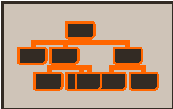
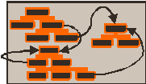

## Standard Dictionaries

Khiops dictionaries allow to describe the structure of the database to analyze and to enable the deployment of the data analysis trained models:
see [`Start Using Dictionaries`](../../tutorials/kdic_intro.md).
<!-- probleme : la presentation n'est plus presente a ce lien -->

A **dictionary file** is a text file with extension *.kdic*, containing the definition of one or many dictionaries.

A **dictionary** allows to define the name and type of variables in a data table file, as illustrated in the following minimal example.

!!! example "Example of a dictionary file"
    
    ```kdic
    Dictionary	Iris
    {
        Numerical	SepalLength	;
        Numerical	SepalWidth		;
        Numerical	PetalLength		;
        Numerical	PetalWidth		;
        Categorical	Class	;
    };
    ```


It also allows define a label, comments, meta-data per variable, to select variables to use or not for analysis, to construct new variables
 by means of derivation rules.


### Type

The types available for native variables, those that can be stored directly in data table files, are:

- Categorical, 

- Text,

- Numerical,

- Date,

- Time,

- Timestamp,

- TimestampTZ.


Advanced types are provided for specialized usages:

- Entity(name): represents a 0-1 relationship in a multi-table schema, referencing the specified dictionary,
  
- Table(name): represents a 0-n relationship in a multi-table schema, referencing the specified dictionary,
  
- TextList: derived from a list of Text variables, mainly to collect Text variable from a multi-table schema,

- Structure(name): used for algorithmic structures that store model parameters (for internal use).

### Name

The names are case sensitive and are limited to 128 characters. 
In the case where they use characters other than alphanumeric characters, 
they must be surrounded by back-quotes.
Back-quotes inside variable names must be doubled.

### Unused variables

A variable can be ignored in the data processing (memory loading, modeling, deployment) if the keyword *Unused* 
is specified before the variable definition. 

Even though, Khiops is still aware of the variable, which allows to construct new variables derived from the ignored variable.

!!! example "Dictionary file with unused variables"
    
    ```kdic
    Dictionary	Iris
    {
    Unused    Numerical	SepalLength	;
    Unused    Numerical	SepalWidth		;
        Numerical	PetalLength		;
        Numerical	PetalWidth		;
        Categorical	Class	;
    };
    ```

### Comments and labels

Labels and comments are lines that begin with //.

- at the dictionary level:

    - the label is the first commented line before the dictionary definition,
    
    - comments are the next commented lines before the dictionary definition; they can be interspersed with dictionary definition fragments (e.g. key, meta-data),
    
    - internal comments can be added at the end of the dictionary definition, before the closing curly brace `}`,

- at the variable level:

    - the label must appear on the same line, just after the variable definition,

    - multiple comment lines can precede the variable definition.

Empty lines can be inserted anywhere to improve readability.

!!! example "Dictionary file with comment and labels"
    
    ```kdic
    // Iris Flower
    // Definition of an iris flower
    // Illustration with labels and comments
    Dictionary	Iris
    {
        Numerical	SepalLength	    ;   // Length of sepal
        Numerical	SepalWidth		;   // Width of sepal
        Numerical	PetalLength		;   // Length of petal
        Numerical	PetalWidth		;   // Width of petal


        // The Class variable is the target to predict
        // Since its type is Categorical, this is a classification problem
        Categorical	Class	; // Type of Iris flower

        // Note that this sample is quite verbose
    };
    ```

### Meta-data

Meta-data is a list of keys or key value pairs:

- *<key\>* for boolean values,

- *<key=value\>* for numerical values,

- *<key="value"\>* for string values. 

Meta-data is used internally by Khiops to store information related to dictionaries or variables, such as annotations for modeling results.
Additionally, it is used to store the external format of Date, Time, Timestamp, or TimestampTZ variables when a format other than the default is specified.

!!! example "Example of four predefined meta-data keys : DateFormat, TimeFormat, TimestampFormat and TimestampTZFormat"
    
    ```kdic
    Date MyDate ; <DateFormat="DD/MM/YYYY">
    Time MyTime ; <TimeFormat="HH.MM">
    Timestamp MyTimestamp ; <TimestampFormat="YYYY-MM-DD_HH:MM:SS">
    TimestampTZ MyTimestampTZ ; <TimestampTZFormat="YYYY-MM-DD_HH:MM:SS.zzzzz">
    ```

### Derivation rules

*Derivation rules* enable the construction of new variables within a dictionary. 
Operands in a derivation can be existing variables (by name), numerical or categorical constants, or the result of other derivation rules, allowing recursive definitions.

Categorical constants must be enclosed in double quotes, with internal double quotes doubled. 
If a value is too long, it can be split into sub-values concatenated with '+' characters.

Numerical constants can be expressed in scientific notation (e.g., 1.3E7), using a dot as the decimal separator. 
The special value *#Missing* indicates a missing numerical value.

Date, Time, Timestamp or TimestampTZ constants are not directly supported but can be generated via conversion rules
(see [`Date Rules`](date-rules.md): e.g. AsDate("2014-01-15", "YYYY-MM-DD")).

A complete list of derivation rules is provided in the [`Dictionary Rules`](numerical-comparisons.md) section.

!!! example "Example of a dictionary file with a constructed variable PetalArea"

    ```kdic
    Dictionary Iris
    {
        Unused Numerical SepalLength;
        Numerical SepalWidth;
        Numerical PetalLength;
        Numerical PetalWidth;
        Numerical PetalArea = Product(PetalLength, PetalWidth);
        Categorical Class; // Class variable
    };
    ```

### Grammar

We present a formal grammar summarizing all features of the dictionary.

Dictionary grammar:

- it is defined by a name, a list of variables, and an optional label,

- the structure is enclosed within braces `{}` and terminated with a semicolon `;`,

- label and comments:

    - label: the first comment line before the dictionary declaration, serving as a title,

    - comments: all comment lines appearing before the opening brace '{' of the dictionary block 
      (for concision purpose, the grammar indicates only the first position where comments can appear),

    - internal comments: comments lines that follow the last variable and appear before the closing brace '}',

- for multi-table schemas, an optional 'Root' tag and key fields can be included (see [`Multi-table dictionary`](dictionary-files.md#multi-table-dictionary)).

```kdic
['//' <label> <EOL>]
['//' <comment> <EOL>]* 
'Root'? 'Dictionary' <name> [ '(' <key-fields> ')' ]
'{'
    [ <variable> ]*
    ['//' <comment> <EOL>]* 
'}' ';'
```

Variable grammar:

- it is defined by a name, with optional 'Unused' tag, derivation, metadata, and label,

- label and comments:

    - label: an end-of-line comment positioned at the end of the variable declaration,

    - comments: any line comments appearing before the variable declaration.
     

```kdic
['//' <comment> <EOL>]* 
'Unused'? <type> <name> [ '=' <derivation> ] ';' [ <meta-data> ] [ '//' <label> <EOL> ]
```

Variables within a dictionary can also be organized into *variables blocks*. 
This advanced feature, used internally by Khiops for the management of sparse data, is detailed [`here`](intro-block.md). 

## Multi-table dictionary

Whereas most data mining tools work on instances * variables flat tables, real data often have a structure coming from databases. 
Khiops allows to analyse *multi-table* databases, where the data come from several tables, with zero to one or zero to many relation between the tables.

To analyse multi-table databases, Khiops relies on:

- an extension of the dictionaries, to describe multi-tables schemas, (this section)

- databases that are stored in one data file per table in a multi-table schema (cf. [`Train database`](../../ui-docs/khiops.md#train-database)),

- automatic feature construction to build a flat analysis table (cf. [`Variable construction parameters`](../../ui-docs/khiops.md#advanced-predictor-parameters)).

In this section, we present star schemas, snowflake schemas, external tables, then give a summary.

### Star schema

For each dictionary, one or multiple *key fields* must be specified on the first line of the definition, enclosed in parentheses 
(e.g. *Dictionary Customer (id\_customer)*). 

- when multiple key fields are used, they should be separated by commas (e.g. *Dictionary Customer (id\_country, id\_customer)*),

- key fields must be selected from categorical variables and must not be derived from rules.

One dictionary must be designated as the main dictionary, representing the entities to analyze:

- this can be indicated using the optional *Root* tag (e.g. *Root Dictionary Customer (id\_customer)*),

- the Root tag also signifies that entities must be unique according to their key, even in the case of a single-table schema.


The relation between the dictionaries has to be specified by creating new Entity or Table relational variables

- e.g. in *Dictionary Customer*, an *Entity(Address) Address* variable for a 0-1 relationship between a customer and its address (where *Address* is the dictionary of the sub-entity).

- e.g. in *Dictionary Customer*, a *Table(Usage) Usages* variable for a 0-n relationship between a customer and its usages (where *Usage* is the dictionary of the sub-entity).

The keys in the dictionaries of the sub-entities must have at least the same number of fields as in the main dictionary,
but these key fields do not need to have the same names.

There must be one table file per table used in the schema. 
All tables must be sorted by key, and as for the main table, each record must have a unique key.

<!--- TODO les fichers image30/31/32.emf ont ete convertis en .png : est ce un probleme pour la perte de definition des images ? --->


!!! example "Example of a multi-table dictionary file"

    A dictionary file with a main dictionary *Customer*, a 0-1 relation with *Address* and a 0-n relation with *Usages* 
    A multi-table database related to this multi-table dictionary consists of three data table files, sorted by their key fields.

    ```kdic
    Root Dictionary Customer(id_customer)
    {
        Categorical id_customer;
        Categorical Name;
        Entity(Address) Address; // 0-1 relationship
        Table(Usage) Usages; // 0-n relationship
    };

    Dictionary Address(id_customer)
    {
        Categorical id_customer;
        Numerical StreetNumber;
        Categorical StreetName;
        Categorical City;
    };

    Dictionary Usage(id_customer)
    {
        Categorical id_customer;
        Categorical Product;
        Timestamp Time;
        Numerical Duration;
    };
    ```

### Snowflake schema

The example in the preceding section illustrates the case of a star schema, with the customer in a main table and its address and usages in secondary tables. Secondary tables can themselves be in relation to sub-entities, leading to a snowflake schema. 
In this case, the number of key fields must increase with the depth of the schema (but not necessarily at the last depth).


### External tables

External tables can also be used, to share common tables accros multiple analysis entities.

In the following schema, the products can be referenced from the services of a customer.


Whereas the sub-entities of the main entity Customer, such as address, services, and usages per service, 
are all ***included*** within the customer ***folder***, products are ***referenced*** by the services.

The dictionary defining an external table must include the *Root* tag,
indicating that its records can be uniquely identified and referenced by key.

The related table file will be fully loaded in memory for efficient direct access,
whereas the entities of each folder can be loaded one at a time, for scalability reasons.

Whereas the joins between the tables of the same folder are implicit, on the basis of the table keys,
the join with an external table must be explicit in the dictionary, using a key (into brackets) from the referencing entity.
Note that this key can be derived using derivation rules if necessary.

!!! example

    ```kdic
    Dictionary Service (id_customer, id_product)
    { 
        Categorical id_customer;
        Categorical id_product;
        Entity(Product) Product [id_product];
        Table(Usage) Usages;
    };

    Root Dictionary Product (id_product)
    {
        Categorical id_product;
        Categorical Name;
        Numerical Price;
    };
    ```

Examples of datasets with multi-table schemas and external tables are given in the "samples" directory of the Khiops package (%PUBLIC%\\khiops\_data\\samples in Windows, $HOME/khiops\_data/samples in Linux) .

### Summary

Khiops allows to analyse multi-table databases, from standard mono-table to complex schema.

|   | Database format  |
| -----| ----------|
|  | Mono-table : <br>  - standard representation <br> Fields types : <br>  - Numerical, Categorical <br> - Text <br> - Date, Time, Timestamps, TimestampsTZ |
|  | Star schema standard representation : <br> - Multi-table extension <br> - Each table must have a key <br> - The main table can be tagged as *Root* <br> Additional fields types in the main table : <br> - Entity: 0-1 relationship <br> - Table : 0-n relationship|
|  | Snowflake schema : <br> - Extended star schema <br> - Each table must have a key <br> - The main table can be tagged as *Root* <br> Additional fields types in *any* table of the schema : <br> - Entity: 0-1 relationship <br> - Table : 0-n relationship|
|  | External tables : <br> - External tables allow to reuse common tables referenced by all entities <br> - Must be root tables <br> - Must be referenced explicitely, using keys from the referencing entities | 


### Derivation rules for multi-table schemas

Derivation rules can be used to extract information from other tables in a multi-table schema. 
In this case, they use variables of different scopes:

- First operand of type Entity or Table, in the current dictionary scope (ex: DNA),

- Next operands, in the scope of the secondary table (ex: Pos, Char).

!!! example

    The "MeanPos" and "MostFrequentChar" extract information from a DNA sequence in the secondary table. 
    The derivation rules (TableMean and TableMode) have a first operand that is a Table variable in the scope of SpliceJunction, 
    while their second operand is in the scope of SpliceJunctionDNA.

    ```kdic
    Root Dictionary SpliceJunction(SampleId)
    {
        Categorical SampleId;
        Categorical Class;
        Table(SpliceJunctionDNA) DNA;
        Numerical MeanPos = TableMean(DNA, Pos); // Mean position in the DNA sequence
        Categorical MostFrequentChar = TableMode(DNA, Char); // Most frequent char in the DNA sequence
    };

    Dictionary SpliceJunctionDNA(SampleId)
    {
        Categorical SampleId;
        Numerical Pos;
        Categorical Char;
    };
    ```

### Derivation rules with multiple scope operands

For operands in the scope of a secondary table, it is possible to use variables from the scope of the current dictionary, 
which is in the "upper" scope of the secondary table. In this case, the scope operator '.' must be used.

!!! example

    The "FrequentDNA" selects the record of the "DNA" table, where the Char variable (in secondary table) is equal to the "MostFrequentChar" variable 
    (with the scope operator '.'), as it in the scope of the current dictionary. 
    The "MostFrequentCharFrequency" computes the frequency of this selected sub-table.

    ```kdic
    Root Dictionary SpliceJunction(SampleId)
    {
        Categorical SampleId;
        Categorical Class;
        Table(SpliceJunctionDNA) DNA;
        Categorical MostFrequentChar = TableMode(DNA, Char);
        Table(SpliceJunctionDNA) FrequentDNA = TableSelection(DNA, EQc(Char, .MostFrequentChar));
        Numerical MostFrequentCharFrequency = TableCount(FrequentDNA);
    };
    ```

    Note that the resulting "MostFrequentCharFrequency" could be computed using one single formula:
    ```kdic
    Numerical MostFrequentCharFrequency = TableCount(TableSelection(DNA, EQc(Char,.TableMode(DNA, Char))));
    ```


## Deeper Insights 

### Khiops Hierarchical Schemas

While traditional databases are designed for **efficient, reliable data storage and retrieval** 
across various technologies, Khiops **extends the single-table data schema** typically used in data mining by a
**hierarchical schema** that supports **domain knowledge encoding, automated feature engineering and predictive modeling**.
This approach bridges the gap between raw relational data and the analytical needs of machine learning workflows.

Database technologies cover a wide range of schema types, each suited to specific needs: simple storage, hierarchical, relational,
object-oriented, document-oriented, columnar, in-memory, or distributed. 
The choice depends on requirements related to performance, structure, scalability, and use cases
(transactional, analytical, big data, etc.).

Khiops cannot be directly mapped onto a relational database or any other traditional database technology. 
However, transforming existing structured data into a Khiops hierarchical schema greatly enhances expressivity 
in encoding domain knowledge. At the same time, it significantly simplifies the data miner's task by converting complex,
structured data into a unified, single-table representation through Khiops' automated feature engineering.


### In-Memory Instances

In the **Customer** snowflake example above, the main entity is the *Customer*, with its main variables,
along with relational variables that encode the hierarchical structure of a customer:


- `Customer`: the main instance

    - `Address`: a secondary instance
  
    - `Services`: an array of secondary instances associated with the customer
  
        - `Usages`: an array of secondary instances, one per service

In memory, this hierarchical structure closely resembles objects in programming languages,
which can be composed of sub-objects or arrays of sub-objects. 
Khiops dictionaries provide a language that allows us to describe and formalize this structure concisely and in an expressive manner.


### Reading Instances from Flat Files

In the context of Khiops, **keys** are introduced within each dictionary solely to facilitate reading data from files
and constructing hierarchical in-memory instances. 
These keys are organized hierarchically according to the Khiops dictionary schema: the key fields of a parent entity are
a subset of the key fields of its sub-entities.

The mapping between in-memory instances and data stored on disk is managed using one tabular file per node in the hierarchical schema, 
with each file sorted by its key. During data loading and processing, all data files are read simultaneously. 
For each segment of the files where the key values start with the current main entity's key, an in-memory entity is
reconstructed, processed, and then discarded from memory to make room for the next instance.

This organization ensures scalable analysis, even with very large flat files that far exceed available RAM, 
by enabling efficient sequential access and hierarchical reconstruction of data.

!!! note

    Khiops cannot directly interface with relational databases. Instead, it requires the data to be prepared
    as one sorted data file per entity in a hierarchical schema. 
    While this data preparation step is necessary, it is significantly simpler than the traditional feature engineering process,
    which often involves transforming complex structured data into a single-table format for analysis.


### Interest of External Tables

Beyond their role in representing the conceptual data model, such as for example separating **customer** management and purchase **logs** 
from referenced **products**, external tables provide important resource optimization benefits:

- **In-Memory Loading for Speed:**  
  External tables are fully loaded into memory to enable rapid access and sharing within each process.  
    - Random disk access is impractical due to high latency, especially when dealing with millions of *customers* and billions of *logs*, each requiring *product* lookups among hundreds of thousands.  
    - Pre-joining external data with main entity *logs* to avoid repeated disk access is highly costly in terms of storage space.

- **Shared Data and Computations:**  
  Loading external tables into memory allows for shared access to data and derived variables, which are computed once and reused within each process.  
    - However, processing external tables is resource-intensive: it is not parallelized and must be performed separately for each process, unlike standard tables, which are processed in parallel with each process handling a subset of the table.
    - This approach is unsuitable for very large external tables.  
    - To maximize efficiency, external instances should be reused:  
        - **Unfavorable case:** When there are more external instances than main instances, pre-filtering relevant external data can be beneficial.  
        - **Favorable case:** When external instances are few and highly reused by main instances.
