# Co-clustering

This page answers several advanced questions about co-clustering interpretation: why co-clustering results can look counter-intuitive on simple examples, the difference between VxV and IxV coclustering, how each behaves on simple bivariate patterns, why VxV becomes sparse in higher dimensions, and what an IxV analysis looks like on a real dataset.

!!! question "Have a question or request?"
    - **Ask in [GitHub Discussions](https://github.com/orgs/KhiopsML/discussions)**
    - **Report bugs or request product changes in the [Khiops repository issues](https://github.com/KhiopsML/khiops/issues)**

## Index of questions

1. [Explaining counter-intuitive Khiops co-clustering results on a simple example](#explaining-counter-intuitive-khiops-co-clustering-results-on-a-simple-example)
2. [What is the difference between VxV and Instances x Variables (IxV) coclustering?](#what-is-the-difference-between-vxv-and-instances-x-variables-ixv-coclustering)
3. [How do VxV and IxV coclustering compare on simple bivariate patterns?](#how-do-vxv-and-ixv-coclustering-compare-on-simple-bivariate-patterns)
4. [Why does VxV coclustering become sparse in higher dimensions, and what protects IxV?](#why-does-vxv-coclustering-become-sparse-in-higher-dimensions-and-what-protects-ixv)
5. [What does an IxV coclustering analysis look like on a real dataset (Iris)?](#what-does-an-ixv-coclustering-analysis-look-like-on-a-real-dataset-iris)

---

## Explaining counter-intuitive Khiops co-clustering results on a simple example

When applying Khiops co-clustering to bivariate examples such as those in the [scikit-learn clustering comparison](https://scikit-learn.org/stable/auto_examples/cluster/plot_cluster_comparison.html), the resulting partition can look hard to interpret, even when the data structure looks visually simple. This raises a few natural questions:

- Is the co-clustering criterion, in this 2D continuous case, based only on frequencies in the rectangles produced by automatic discretization, with no explicit notion of distance between individual points?
- Is the partition returned by Khiops consistent with what the algorithm is supposed to optimize, even if it looks unnatural when just looking at the point cloud?
- Is there any potential misuse in the setup (data preparation, parameter choices, etc.) that could explain the counter-intuitive result?

Coclustering algorithms are based on partitioning each variable into intervals (for numerical variables) or groups of values (for categorical variables).

- The model exploits only the counts per cocluster (or rectangle in the bivariate case).
- There is no explicit a priori notion of distance between instances; the distance emerges from the correlation between variables, based on statistical contrasts between correlation patterns and the case of independent variables.

There is no misuse of the technique, but using Instances x Variables (IxV) coclustering for bivariate analysis resembles an edge case. Bivariate analysis is better handled using Variable x Variable (VxV) coclustering, as detailed in the comparative study below.

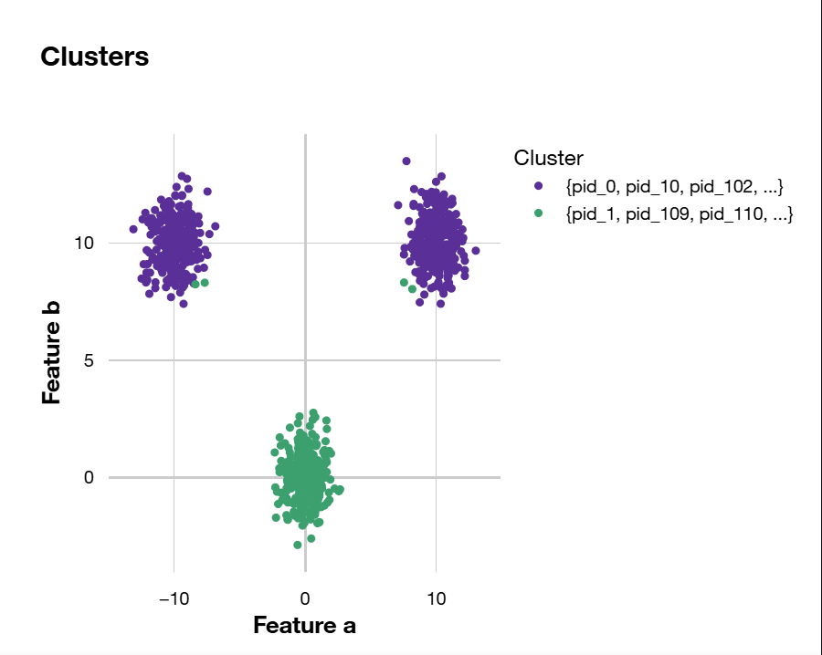{ width="380" }

---

## What is the difference between VxV and Instances x Variables (IxV) coclustering?

**Variable x Variable (VxV) Coclustering**

A co-clustering of variable x variable involves two or more dimensions, one for each variable.

Each variable is partitioned into intervals (for numerical variables) or groups of values (for categorical variables). The entire data space is then partitioned into a grid of co-clusters, resulting from the cross-product of the univariate partitions.

This results in density estimation models, assuming the density is constant within each co-cluster.

**Instances x Variables (IxV) Coclustering**

A co-clustering of instances x variables involves two dimensions:

- a dimension for the instances;
- a dimension for variable parts.

This second dimension corresponds to the set of variables describing each instance: these are the inner variables, specific to this dimension. Each inner variable is partitioned into a set of variable parts, which serve as the vocabulary used to describe each instance.

Thus, on one hand, we have a partition of the instances, and on the other hand, a partition of the variable parts. The co-clustering of instances x variables tends to group instances into clusters if they are described by the same variable parts.

This approach is analogous to text x word co-clustering, where texts are grouped into clusters if they are described by the same clusters of words.

**Takeaway**

- Variable x Variable Coclustering
    - Objective: joint density estimation
    - Suitable for datasets with two variables, or a few variables (typically less than 10)
    - Relevant for comparison with alternative clustering approaches on bivariate toy datasets
- IxV Coclustering
    - Objective: provide a meaningful summary of the dataset by describing each cluster of instances with representative variable parts
    - Similar to text x word coclustering, where each text cluster is characterized by its distribution over word clusters
    - Not suitable for datasets with very few variables; typically, two variables are too few
- Both methods focus on intrinsic correlations across variables, invariant to any monotonous transformation of the data
- Sometimes, in bivariate datasets, visually natural clusters can be explained solely by the marginal distributions of each variable, even when the variables are uncorrelated.
- These methods are particularly valuable when the data exhibits complex density structures or smooth transitions between dense regions, where traditional clustering may fail or be less meaningful.
- When the data is inherently cluster-based, both clustering and coclustering approaches tend to produce comparable results, especially focusing on dense coclusters.

---

## How do VxV and IxV coclustering compare on simple bivariate patterns?

To compare both approaches, datasets were generated using the `make_blobs` function from scikit-learn, creating isotropic Gaussian blobs with a standard deviation of 1. Each dataset contains 1,000 points for two numerical variables, `a` and `b`. Since Khiops coclustering models operate using the ranks of values rather than the raw values (making the results invariant to any monotonic transformation), rank-based scatterplots are also used to facilitate interpretation.

The patterns used in this study:

- **Circle**: blob centered at $[0, 0]$
- **TriangleU**: blobs centered at $[10, 10]$, $[-10, 10]$, $[0, 0]$
- **TriangleL**: blobs centered at $[10, 0]$, $[0, 10]$, $[0, 0]$
- **Diagonal**: blobs centered at $[-10, -10]$, $[0, 0]$, $[10, 10]$
- **NoisyDiagonal**: blobs centered at $[-3, -3]$, $[0, 0]$, $[3, 3]$, and a closer variant at $[-2, -2]$, $[0, 0]$, $[2, 2]$
- **Square**: blobs centered at $[10, 10]$, $[-10, -10]$, $[10, -10]$, $[-10, 10]$
- **Checkers**: blobs centered on a 10 x 10 grid, with centers at $[10i, 10j]$ for even $(i + j)$
- **NoisyCheckers**: blobs centered on a 10 x 10 grid, with centers at $[3i, 3j]$ for even $(i + j)$

**Circle**

Both approaches fail to detect any meaningful information: no explored model performs significantly better than the null model, which assumes independence between the two variables. This is consistent with the data distribution, based on a single isotropic Gaussian distribution, which can be explained by the marginal Gaussian distributions of `a` and `b`, with no correlation between the two variables.

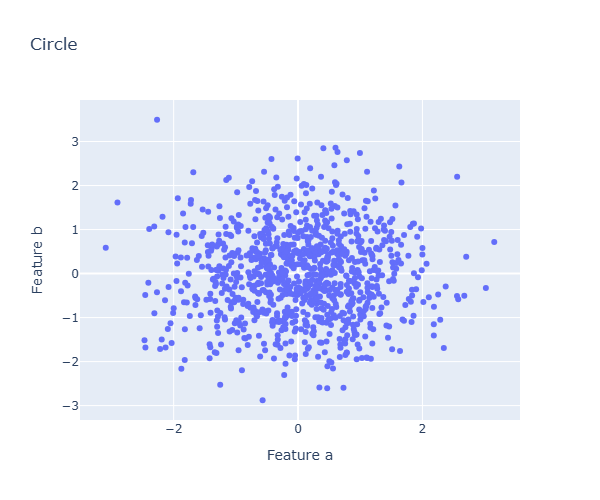{ width="380" }

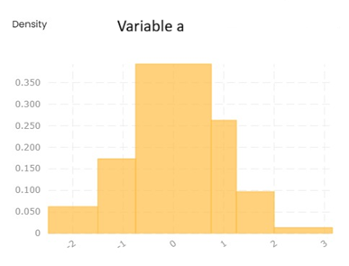{ width="380" }

**TriangleU**

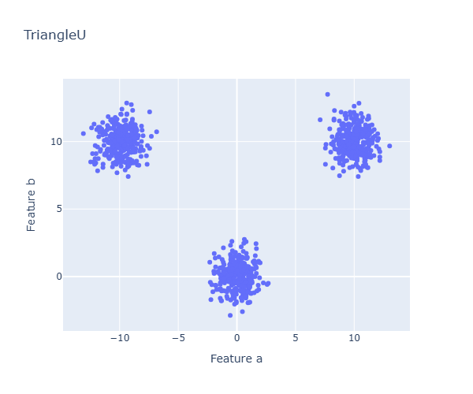{ width="380" }

The VxV approach correctly identifies the pattern consisting of three dense coclusters, with `a` partitioned into three intervals and `b` into two intervals. There is a good match between these dense coclusters and the natural clusters visually distinguishable in the scatterplots.

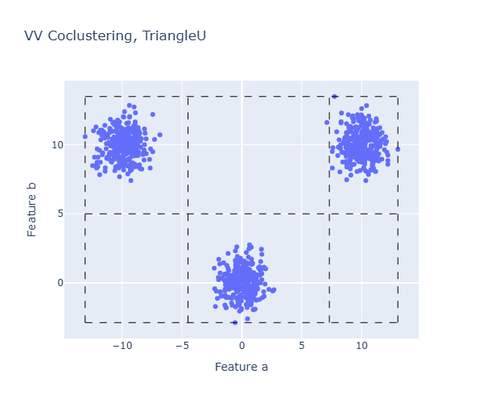{ width="380" }

Surprisingly, the IxV approach only retrieves two clusters of instances, with `a` partitioned into five intervals and `b` into three intervals.

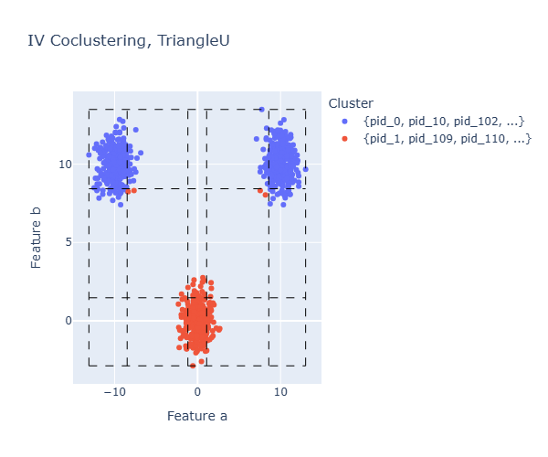{ width="380" }

The coclusters have a fundamentally different nature, as they relate to clusters of instances correlated with clusters of intervals. In fact, the two dense coclusters can be summarized as follows:

- First dense cocluster
    - Relates to either small or large values of `a` and large values of `b`
    - Corresponds to the two upper natural clusters of the displayed pattern
- Second dense cocluster
    - Relates to medium values of `a` and small values of `b`
    - Corresponds to the lower natural cluster of the displayed pattern

This dataset summary makes sense, but the fact that the two upper clusters are not separated is somewhat surprising.

**The limits of IxV coclustering.** In IxV coclustering, let's call inner variable the variables that describe each instance. An IxV coclustering can be viewed as a VxV coclustering related to two categorical variables:

- The first variable, `Id`, represents the instances, with one distinct value per instance: the instance identifier.
- The second variable, `VarPart`, represents the inner variable parts, with one value per part of each inner variable.
- There is one observation per instance and per inner variable.

In our previous example, we have:

- The `Id` variable with 1,000 distinct values.
- The `VarPart` variable with 8 distinct values, related to the five intervals of `a` and the three intervals of `b`.

Altogether, there are 2,000 observations, given the values of the two inner variables describing each instance. The objective of IxV coclustering is thus to partition a contingency table of size 1,000 x 8, containing a total of 2,000 observations, where each value of the `Id` variable has only two observations. The average expected frequency for each cell is approximately 2,000 / (1,000 * 8) ~ 0.25. For comparison, consider the chi-square test of independence applied to contingency tables: small expected frequencies lead to poor approximation of the chi-square distribution of the test statistic, and a general rule of thumb is to have at least 5 as the smallest expected frequency in each cell. In our case, the expected cell frequency of 0.25 is far too low to obtain an accurate model. The IxV coclustering obtained under these conditions cannot be highly accurate, given the tiny number of observations per instance. However, it still provides a meaningful summary of the data, making the best use of the available data while avoiding overfitting.

**The limits of VxV coclustering.** VxV coclustering yields accurate results in the case of two variables. It can be applied to datasets with more than two variables, but this introduces new challenges. Suppose you have `n` instances and `k` variables, each partitioned into only two parts. The VxV coclustering resulting from the cross-product of the univariate partitions contains \(2^k\) coclusters. For example, with `n` = 1,000 instances and `k` = 10 variables, we obtain \(2^{10} = 1024\) coclusters, meaning on average less than one observation per cocluster. With such sparsity, there is not enough data to produce a model better than the null model (a single cocluster). Overall, no meaningful information can be retrieved using a VxV coclustering model when the number of variables becomes too high, typically beyond around \(\log_2(n)\).

**TriangleL**

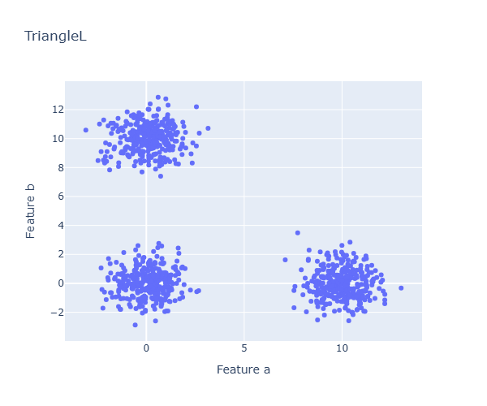{ width="380" }

As with the TriangleU pattern, the VxV approach correctly identifies the pattern consisting of three dense coclusters.

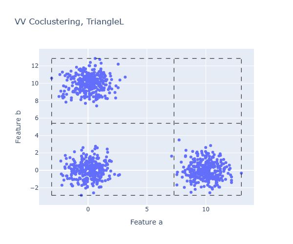{ width="380" }

Once again, the IxV approach only retrieves two clusters of instances, with `a` and `b` each partitioned into two intervals — of even poorer quality than before.

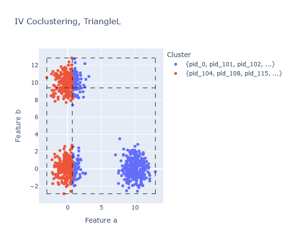{ width="380" }

Looking at the rank-based scatterplot, `a` is partitioned into two equal-frequency intervals, and `b` exploits quartiles, with the second interval corresponding to the last quartile. This aligns with the optimization algorithm, which explores a series of starting solutions with univariate preprocessing based on 2, 4, 8, ... equal-frequency partitions. Given this pattern and only two observations per instance, these raw results are probably the most accurate possible given the data and the limitations of the optimization algorithm. IxV models are definitely not suitable for datasets with only two variables.

**Diagonal**

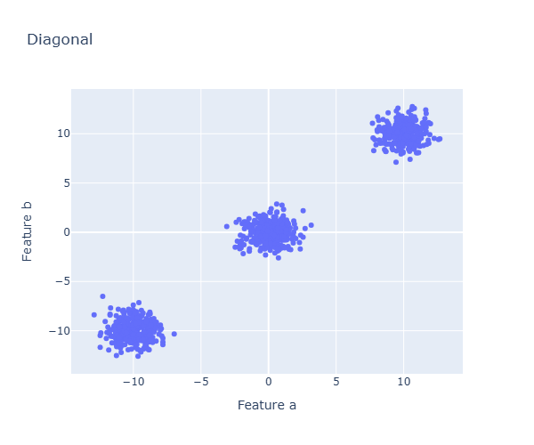{ width="380" }

This pattern consists of three diagonal blobs, with highly correlated variables. It is easier than the triangle patterns and is easily retrieved by both the VxV and IxV approaches.

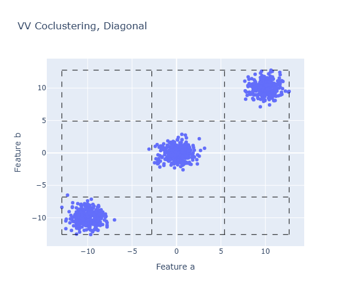{ width="380" }

**NoisyDiagonal**

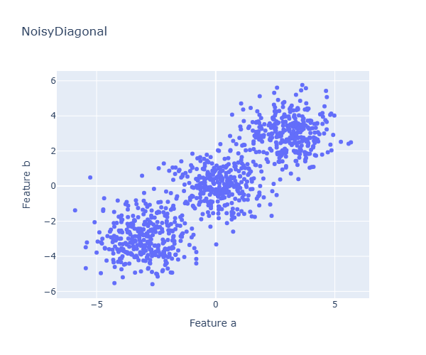{ width="380" }

This pattern is similar to the diagonal pattern, with closer blobs, and is also correctly identified by both approaches, though the clusters are less separable. With VxV coclustering, the three original blobs are primarily identified within the three dense diagonal coclusters, derived from the 25 coclusters resulting from a 5 x 5 intervals coclustering. Similarly, with IxV coclustering, three clusters of instances are identified, also based on a 5 x 5 partition of variables `a` and `b`. It is noteworthy that the objective of both coclustering approaches is to estimate piecewise constant densities within each cocluster; contrary to traditional clustering methods, clusters are only a by-product of the approach — only dense coclusters can be interpreted as traditional clusters.

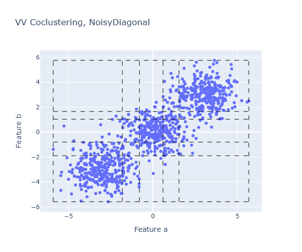{ width="380" }

**BlurredDiagonal**

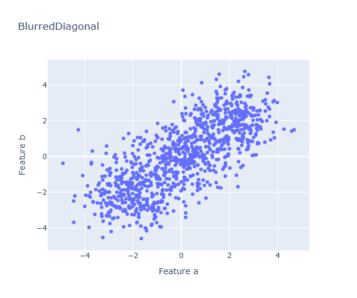{ width="380" }

The three blobs are even closer than before, resulting in visually indistinguishable clusters. The VxV coclustering correctly retrieves the joint density, although the connection between dense coclusters and clusters has disappeared. The IxV coclustering provides a rough estimation of the joint density, using two clusters of instances. Assuming data can be decomposed into distinct clusters is a strong hypothesis, which often does not hold for many real datasets where there is a smooth transition between dense regions; in such cases, traditional clustering methods may not be appropriate or effective, whereas density-based coclustering approaches aim to provide a summary of the dataset through piecewise constant estimation of the joint density, applicable regardless of the underlying distribution.

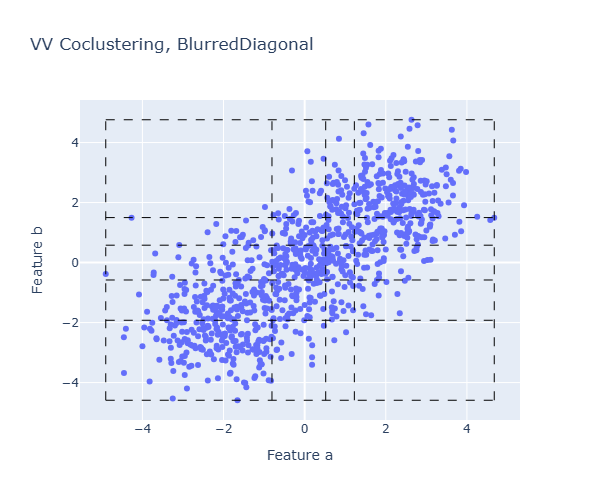{ width="380" }

**Square**

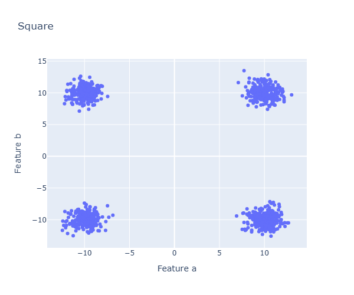{ width="380" }

Surprisingly, the four natural clusters, visually distinguishable in the scatterplots, are not retrieved by either the VxV or the IxV approaches. As shown in the rank-based scatterplot, the two variables `a` and `b` are perceived as independent, and no correlation pattern can be identified. The visual pattern can be much more simply explained by the marginal distributions of `a` and `b`, each having two modes, resulting in a bivariate scatterplot that appears as four clusters. It is important to remember that coclustering models seek correlation patterns that are invariant to any monotonic transformation of the data; therefore, some visual bivariate patterns may appear due to strong patterns in the marginal distributions of the variables, even when the variables are uncorrelated.

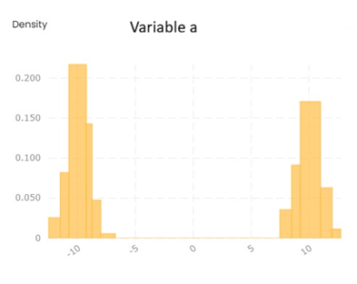{ width="380" }

**Checkers**

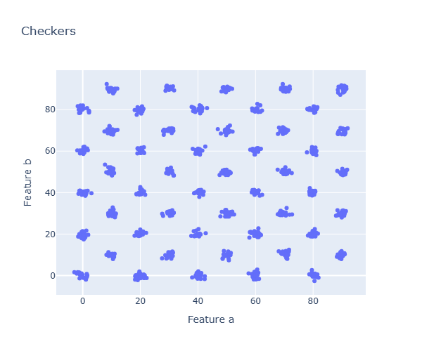{ width="380" }

This complex pattern is correctly retrieved using the VxV approach. As expected, the IxV approach cannot retrieve such a complex pattern given the very few observations per instance.

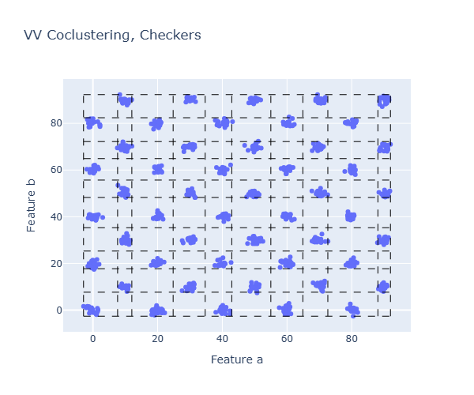{ width="380" }

**NoisyCheckers**

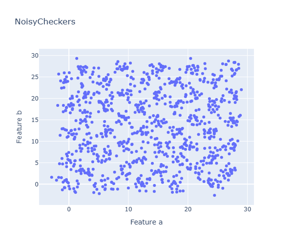{ width="380" }

This complex and noisy pattern is also correctly retrieved using the VxV approach — remarkable, since the underlying pattern is hardly visually distinguishable in the scatterplots. This is close to the limit of reliable detection of correlation patterns, especially since the method is regularized against overfitting, preventing it from retrieving patterns in the case of independent variables. As expected, the IxV approach cannot retrieve such a complex pattern given the very few observations per instance.

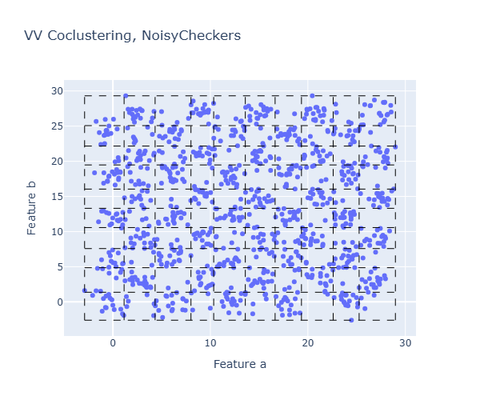{ width="380" }

---

## Why does VxV coclustering become sparse in higher dimensions, and what protects IxV?

As shown in the TriangleU pattern above, when considering a larger number of variables (say ~10), the cross-product of variable partitions grows exponentially, leading to extreme sparsity for VxV coclustering. IxV coclustering does not implicitly face the same combinatorial explosion, for the following reasons.

**Data in a k-dimensional space.** When data is defined in a k-dimensional space (e.g., numerical space), if the space is fully populated, nothing can be learned.

Extreme cases:

- k independent variables: both coclustering approaches, VxV and IxV, result in the null model because the variables are independent.
- k identical variables: the dependency pattern is straightforward, as the data lies on a manifold of dimension 1.
    - The VxV approach describes the data in its full k-dimensional space.
    - The IxV approach seeks clusters located on the data manifold, summarizing them by partitioning each dimension.

**The case of k identical variables — VxV Coclustering Approach.** There are `n` observations in `k` dimensions. Describing the position of each observation in the k-dimensional space is costly: splitting each dimension into `I` equal intervals results in \(I^k\) coclustering cells. Describing `n` instances then requires a multinomial distribution with \(I^k\) outcomes, with zero probability everywhere except for `I` outcomes. This limits the precision of data summarization, especially as `k` increases (curse of dimensionality).

**The case of k identical variables — IxV Coclustering Approach.** There are `n * k` observations, each represented as a pair (instance, variable value) in 2D space. Splitting each dimension into `I` parts results in `I` clusters of instances, `I` clusters of variable parts, and a multinomial distribution with \(I^2\) outcomes to describe the data, with zero probability everywhere except for `I` outcomes. This approach effectively captures strong dependencies across variables in a parsimonious way.

**Experimental illustration.** Datasets with 2, 4, 8 numerical variables uniformly distributed on [0, 1] were generated, with sizes from 2 to 1024 (powers of two), each experiment repeated 10 times.

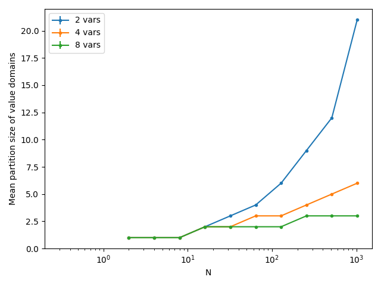{ width="380" }

Synthesis:

- When data is small, the null model (single part per variable) is optimal.
- With more data, models improve, but the number of parts per variable increases slowly.
- For 8 variables, at least 128 instances are needed to exploit all variables.
- The mean number of parts per variable increases with data size but suffers from the curse of dimensionality (up to 20 parts for 2 variables, but only 3 for 8 variables).

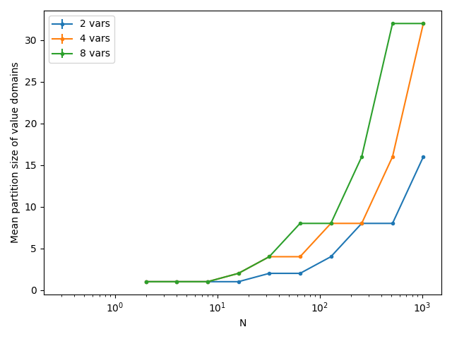{ width="380" }

Synthesis:

- When data is small, the null model (single part per variable and single cluster per dimension) is optimal.
- Performs less accurately with only 2 variables (only 2 observations per instance), and poorly in the case of more complex patterns.
- With 1,000 instances, it builds more than 30 parts per variable, more than ten times the VxV approach for the same number of variables.

**Summary.** VxV coclustering describes the data manifold in k-dimensional space; the data size must grow exponentially with `k` due to the curse of dimensionality, so it is suitable for small dimensions. IxV coclustering focuses on the intrinsic dimension of the data manifold, and is suitable for manifolds of intrinsic dimension far less than `k`, summarizing it via instance clusters and variable parts. Estimating joint density remains challenging: if the intrinsic dimension of the manifold is too high, nothing can be effectively learned, regardless of the modeling approach.

---

## What does an IxV coclustering analysis look like on a real dataset (Iris)?

The Iris dataset provides a concrete, real-data illustration of IxV coclustering.

**Iris dataset.** The Iris dataset consists of 150 instances of flowers, described by one categorical variable, `Class` ({Iris-setosa}, {Iris-versicolor}, {Iris-virginica}), and four numerical variables: `PetalLength`, `PetalWidth`, `SepalLength`, `SepalWidth`.

**Partition of the variables** used in the IxV coclustering:

- `Class` (categorical, 3 groups): {Iris-setosa}, {Iris-versicolor}, {Iris-virginica} — 50, 50, 50
- `PetalLength` (numerical, 3 intervals): ]-inf, 2.4], ]2.4, 4.75], ]4.75, +inf[ — 50, 55, 45
- `PetalWidth` (numerical, 3 intervals): ]-inf, 0.8], ]0.8, 1.75], ]1.75, +inf[ — 50, 46, 54
- `SepalLength` (numerical, 3 intervals): ]-inf, 5.45], ]5.45, 6.85], ]6.85, +inf[ — 52, 17, 81
- `SepalWidth` (numerical, 2 intervals): ]-inf, 3.35], ]3.35, +inf[ — 36, 114

Given these partitions, each Iris instance can be considered as a text document, described by "words" based on variable parts (one observation per instance and per inner variable, so 150 * 5 = 750 observations in total).

**Clusters of instances and of variable parts.** There are three clusters of instances (`Ci1`, `Ci2`, `Ci3`, 50 instances each), and four clusters of variable parts (`Cvp1` to `Cvp4`). The 750 observations are distributed across the resulting 3 x 4 coclustering matrix.

**Interpretation using dense coclusters.** The coclustering matrix exhibits significant contrasts compared to the case where instances and variable parts are independent (visualized with red for dense coclusters above the expected frequency under independence, blue below, white close to expected). In the Iris dataset, there is one dense cocluster per cluster of instances, which facilitates interpretation:

- `Ci1` (50 instances) is over-represented for: `Class` {Iris-versicolor}, `PetalLength` ]2.4, 4.75], `PetalWidth` ]0.8, 1.75]
- `Ci2` (50 instances) is over-represented for: `Class` {Iris-virginica}, `PetalLength` ]4.75, +inf[, `PetalWidth` ]1.75, +inf[, `SepalLength` ]6.85, +inf[
- `Ci3` (50 instances) is over-represented for: `Class` {Iris-setosa}, `PetalLength` ]-inf, 2.4], `PetalWidth` ]-inf, 0.8], `SepalLength` ]-inf, 5.45], `SepalWidth` ]3.35, +inf[

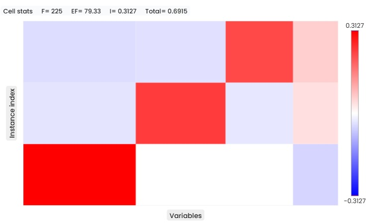{ width="380" }

Overall, the Iris dataset can be summarized using three clusters, focusing mainly on the variables `Class`, `PetalLength`, and `PetalWidth`. The first cluster mainly consists of Iris-versicolor flowers with medium-sized petals, the second of Iris-virginica flowers with large petals, and the third of Iris-setosa flowers with small petals. `SepalLength` and `SepalWidth` are less important for characterizing the clusters, as also shown by scatter plots comparing the most explanatory variables (`PetalWidth`, `PetalLength`) versus the least explanatory ones (`SepalWidth`, `SepalLength`).

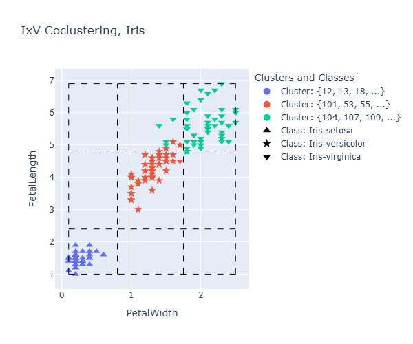{ width="380" }

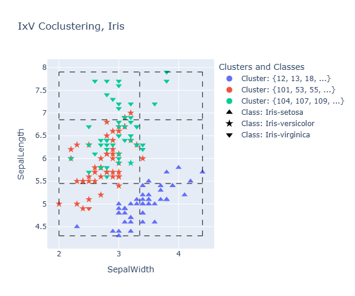{ width="380" }

**Relation with VxV coclustering.** In the bivariate case, VxV coclustering provides a reliable and accurate joint density estimator; for the Iris dataset, some VxV results use up to 4 parts per variable. Conversely, IxV coclustering is not suitable when only two variables are involved, as it results in only two observations per instance — insufficient for accurate density estimation, and IxV systematically uses fewer parts in that case.

With more variables, the IxV coclustering approach offers a good summary of the dataset, as demonstrated in this exploratory study, while VxV coclustering suffers from sparsity as the number of variables increases (for example, with only two parts per variable and `k` variables, VxV results in \(2^k\) coclusters, and visualization tools become much more difficult to use beyond two dimensions). For the Iris dataset, VxV coclustering results in a 3 x 3 x 3 x 2 x 1 cocluster grid (with `SepalWidth` partitioned into a single interval), compared to the IxV approach building 3 clusters of instances distributed across 4 clusters of variable parts, based on 3, 3, 3, 3, and 2 parts per variable — offering a finer partitioning of the descriptive variables.

**Key takeaways.** VxV coclustering provides detailed joint density estimates, but the quality of the estimation decreases with data sparsity as the number of variables increases, and the usefulness of visualization tools diminishes with higher dimensions. IxV coclustering offers a robust summary of datasets, especially when there are a sufficient number of variables, but it is not suitable for precise density estimation in bivariate cases.

## Source

*Source: [discussion #935](https://github.com/orgs/KhiopsML/discussions/935)*
