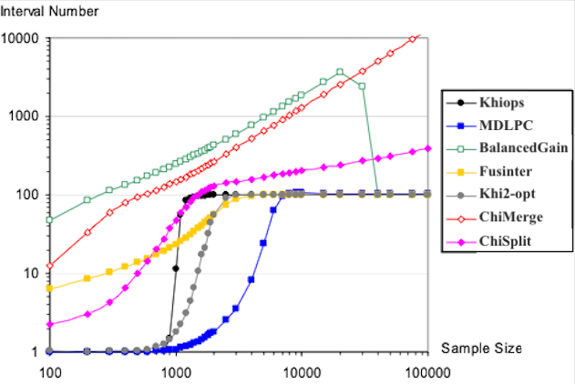

# Fundamentals of Modeling

This page centralizes key modeling questions frequently asked by the Khiops community.

!!! question "Have a question or request?"
    - **Ask in [GitHub Discussions](https://github.com/orgs/KhiopsML/discussions)**
    - **Report bugs or request product changes in the [Khiops repository issues](https://github.com/KhiopsML/khiops/issues)**

## Index of questions

1. [Why is it better to provide raw data to Khiops instead of preprocessed or encoded data?](#why-is-it-better-to-provide-raw-data-to-khiops-instead-of-preprocessed-or-encoded-data)
2. [Since Khiops does not have hyperparameters, how can I manage overfitting?](#since-khiops-does-not-have-hyperparameters-how-can-i-manage-overfitting)
3. [How does Khiops handle datasets with imbalanced classes?](#how-does-khiops-handle-datasets-with-imbalanced-classes)
4. [How does Khiops handle target value grouping, and why is it useful for classification tasks?](#how-does-khiops-handle-target-value-grouping-and-why-is-it-useful-for-classification-tasks)

---

## Why is it better to provide raw data to Khiops instead of preprocessed or encoded data?

Khiops is specifically designed to work directly with raw data, minimizing the need for manual preprocessing. In fact, it is strongly recommended to avoid preparing your data to prevent loss of information, whether it concerns variable encoding, missing values, or data flattening (propositionalization).

Khiops employs the MODL formalism, based on the MDL (Minimum Description Length) principle, to encode variables optimally:

- Categorical variables: Khiops automatically groups values into clusters based on their correlation with the target variable.
- Numerical variables: Khiops uses discretization to partition values into intervals, ensuring that each interval represents a meaningful range of data relative to the target variable.

This optimal encoding is inherently tied to the modeling process and adapts dynamically to the data, making manual encoding methods unnecessary (and less effective!).

**Example: Why Encoding Isn't Necessary**

Imagine a dataset with a categorical variable "city" containing hundreds of unique values. In a traditional workflow:

- One-hot encoding "city" would create hundreds of binary columns, resulting in a sparse and computationally expensive matrix.
- Frequency encoding might lose context, treating "city" as independent from the target variable.

With Khiops:

- "City" is automatically grouped into meaningful clusters (e.g., based on correlations with the target variable's distribution), preserving interpretability and maximizing predictive power.

Similarly, for a numerical variable "age", Khiops would:

- Dynamically determine intervals (e.g., [0-18], [19-35], [36-50], [50-97]) based on the correlation between "age" and the target variable.
- Avoid creating unnecessary intervals, ensuring a balance between simplicity and accuracy.

**Handling Missing Values**

Khiops also treats missing values as part of the data, recognizing that they can carry meaningful information. Missing values are not discarded or imputed arbitrarily. Instead, Khiops assigns them to their own group or interval if they are informative for the target variable. This approach ensures that missing data is leveraged effectively, rather than being treated as noise or ignored outright.

**Scientific Basis**

Khiops' preprocessing capabilities are grounded in rigorous statistical principles. The MODL formalism:

- Automatically balances model complexity and predictive information to prevent overfitting.
- Dynamically adapts to the structure of the data, selecting groupings or intervals only when they provide significant predictive value.
- Avoids arbitrary preprocessing decisions by tying encoding directly to the learning objective.

For more details and examples, see this [notebook tutorial](https://khiops.org/advanced/Notebooks/No_data_Cleaning/) or read about [Optimal Encoding](https://khiops.org/learn/preprocessing/). This approach ensures that manual preprocessing is unnecessary (in fact, it is often counterproductive).

*Source: [discussion #510](https://github.com/orgs/KhiopsML/discussions/510)*

---

## Since Khiops does not have hyperparameters, how can I manage overfitting?

Khiops avoids overfitting through its core design, which is based on the MDL (Minimum Description Length) principle. This formalism balances the complexity of a model with its ability to explain the data, making Khiops particularly robust.

Here's why Khiops excels at avoiding overfitting:

- Statistically significant patterns only: Khiops selects only patterns supported by sufficient data, automatically rejecting noise.
- No arbitrary parameters: by avoiding user-defined hyperparameters, Khiops streamlines workflows and reduces the risk of overfitting caused by over-tuning.

**How Khiops achieves this.** Unlike standard models that rely on regularization parameters to control the trade-off between complexity and generalization, Khiops achieves this balance intrinsically through a mechanism rooted in information theory. [Our original formalism](https://khiops.org/learn/modl/) penalizes unnecessary complexity by favoring models that explain the data as simply as possible. This ensures that every variable, interval, or aggregate is justified by the amount of information it provides, without requiring external tuning. For instance:

- A complex derived feature from multi-table data is included only if it significantly improves the model.
- Similarly, for the encoding of a variable, an interval or a group will only be added if it provides sufficient information to justify its inclusion.

Khiops naturally handles noisy datasets by ignoring irrelevant patterns:

- When enough meaningful data is present, noise doesn't affect the model (even if highly present).
- If the dataset contains too much noise and insufficient data, Khiops will prudently return one single interval.

While this cautious behavior is a key advantage, it also means that Khiops performs better and better with more data (building powerful models requires enough data to justify more complex constructs).

**Illustration**

The graph below shows how Khiops' MODL approach handles the discretization of the "crenel pattern" Class = Sign(Sinus(100πx)), with 10% misclassified instances (as described in [Boulle, 2006](http://www.marc-boulle.fr/publications/BoulleML06.pdf), Figure 18). The x-axis represents the number of instances available in the dataset, while the y-axis shows the number of intervals created by the discretization process. This example is particularly illustrative because it demonstrates how MODL balances complexity and informativity, even in the presence of noise, while avoiding overfitting.

{ width="500" }

- Insufficient or noisy data: When there are too few instances or excessive noise, Khiops keeps only one interval, avoiding unnecessary complexity (such numerical variables will be ignored in the final model as they are considered uninformative).
- Optimal intervals: As more data becomes available, Khiops adjusts dynamically, creating an optimal number of intervals to reflect the data's structure.
- No overfitting: The number of intervals does not grow indefinitely. In this example, Khiops concludes that 100 intervals are sufficient. Adding more data does not produce spurious intervals, which prevents overfitting.

*Source: [discussion #488](https://github.com/orgs/KhiopsML/discussions/488)*

---

## How does Khiops handle datasets with imbalanced classes?

Khiops is robust to class imbalance, so rebalancing techniques are generally not required.

However, class imbalance often necessitates collecting large amounts of data to gather sufficient information about the minority class. This can result in very large datasets with billions of records and significantly longer training times. In such cases, rebalancing the dataset can be beneficial.

The standard approach is to retain all examples from the minority class and undersample the majority class. This strategy reduces computation time while preserving critical information. Never oversample the minority class, as duplicate instances lead to significant overfitting.

**Best practices for rebalancing:**

- Retain all individuals in the minority class.
- Undersample the majority class only as much as necessary to fit within the available computational resources, ensuring sufficient information is retained for training. In most cases, having up to 100 times more examples than the minority class is sufficient.

**Impact on model performance and scores:**

- Score ranking: the ranking of scores (used for ranking or thresholding) on a non-rebalanced test set remains consistent. Metrics such as ROC curves and AUC are minimally impacted.
- Predicted probabilities are completely skewed and unusable because the training set has an artificially higher representation of the minority class. This is typically not an issue, as most applications prioritize score rankings over probabilities.
- Calibration: if accurate probability estimates are required, apply a calibration method to adjust the predicted probabilities.

*Source: [discussion #474](https://github.com/orgs/KhiopsML/discussions/474)*

---

## How does Khiops handle target value grouping, and why is it useful for classification tasks?

Khiops' target value grouping functionality is designed to address challenges when dealing with a large number of target classes. When the number of classes is high, it can be difficult to discriminate between all classes, especially with an insufficient number of instances (i.e. with sparse input data).

To address this, Khiops reduces data sparsity by grouping target classes. In practice:

1. **Univariate preprocessing:** target class groupings occur during the preprocessing step. Khiops determines the optimal grouping of target values for each variable based on the correlations between the data. The grouped classes are treated as distinguishable from other groups, but classes within the same group are considered indistinguishable.
2. **Class-level predictions:** the Selective Naive Bayes (SNB) predictor uses the univariate preparations to make precise, class-by-class predictions. While groupings simplify univariate preprocessing, the final model still predicts probabilities for individual classes, not groups.

**Example: grouped target probabilities.** In the following example, the explanatory variable `x` has two distinct values {v1, v2}, and the target variable `y` has eight classes {A, B, C, D, E, F, G, H}, which are clustered into three groups during preprocessing.

For `x = v1`:

- P(y ∈ {A, B} | x = v1) = 0.1
- P(y ∈ {C, D, E, F} | x = v1) = 0.75
- P(y ∈ {G, H} | x = v1) = 0.15

For `x = v2`:

- P(y ∈ {A, B} | x = v2) = 0.6
- P(y ∈ {C, D, E, F} | x = v2) = 0.1
- P(y ∈ {G, H} | x = v2) = 0.3

In this example, the classifier identifies that distinguishing between groups ({A, B}, {C, D, E, F}, {G, H}) is feasible, but it cannot reliably separate classes within the same group during univariate preparation.

Because this grouping is done independently for each explanatory variable, a different grouping could occur for another explanatory variable `z`. For example, for `z = v0`:

- P(y ∈ {A, D, H} | z = v0) = 0.6
- P(y ∈ {B, C, E, F, G} | z = v0) = 0.4

The SNB predictor later uses this variable-specific grouped information from all explanatory variables to make precise, individual class predictions.

**Additional insights.** In some cases, it may be beneficial to globally reduce the number of target classes for the entire problem. The univariate preparation reports generated by Khiops can help data miners identify frequently occurring groupings, guiding decisions about merging or removing target classes altogether.

*Source: [discussion #509](https://github.com/orgs/KhiopsML/discussions/509)*
