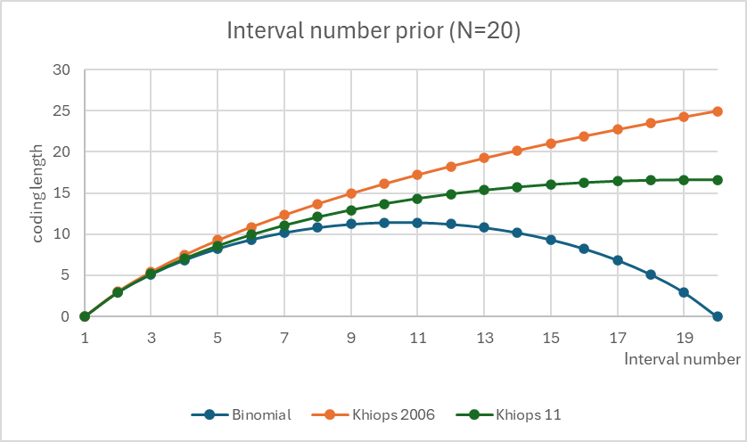

# Preprocessing and Encoding

This page centralizes recurring questions about variable preparation and encoding behavior in Khiops.

!!! question "Have a question or request?"
    - **Ask in [GitHub Discussions](https://github.com/orgs/KhiopsML/discussions)**
    - **Report bugs or request product changes in the [Khiops repository issues](https://github.com/KhiopsML/khiops/issues)**

## Index of questions

1. [Does Khiops automatically apply log, square, or other transformations during variable encoding?](#does-khiops-automatically-apply-log-square-or-other-transformations-during-variable-encoding)
2. [Discretization cost and number of interval partitions](#discretization-cost-and-number-of-interval-partitions)

---

## Does Khiops automatically apply log, square, or other transformations during variable encoding?

This question was raised during a presentation of Khiops.

No, Khiops does not automatically apply transformations such as logarithm, square, or square root based on skewness or other distributional characteristics. Instead, it relies on a non-parametric, information-theoretic discretization approach based on value ranks, making explicit variable transformations unnecessary.

**Why Are Such Transformations Unnecessary in Khiops?**

Khiops employs the MODL (Minimum Optimized Description Length) discretization method, which ensures:

- Optimal Binning via Information Theory: The MODL criterion selects the best discretization scheme with the optimal number of intervals and bounds, without requiring parametric assumptions. It directly adapts to the data's intrinsic structure.
- Invariance to Monotonic Transformations: Khiops encodes numerical variables using value ranks rather than raw values. Thus, monotonic transformations (log, square root, exponential, etc.) have no effect on the discretization outcome.
- Robustness to Skewness and Outliers: Unlike parametric approaches, Khiops does not rely on moments (mean, variance, skewness) or density estimation, making it naturally resilient to skewed distributions and outliers.
- No Need for Normalization or Standardization: Since Khiops operates on ranks rather than raw values, common preprocessing steps like Z-score normalization (subtracting the mean and dividing by the standard deviation) or standardization to 0-1 range, are unnecessary. Feature scaling does not impact the learning process.

**Conclusion**

Transformations aimed at normalizing distributions or correcting skewness are unnecessary in Khiops. Its MODL-based encoding automatically adapts to the data, ensuring optimal variable encoding without manual intervention.

*Source: [discussion #634](https://github.com/orgs/KhiopsML/discussions/634)*

---

## Discretization cost and number of interval partitions

Khiops' interval discretization cost contains a term for the number of possible partitions of N ordered elements into I intervals, namely \(\binom{N+I-1}{I-1}\). This number includes partitions where intervals may be empty, but to my understanding these partitions are never explored in the optimization process. Why not use the number of non-empty interval partitions \(\binom{N-1}{I-1}\)?

**Parsimonious Prior for Interval Number in Supervised Discretization**

**Objective**

The prior for model selection regarding the number of discretization intervals was designed with the following requirements:

- Parameter-free, being an objective rather than a subjective prior
- Parsimonious
- As flat as possible, allowing the data to speak freely
- Monotonically decreasing with respect to the number of intervals, favoring smaller numbers of intervals
- Monotonically consistent with respect to the total number of instances, to ensure consistent preferences across varying sample sizes

**Limits of the Proposed Prior**

The binomial prior based on \(\binom{N-1}{I-1}\) for choosing I-1 cut-points among N-1 possible cut-points is an "intuitive" prior, but it does not meet these requirements regarding the monotonicity constraints.

As \(\binom{N-1}{I-1} = \binom{N-1}{N-I}\), the prior probability increases with I for I≥N/2, and the prior probability for the null model (I=1) is exactly the same as for the overfitting model (I=N), with as many intervals as instances.

**Interest of Khiops' Prior (2006)**

Khiops' original prior introduced in [1] is based on \(\binom{N+I-1}{I-1}\). It is inspired by the prior distribution of the Ni instances per interval over J classes, which exploits the number of possible multinomial parameters \(\binom{N_i+J-1}{J-1}\).

**New Khiops' Prior**

A new, more parsimonious prior, not yet published, is now used in the latest versions of Khiops, for the part of the criterion related to choosing interval cut-points. It is inspired by the problem of selecting a subset of variables from a large, potentially infinite number of variables [2] (end of Section 2.1), introduced to deal with automatic feature construction from multi-table databases.

The formula in the case of selecting I-1 cut-points among N-1 potential cut-points is:

$$(I-1)! (N-1)^{I-1}$$

It meets all the requirements and is more parsimonious than Khiops' initial prior.

**Experiments**

Below are the results of some experiments showing the coding length for each prior (coding length = opposite of the logarithm of prior probabilities), for N=20 and N=1000:

- the proposed prior is parsimonious but does not meet the requirements,
- both Khiops priors meet all the requirements and are as parsimonious as the proposed prior for small numbers of intervals, up to I≈0.15N,
- the latest Khiops prior is by far more parsimonious than the initial one for larger numbers of intervals.

{ width="550" }

**References**

[1] M. Boullé. MODL: a Bayes optimal discretization method for continuous attributes. Machine Learning, 65(1):131–165, 2006.
[2] M. Boullé, C. Charnay, N. Lachiche. A scalable robust and automatic propositionalization approach for Bayesian classification of large mixed numerical and categorical data. Machine Learning, 108(2):229–266, 2019.

---

**Follow-up question:** While I see that the current cost is flatter I don't see why it is more parsimonious. In the graphs I see that for large I the coding length is smaller, so it penalizes less than the original one?

Actually, the new Khiops prior is almost the same as the initial one and as the binomial prior for small I. As mentioned, for large I, its coding length is smaller, and it penalizes less than the original one. This part of the total coding length is therefore smaller.

In the MDL approach, the purpose is to minimize the total coding length:

$$CL(Model) + CL(Data|Model)$$

In the problem of supervised discretization (as with all problems tackled using the MODL approach exploited in Khiops), the data part of the coding length exploits multinomial distributions within each elementary part (interval, value group, ...), using a two-part enumerative code:

$$\log \binom{N_i+J-1}{J-1} + \log \frac{N_i!}{N_{i1}! N_{i2}! \ldots N_{iJ}!}$$

This code exhibits strong theoretical guarantees of optimality [1].

Since the data part of the code is optimal, any improvement with respect to the model part of the code is beneficial, leading to better model selection.

!!! note
    This does not mean that the selected discretization models will be more parsimonious in terms of number of intervals. It means that they will be more parsimonious in terms of total coding length, and thus constitute better models, achieving a better trade-off between:

    - a good fit of the data
    - overfitting avoidance

[1] M. Boullé, F. Clérot, C. Hue. Revisiting enumerative two-part crude MDL for Bernoulli and multinomial distributions (Extended version). Research Report arXiv, abs/1608.05522, 2016.

*Source: [discussion #993](https://github.com/orgs/KhiopsML/discussions/993)*
