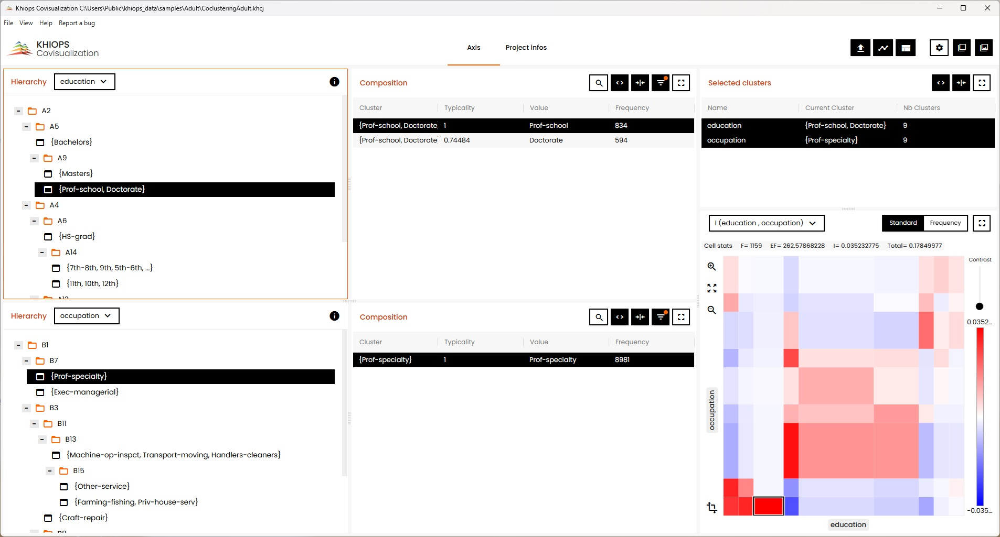
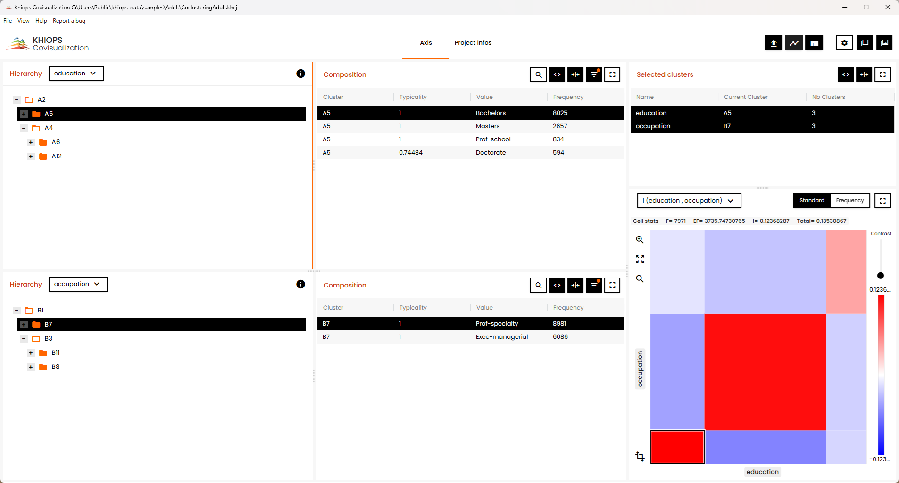
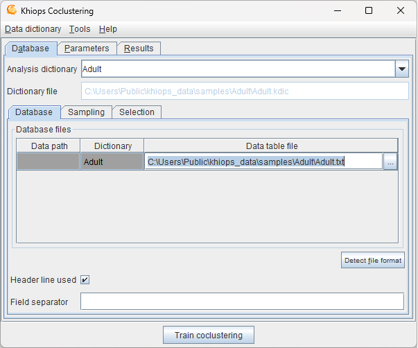
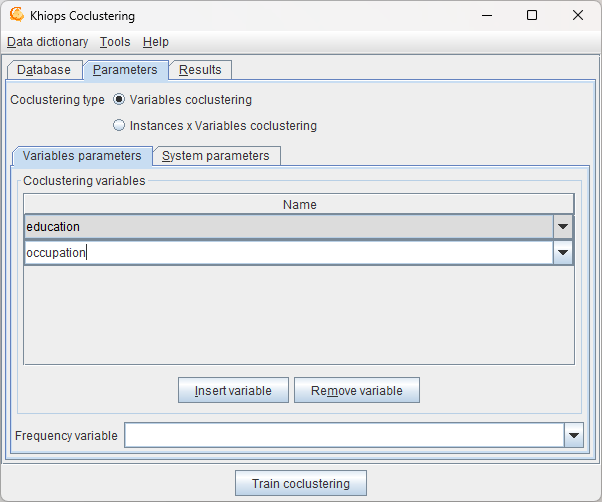
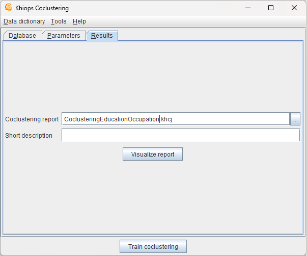
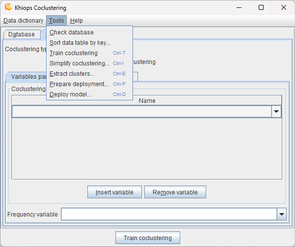
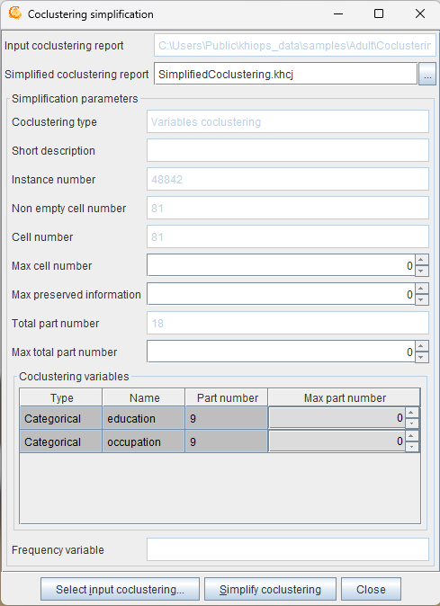
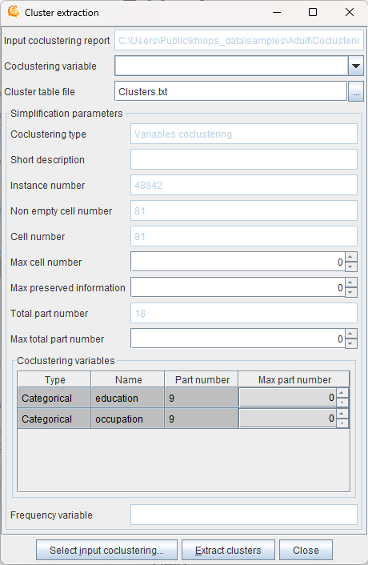
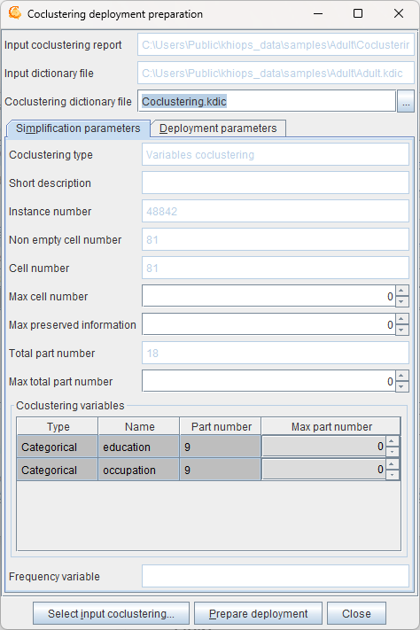
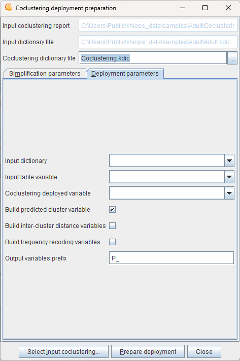

---
hide:
  - navigation
---
This documentation describes the Khiops Coclustering GUI Application, which allows users to access Khiops Coclustering functionalities 
without writing any code. For interface elements common to Khiops GUI, the user is referred to the [`Khiops`](khiops.md)  documentation.

Khiops Coclustering aims at detecting highly informative patterns by the mean of hierarchical coclustering models, suitable for the task of explanatory analysis. This novel type of statistical analysis provides insights in many domains, such as:

  - Market analysis : clusters of customers versus clusters of products,

  - Web log analysis : clusters of cookies versus clusters of web pages,

  - Graph analysis : clusters of source versus target nodes,

  - Temporal graph analysis : clusters of source versus target nodes versus temporal intervals,

  - Curve corpus analysis : clusters of curves versus interval of X versus intervals of Y,

  - Text corpus analysis : clusters of texts versus clusters of words,
  
  - ...

A coclustering model summarizes the correlation between two or more variables by simultaneously partitioning the values of each variable, into groups of values in the categorical case and into intervals in the numerical case. The cross-product of these univariate partitions forms a multivariate partition, called data grid. By counting the frequencies in the multivariate parts (called cells) of this data grid, we obtain a nonparametric estimator of the joint density of the variables. Each partition is organized into hierarchies, so as to enable an exploratory analysis of the results at any grain level.

For illustration purpose, let us consider the correlation between the education and occupation variables of the Adult database (coming from the US Census Bureau). This database contains about 50,000 instances, with 14 values of occupation and 16 values of education.

Applying the **Khiops Coclustering** back-end tool, we obtain a 10\*9 fine-grained data grid. The [`Khiops Covisualization`](covisualization.md) tool enables the exploration of the correlation between the two variables. Displaying the mutual information highlights the over-represented cells (in red), i.e. cells with a frequency higher than expected in case of independent variables, and the under-represented cells (in blue). In the screenshot below, the selected cell indicates a high concentration of education *Prof-school* or *Doctorate* jointly with occupation *Prof-specialty*.

Folding down both hierarchies allows to obtain a simplified 3\*3 data grid which provides a quick summary with an easier interpretation.

In the screenshot below, the selected cell indicates a high concentration of education *Bachelor*, *Master*, *Prof-school* or *Doctorate* jointly with occupation *Exec-managerial* or *Prof-specialty*.

Beyond the illustrative example, this kind of analysis provides insightful summaries when applied to databases with millions of instances and variables with thousands of values.

**Khiops Coclustering** is the back-end tool for training and managing coclustering models.

The main functionalities are training a coclustering, simplifying a coclustering by applying granularity constraints and extracting clusters indices.

## Quick start

### Fast path

Build a coclustering report :

- Enter the name of the input file in the **Data table file** field of the **Database** pane,

- Insert the coclustering variables to analyze in the **Parameters** pane,

- Click on the **Train coclustering** button,

- Click on the **Visualize results** button in the **Results** pane.

### What is a data dictionary ?

A data dictionary allows you to define the type and name of variables in a data file, with additional key features:

- selecting variables to include or exclude from analysis,

- organizing data within a multi-table schema, such as a star schema or snowflake schema,
    
- creating new variables through derivation rules,

- storing data transformation workflows derived from machine learning model outputs,

- facilitating data transformation of the input database via the **Deploy model** feature, which includes:
   
    - deploying prediction scores using a prediction model,

    - recoding data with a recoder model,
     
    - generating interpretation indicators with an interpreter model,
     
    - deploying or reinforcing scores using a reinforcer model,
     
    - ...

For comprehensive information on dictionaries, refer to [`Start Using Dictionaries`](../tutorials/kdic_intro.md).

A dictionary file contains one or several dictionaries; details about their format can be found in [`Dictionary files`](../api-docs/kdic/dictionary-files.md).

### Standard path 

**Manage data dictionaries**

- Click on the **Manage dictionaries** sub-menu of the **Data dictionary** menu 
  A dialog box appears, which allows you to build a dictionary from a data file and edit the dictionaries of a dictionary file. 

**Use a data dictionary**

- Click on the **Open** sub-menu of the **Data dictionary** menu 

- Choose the dictionary file (extentions .kdic) 

- Enter the name the dictionary in the **Analysis dictionary** field of the **Database** pane 

## Database

**Analysis dictionary**: name of dictionary to analyse. Automatically generated from data table file if not specified.

***Dictionary file***: (read-only) name of the current dictionary file.

**Database**: see [`Database`](khiops.md#database) in Khiops tool.

**Sampling**: see [`Sampling`](khiops.md#sampling) in Khiops tool.

**Selection**: see [`Selection`](khiops.md#selection) in Khiops tool.

## Parameters

### Coclustering parameters

**Coclustering type**: type of coclustering among:

- **Variables coclustering**: based on the coclustering variables parameters,

- **Instances * Variables coclustering**: based on an identifier in one dimension, and all numerical and categorical variables in the other dimension. 
If an identifier variable of the records is present in the data, it must be a key variable of the input dictionary and the data must be sorted and unique according to this key.
If no identifier exists, such a variable is automatically created.
For the 'variables' dimension of the coclustering, all numerical and categorical variables used in the input dictionary are employed.

**Coclustering variables**: list of input variables for the variables coclustering model.

There must be at least two numerical or categorical input coclustering variables. Up to ten variables are allowed for variable coclustering.

**Frequency variable**: optional field, only for variables coclustering. Name of a variable that contains the frequency of the records. Using the frequency variable is equivalent to duplicating the records in the input database, where the number of duplicates per record is equal to the frequency.

### System parameters

See [`System parameters`](khiops.md#system-parameters) in Khiops tool.

## Results

**Coclustering report**: (default: Coclustering.khcj). Name of the coclustering file in JSON format.
By default, the result files are stored in the train database directory, unless an absolute path is specified.
The JSON file is useful to inspect the coclustering results from any external tool.

**Short description**: (default: empty) brief description to summarize the current analysis, which will be included in the reports.

**Visualize report**: visualize coclustering if available, using [`Khiops Covisualization`](covisualization.md) tool.

## Data dictionary menu

See [`Data dictionary menu`](khiops.md#data-dictionary-menu) in Khiops tool.

## Tools menu

### Check database

See [`Check database`](khiops.md#check-database) in Khiops tool.

### Sort data table by key

This action allows to sort a data table according to sort variables. 
It is usefull for instance * variables coclustering, where the identifier variable must be a key variable and the data should be sorted accordingly.

See [`Sort data table by key`](khiops.md#sort-datatable-by-key) in Khiops tool.

### Train coclustering 

This action, which trains a coclustering model from the data given the coclustering parameters, is the main functionality of the tool. 
The required memory and computation time grow with the size of the data. 
As a rule of thumb, around 1 GB RAM is required per millions of data records and about one hour per million records is necessary to train the first coclustering model. 
This action is anytime: coclustering models are computed and continuously improved, with new solutions saved as soon as improvements are reached. 
The intermediate solutions can be used without waiting for the final solution, and the process can be stopped at any time to keep the last best solution.

The three next application actions exploit an existing coclustering model. 
They use an input coclustering model as well as granularity constraints that indicate whether the coclustering should be exploited at fine or coarse grain level.

### Simplify coclustering
Opens a new window named *Coclustering simplification* that enables to specify the simplification of a coclustering model given granularity constraints.

**Input coclustering report**: name of the coclustering report to post-process.

Use the button **Select input coclustering** to choose an input coclustering report.

**Simplified coclustering report**: (default: SimplifiedCoclustering.khcj). Name of the simplified coclustering report, that is the most detailed version of the input coclustering report that meets all the simplification constraints.

Use the button **Simplify coclustering** to build the simplified coclustering report.

The input coclustering is simplified using a bottom-up hierarchical agglomeration of the parts, until all the active simplification constraints are fulfilled.

#### Simplification parameters

**Simplification parameters**: recall of some coclustering statistics (read-only fields) and post-processing parameters to simplify the coclustering

  - Coclustering type
 
  - Short description

  - Instance number

  - Non empty cell number

  - Cell number

  - **Max cell number**: max number of cells to keep in the simplified coclustering (0 : no constraint)

  - **Max preserved information**: max percentage of information to keep in the simplified coclustering (0 : no constraint). Low percentages correspond to weakly informative coarse models whereas high percentages correspond to highly informative detailed models.

  - Total part number

  - **Max total part number**: max number of total part number to keep in the simplified coclustering (0 : no constraint)

  - **Coclustering variables** (in the array)
    
      - Type
    
      - Name
    
      - Part number
    
      - **Max part number**: max number of parts to keep for this variable in the simplified coclustering (0 : no constraint)

  - Frequency variable

### Extract clusters
Opens a new window named *Cluster extraction* that enables to specify the extraction of clusters with a given coclustering variable and given granularity constraints.

**Input coclustering report**: name of the coclustering report to post-process.

Use the button **Select input coclustering** to choose an input coclustering report.

**Coclustering variable**: name of the coclustering variable containing the clusters to extract

Use the button **Extract clusters** to extract the clusters from the input coclustering after specification of the simplification parameters.

**Cluster table file**: (default: Clusters.txt). Name of the text file containing the extracted clusters.

The cluster file is a text file with a header line, on record per line with tabulation as field separator.

For a *categorical* variable, the fields are:

  - Cluster: name of the cluster (group of values)

  - Value: name of the value contained in the cluster

  - Frequency: frequency of the value

  - Typicality: interest measure of the value within its cluster

!!! warning "Star value"

    The special value '` * `' represents any value not seen during training the coclustering.
    Please note that this special value cannot be used in a join operation.

For a *numerical* variable, the fields are:

  - Cluster: name of the cluster (interval of values)

  - Lower bound: lower bound (excluded) of the interval

  - Upper bound: upper bound (included) of the interval

Infinite lower and upper bounds are represented by empty fields. A cluster containing the missing value has empty fields for both the lower and upper bounds.

#### Simplification parameters

See [`Simplification parameters`](#simplification-parameters)

### Prepare deployment

!!! warning "Advanced usage"

    Coclustering can only be deployed in special cases. A coclustering model is able to extract correlation information between two or more variables. Examples of specific cases eligible
    for deployment are Text\*Word for a text corpus, Cookie\*Page for a web log corpus, Curve\*X\*Y for a curve corpus. 
    Let us take the example of a curve corpus, represented by a database of points with three variables, CurveId, X and Y and one record for each point in the curve corpus. 
    The coclustering model builds clusters of curves and intervals of X and Y, such that curves distributed similarly on the intervals of X and Y tend to be grouped together. 
    When new curves are available, it is interesting to deploy them on the basis of the trained coclustering model. 
    Deploying a new curve consists in creating new variables to enrich the curve description: closest cluster of curve, distance to each cluster of curves, 
    number of points per interval of X or Y. This is made possible by the Prepare deployment functionality.

Opens a new window named *Coclustering deployment preparation* to create a Khiops deployment dictionary. 
Once the deployment dictionary has been built, use the [`Deploy model`](#deploy-model) functionality.

**Input coclustering report**: name of the coclustering report to post-process.

**Input dictionary file**: name of the dictionary file, that corresponds to the deployment database.

The input dictionary file must be opened from the main window using the "Dictionary file" menu.

Use the button **Select input coclustering** to choose an input coclustering report.

Use the button **Prepare deployment** to build the coclustering deployment dictionary file.

To deploy a coclustering, use the **Deploy model** functionality and apply the deployment dictionary on new data.
#### Simplification parameters

See [`Simplification parameters`](#simplification-parameters)

#### Deployment parameters

*Input dictionary*: name of the dictionary that corresponds to the deployment database that contains the instances of interest.

*Input table variable*: name of the table variable in the input dictionary that contains the detailed record for each instance of interest.

*Coclustering deployed variable*: name of the deployed variable, i.e. one of the coclustering variables, which represents the entity of interest.

*Build predicted cluster variable*: indicates that the deployment model must generate a new variable containing the label of the cluster of the entity of interest.

*Build inter-cluster variables*: indicates that the deployment model must generate new variables representing the distance of the entity of interest to each cluster.

*Build frequency recoding variables*: indicates that the deployment model must generate new variables representing the frequency per cluster of the other coclustering variables.

*Output variable prefix*: (default: P\_) prefix added to the deployment variables in the deployment dictionary.

Multi-table functionality is a prerequisite to the deployment of coclustering model. See [`here`](../api-docs/kdic/dictionary-files.md) for details.

!!! example

    In the case of a curve corpus, curves are represented using a multi-table schema, with curves as the main entity, in 0 to n relationship with their points.

    - Main entity: dictionary Curve(CurveId), with two variables
    
        - Categorical CurveId
    
        - Table(Point) curvePoints

    - Secondary entity: dictionary Point(CurveId), with three variables
    
        - Categorical CurveId
    
        - Numerical X
    
        - Numerical Y

    The curve database consists of two data tables: one for the curves and the other for the points.

    In this case, the objective is to deploy new curves, unseen during training. 
    Whereas the coclustering model was trained using a single table point dataset, the deployments need a multi-table curve dataset, 
    since each curve to deploy is represented by an identifier in the root table and a set of points in the secondary table.

    The input dictionary is *Curve*, the input table variable is *curvePoints* and the coclustering deployed variable is *CurveId*. 
    When the coclustering deployment model is prepared, it can be used to deploy new curves, that is to create new variables in the curve table:

    - P\_CurveIdPredictedLabel: predicted cluster label for variable CurveId

    - P\_CurveIdDistance <*CurveCluster*\>: distance to curve cluster, for each cluster of curves <*CurveCluster*\>

    - P\_XFrequency <*IntervalX*\>: number of points per interval for each interval of X <*IntervalX*\>

    - P\_YFrequency <*IntervalY*\>: number of points per interval for each interval of Y <*IntervalY*\>

    Using "Deploy model" functionality, a curve dataset can be deployed by the mean of the coclustering deployment model.

### Deploy model

See [`Deploy model`](khiops.md#deploy-model) in Khiops tool.

### Help menu

See [`Help menu`](khiops.md#help-menu) in Khiops tool.