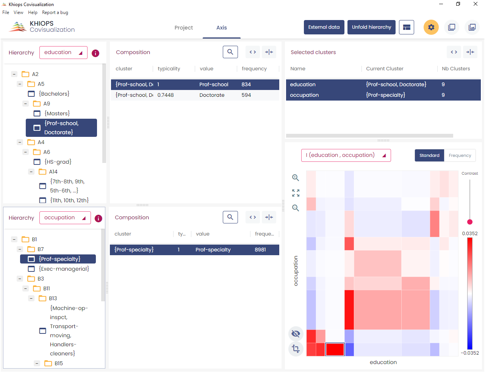
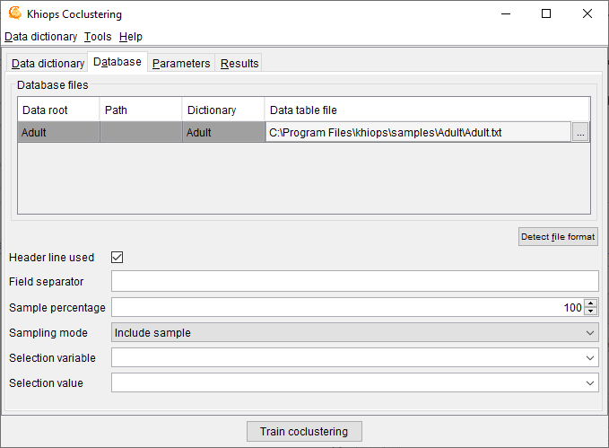
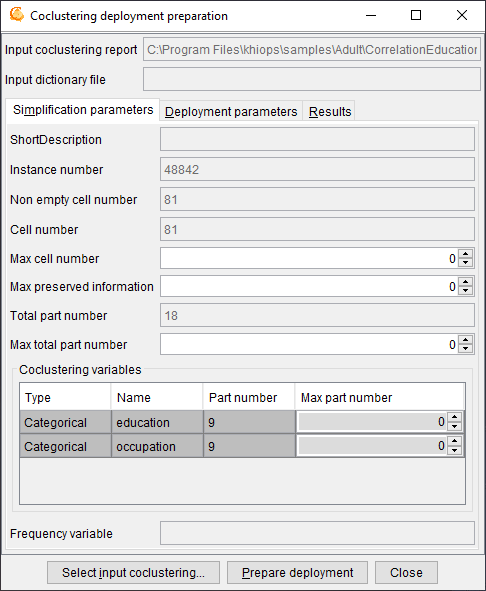
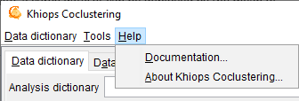

---
hide:
  - navigation
---

Khiops Coclustering aims at detecting highly informative patterns by the mean of hierarchical coclustering models, suitable for the task of explanatory analysis. This novel type of statistical analysis provides insights in many domains, such as:

  - Text corpus analysis : clusters of texts versus clusters of words

  - Market analysis : clusters of customers versus clusters of products

  - Web log analysis : clusters of cookies versus clusters of web pages

  - Graph analysis : clusters of source versus target nodes

  - Temporal graph analysis : clusters of source versus target nodes versus temporal intervals

  - Curve corpus analysis : clusters of curves versus interval of X versus intervals of Y

  - …

A coclustering model summarizes the correlation between two or more variables by simultaneously partitioning the values of each variable, into groups of value in the categorical case and into intervals in the numerical case. The cross-product of these univariate partitions forms a multivariate partition, called data grid. By counting the frequencies in the multivariate parts (called cells) of this data grid, we obtain a nonparametric estimator of the joint density of the variables. Each partition is organized into hierarchies, so as to enable an exploratory analysis of the results at any grain level.

For illustration purpose, let us consider the correlation between the education and occupation variables of the Adult database (coming from the US Census Bureau). This database contains about 50000 instances, with 14 values of occupation and 16 values of education.

Applying the **Khiops Coclustering** back-end tool, we obtain a 10\*9 fine-grained data grid. The [`Khiops Covisualization tool`](covisualization.md) enables the exploration of the correlation between the two variables. Displaying the mutual information highlights the over-represented cells (in red), i.e. cells with a frequency higher than expected in case of independent variables, and the under-represented cells (in blue). In the screenshot below, the selected cell indicates a high concentration of education *Prof-school* or *Doctorate* Jointly with occupation *Prof-specialty*.

Folding down both hierarchies allows to obtain a simplified 3\*3 data grid which provides a quick summary with an easier interpretation.

In the screenshot below, the selected cell indicates a high concentration of education *Bachelor*, *Master*, *Prof-school* or *Doctorate* jointly with occupation *Exec-managerial* or *Prof-specialty*.

Beyond the illustrative example, this kind of analysis provides insightful summaries when applied to databases with millions of instances and variables with thousands of values.

**Khiops Coclustering** is the back-end tool for training and managing coclustering models.

The main functionalities are training a coclustering, simplifying a coclustering by applying granularity constraints and preparing the deployment of a coclustering.

The tool and its parameters have been simplified to focus on the coclustering problem. 
The deployment of coclustering models is left to the back-end **Khiops** tool dedicated to supervised data analysis (see [`Khiops Guide`](khiops.md)) for information about data dictionaries, data tables and technical limits).

## Dictionary file

A dictionary file is a text file with the extension .kdic. It contains the definition of one or several dictionaries, each one describing the set of variables to use 
in a data analysis. See [`Dictionary files`](../api-docs/kdic/dictionary-files.md) for a detailed description of dictionaries and their management.

Khiops Coclustering allows to **Open** a **Dictionary file**. Opening a dictionary file amounts to loading its dictionaries into memory and making them available for data analysis. The **Save** and **Save as** actions write dictionaries to a dictionary file, whereas the **Close** action cleans the memory. The **Build dictionary from file** action builds dictionaries from data files and save them in a dictionary file. The **Reload dictionary file** action reads again a dictionary file, which may have been modified using an external text editor. The list of available dictionaries can be browsed using Khiops.

**Analysis dictionary**: name of the dictionary related to the data to analyse. Mandatory field.

**Dictionary file**: name of the dictionary file related to the data to analyse. Read-only field that shows the name of the current dictionary file.

**Dictionaries in file**: list of available dictionaries, with statistics describing the used variables (Name, Variables, Categorical, Numerical, Derived).

### Build dictionary from data table

This action opens a window that allows to build dictionaries from data tables.

**Data table file**: name of the data table file to analyse. Mandatory field.

**Detect file format**: heuristic help that scans the first few lines to guess the file format. The header line and field separator are updated on success, with a warning or an error in the log window only if necessary.

**Header line used**: (default: true). If the file has a header line, Khiops will use the header line fields as variables names; otherwise, the variables will be names Var1, Var2...

**Field separator**: by default, if nothing is specified, the tabulation is used as the field separator.

**Show first lines**: show first lines of data table in log window.

**Build dictionary from data table**: start the analysis of the data table file to build a dictionary. The first lines of the file are analysed in order to determine the type of the variables: Categorical, Numerical, Date, Time or Timestamp. After analysis, the user can choose the name of the dictionary.

**Close**: closes the window. If dictionaries have been built, proposes to save them in a dictionary file

### Reload dictionary file

Reload into memory the current dictionary file.

This action allows to modify the dictionary file using an external text editor (Notepad for example), to save the modifications, and to take them into account into Khiops by reloading the dictionary file.

In case of invalid dictionary file, the current dictionaries are kept in memory.

### Dictionary file menu

#### Open

An open dialog box asks the name of the dictionary file to open.

In case of invalid dictionary file, the current dictionaries are kept in memory.

#### Close

The dictionaries are removed (from memory only). The potential pending modifications are lost if they have not been saved.

#### Save

The memory dictionaries are saved under the current dictionary file.

#### Save as

A save dialog box asks the name of the dictionary file to save.

#### Export as JSON

A save dialog box asks the name of the JSON file to export the dictionaries under a JSON format, with a .kdicj extension.

#### Dictionaries in file/Inspect current dictionary

Allows to inspect and partly modify a dictionary chosen among the list of available dictionaries. The dictionary to inspect must be selected among the dictionaries in file.

The action is available both from the menu and using a right click button on the selected dictionary.

During the inspection of a dictionary, the list of its variables can be browsed into a sub-window. For each variable, the following properties are displayed: **Used**, **Type**, **Name**, **Derived**, **Meta-data** and **Label**.

The Data Miner can choose whether to keep or not the variable for data analysis, using the **Used** property. The **Select all** and **Unselect all** buttons allow to choose all or no variables.

It is also possible to change the **Type** of variables: Numerical, Categorical, Date, Time or Timestamp.

Remark: for large scale modifications in a dictionary, it is preferable to update the dictionary file using an external text editor (Notepad, WordPad…), to save the file with the external editor, and then to reload the dictionary.

#### Quit

Quits the application.

## Database

**Database file**: name of the database file to analyse. Mandatory field.

**Detect file format**: heuristic help that scans the first few lines to guess the file format. The header line and field separator are updated on success, with a warning or an error in the log window only if necessary.

**Header line used**: (default: true). If the file does not have a header line, Khiops Coclustering considers the leading variables in the dictionary to analyse the fields in the file.

**Field separator**: by default, if nothing is specified, the tabulation is used as the field separator.

Khiops Coclustering can be used to extract a subpart (or its exact complementary) of the records in a database file. This sampling is specified with a sample percentage of the records (to keep or to discard). The sampling is a random sampling, but is reproducible (the random seed is always the same).

**Sample percentage**: percentage of the samples (default: 100)

**Sampling mode**: to include or exclude the records of the sample (default: include sample).

Another way to build samples is to use a selection variable and a selection value.

**Selection variable**: when nothing is specified, all the records are analysed. When a selection variable is specified, the records are selected when the value of their selection variable is equal to the selection value.

**Selection value**: used only when a selection variable is specified. In that case, the value must be a correct value (numerical value if the selection variable is a numerical variable).

## Parameters

### Coclustering parameters

**Coclustering variables**: list of input variables for the coclustering model.

There must be at least two numerical or categorical input coclustering variables. Up to ten variables are allowed.

**Frequency variable**: optional field. Name of a variable that contains the frequency of the records. Using the frequency variable is equivalent to duplicating the records in the input database, where the number of duplicates per record is equal to the frequency.

### System parameters

**Max number of error messages in log**: allows to control the size of the log, by limiting the number of messages, warning or errors (default: 20).

**Min optimization time in seconds**: allows to specify the min amount of time for the optimization algorithms. By default, this parameter is 0 and the algorithm stops by itself when no significant improvement is expected. Otherwise, the optimization is performed at least as long as specified, then stops after the next built solution.

**Memory limit in Mo**: allows to specify the max amount of memory available for the data analysis algorithms. By default, this parameter is set to the size of the RAM available for the Windows applications. This parameter can be decreased in order to keep memory for the other Windows application, or increased in the limit of the available RAM.

**Max number of processor cores**: allows to specify the max number of processor cores to use. Not used in this version: coclustering algorithms will be parallelized in future versions.

**Temp file directory**: name of the directory to use for temporary files (default: none, the system default temp file directory is then used).

## Results

**Result files directory**: name of the directory where the results files are stored (default: empty). By default, the results files are stored in the directory of the train database. If a result directory is specified, it can be:

  - an absolute path (example "c:\\project\\scenario1"): the results files are stored in this directory

  - a local path (example "scenario1"): the results files are stored in a sub-directory of the train database directory

  - a relative path (example ".\\scenario1"): the results files are stored in a sub-directory of current directory (Khiops Coclustering executable start directory)

**Result files prefix**: (default: empty). This prefix is added before the name of each result file.

**Coclustering report**: (default: Coclustering.khc) name of the coclustering report, that contains the full definition of the coclustering model. The coclustering report is the input of the *Khiops Covisualization* tool, for versions prior to V10. This option is deprecated, and future versions will output the report in JSON format only.

**Export JSON**: exports the coclustering report under a JSON format. The exported JSON file has the same name as the coclustering report file, with a .khcj extension. This coclustering report is the input of the new *Khiops Covisualization* tool since version 10.1. The JSON file is also useful to inspect the coclustering results from any external tool.

## Tools

The actions available from the tools menu are :

- Train coclustering : 
trains a coclustering model given the coclustering parameters

- Simplify coclustering... :
builds a simplified coclustering model and opens a new window named *Coclustering simplification*

- Extract clusters... :
extracts clusters in a text file for a given coclustering variable and opens a new window named *Cluster extraction*

- Prepare deployment... :
enables the deployment of a coclustering model by the means of a Khiops deployment dictionary and opens a new window named *Coclustering deployment preparation*

The first action, which trains a coclustering model from the data, is the main functionality of the tool. The required memory and computation time grow with the size of the data. As a rule of thumb, around 1 GB RAM is required per millions of data records and about one hour per million records is necessary to train the first coclustering model. This action is anytime: coclustering models are computed and continuously improved, with new solutions saved as soon as improvements are reached. The intermediate solutions can be used without waiting for the final solution, and the process can be stopped at any time to keep the last best solution.

The three last application actions exploit an existing coclustering model. They use an input coclustering model as well as granularity constraints that indicate whether the coclustering should be exploited at fine or coarse grain level.

### Coclustering simplification

This window enables the simplification of a coclustering model given granularity constraints.

**Input coclustering report**: name of the coclustering report to post-process.

Use the button **Select input coclustering** to choose an input coclustering report.

Use the button **Simplify coclustering** to build the simplified coclustering report.

The input coclustering is simplified using a bottom-up hierarchical agglomeration of the parts, until all the active simplification constraints are fulfilled (max cell number, max preserved information and max part number per variable).

#### Simplification parameters

**Simplification parameters**: recall of some coclustering statistics (read-only fields) and post-processing parameters to simplify the coclustering

  - Short description

  - Instance number

  - Non empty cell number

  - Cell number

  - **Max cell number** : max number of cells to keep in the simplified coclustering (0 : no constraint)

  - **Max preserved information** : max percentage of information to keep in the simplified coclustering (0 : no constraint). Low percentages correspond to weakly informative coarse models whereas high percentages correspond to highly informative detailed models.

  - Total part number

  - **Max total part number : max number of total part number to keep in the simplified coclustering (0 : no constraint)**

  - **Coclustering variables** (in the array)
    
      - Type
    
      - Name
    
      - Part number
    
      - **Max part number** : max number of parts to keep for this variable in the simplified coclustering (0 : no constraint)

  - Frequency variable

#### Results

**Result files directory**

**Result files prefix**

**Simplified coclustering report**: (default: SimplifiedCoclustering.khcj) name of the simplified coclustering report, that is the most detailed version of the input coclustering report that meets all the simplification constraints.

### Cluster extraction

This window enables the extraction of clusters for a given coclustering variable and given granularity constraints.

**Input coclustering report**: name of the coclustering report to post-process.

Use the button **Select input coclustering** to choose an input coclustering report.

Use the button **Extract clusters** to extract the clusters from the input coclustering.

The clusters are extracted for a given variable from the simplified coclustering (provided that simplification parameters are specified).

#### Simplification parameters

See [`Simplification parameters`](#simplification-parameters)

#### Cluster parameters

**Coclustering variable**: name of the coclustering variable containing the clusters to extract

#### Results

**Result files directory**

**Result files prefix**

**Cluster table file**: (default: Clusters.txt) name of the text file containing the extracted clusters.

The cluster file is a text file with a header line, on record per line with tabulation as field separator.

In case of a *categorical* variable, the fields are:

  - Cluster: name of the cluster (group of values)

  - Value: name of the value contained in the cluster

  - Frequency: frequency of the value

  - Typicality: interest measure of the value within its cluster

!!! warning "Star value"

    The special value '` * `' represents any value not seen during training the coclustering.
    Please note that this special value cannot be used in a join operation.

In case of a *numerical* variable, the fields are:

  - Cluster: name of the cluster (interval of values)

  - Lower bound: lower bound (excluded) of the interval

  - Upper bound: upper bound (included) of the interval

Infinite lower and upper bounds are represented by empty fields. A cluster containing the missing value has empty fields for both the lower and upper bounds.

### Prepare deployment

This dialog box deals with the preparation of the deployment of a coclustering model by the means of a Khiops deployment dictionary. Deploying a coclustering model consists in associating each instance of one variable of a coclustering model to the label of its cluster, as well as creating new variables such as the distance of the instance of each cluster.

The obtained coclustering deployment dictionary allows the user to update a database for a given entity of interest by adding new variables.

**Input coclustering report**: name of the coclustering report to post-process.

**Input dictionary file**: name of the dictionary file, that corresponds to the deployment database.

The input dictionary file must be opened from the main window using the "Dictionary file" menu.

Use the button **Select input coclustering** to choose an input coclustering report.

Use the button **Prepare deployment** to build the coclustering deployment dictionary file.

To deploy a coclustering, use the **Deploy model** functionality of the **Khiops** back-end tool and apply the deployment dictionary on new data.

A coclustering model is able to extract correlation information between two or more variables, such as Text\*Word for a text corpus, Cookie\*Page for a web log corpus, Curve\*X\*Y for a curve corpus. Let us take the example of a curve corpus, represented by a database of points with three variables, CurveId, X and Y and one record for each point in the curve corpus. The coclustering model builds clusters of curves and intervals of X and Y, such that curves distributed similarly on the intervals of X and Y tend to be grouped together. When new curves are available, it is interesting to deploy them on the basis of the trained coclustering model. Deploying a new curve consists in creating new variables to enrich the curve description: closest cluster of curve, distance to each cluster of curves, number of points per interval of X or Y.

#### Simplification parameters

See [`Simplification parameters`](#simplification-parameters)

#### Deployment parameters

*Input dictionary*: name of the dictionary that corresponds to the deployment database that contains the instances of interest.

*Input table variable*: name of the table variable in the input dictionary that contains the detailed record for each instance of interest.

*Coclustering deployed variable*: name of the deployed variable, i.e. one of the coclustering variables, which represents the entity of interest.

*Build predicted cluster variable*: indicates that the deployment model must generate a new variable containing the label of the cluster of the entity of interest.

*Build inter-cluster variables*: indicates that the deployment model must generate new variables representing the distance of the entity of interest to each cluster.

*Build frequency recoding variables*: indicates that the deployment model must generate new variables representing the frequency per cluster of the other coclustering variables.

*Output variable prefix*: (default: P\_) prefix added to the deployment variables in the deployment dictionary.

Multi-table functionality is a prerequisite to the deployment of coclustering model. See [`here`](../api-docs/kdic/dictionary-files.md) for details.

In the case of a curve corpus, curves are represented using a multi-table schema, with curves as the root entity, in 0 to n relationship with their points.

- Root entity: dictionary Curve(CurveId), with two variables
    
      - Categorical CurveId
    
      - Table(Point) curvePoints

- Secondary entity: dictionary Point(CurveId), with three variables
    
      - Categorical CurveId
    
      - Numerical X
    
      - Numerical Y

The curve database consists of two data tables: one for the curves and the other for the points.

In this case, the objective is to deploy new curves, unseen during training. Whereas the coclustering model was trained using a single table point dataset, the deployments need a multi-table curve dataset, since each curve to deploy is represented by an identifier in the root table and a set of points in the secondary table.

The input dictionary is *Curve*, the input table variable is *curvePoints* and the coclustering deployed variable is *CurveId*. When the coclustering deployment model is prepared, it can be used to deploy new curves, that is to create new variables in the curve table:

  - P\_CurveIdPredictedLabel: predicted cluster label for variable CurveId

  - P\_CurveIdDistance <*CurveCluster*\>: distance to curve cluster, for each cluster of curves <*CurveCluster*\>

  - P\_XFrequency <*IntervalX*\>: number of points per interval for each interval of X <*IntervalX*\>

  - P\_YFrequency <*IntervalY*\>: number of points per interval for each interval of Y <*IntervalY*\>

Using the Khiops tool with its "Deploy model" functionality, a curve dataset can be deployed by the mean of the coclustering deployment model.

#### Results

**Result files directory**

**Result files prefix**

**Coclustering dictionary file**: (default: Coclustering.kdic) name of the deployment dictionary that contains the coclustering deployment model.

### Help

The actions available from the help menu are

  - **Documentation…**

> Shows a summary of the available documentation and other resources.

  - **About Khiops Coclustering…**