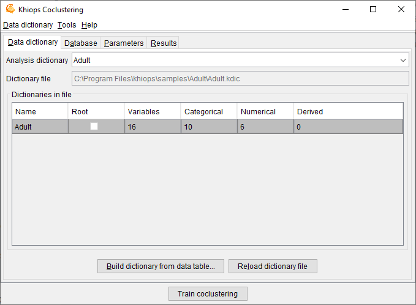
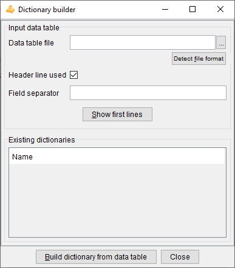
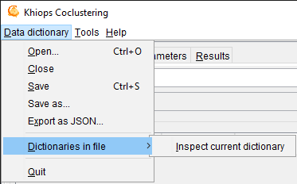
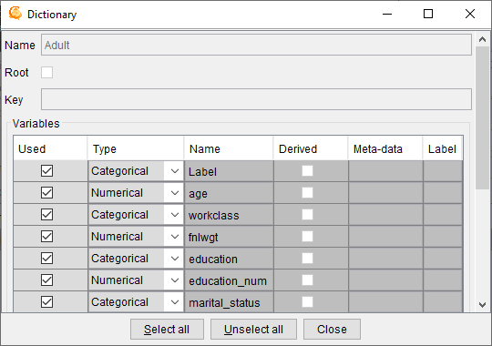

##  Dictionary file

A dictionary file is a text file with the extension .kdic. It contains the definition of one or several dictionaries, each one describing the set of variables to use in a data analysis. See **Khiops Guide** for a detailed description of dictionaries and their management.

Khiops Coclustering allows to **Open** a **Dictionary file**. Opening a dictionary file amounts to loading its dictionaries into memory and making them available for data analysis. The **Save** and **Save as** actions write dictionaries to a dictionary file, whereas the **Close** action cleans the memory. The **Build dictionary from file** action builds dictionaries from data files and save them in a dictionary file. The **Reload dictionary file** action reads again a dictionary file, which may have been modified using an external text editor. The list of available dictionaries can be browsed using Khiops.

**Analysis dictionary**: name of the dictionary related to the data to analyse. Mandatory field.

**Dictionary file**: name of the dictionary file related to the data to analyse. Read-only field that shows the name of the current dictionary file.

**Dictionaries in file**: list of available dictionaries, with statistics describing the used variables (Name, Variables, Categorical, Numerical, Derived).

###  Build dictionary from data table

This action opens a window that allows to build dictionaries from data tables.

**Data table file**: name of the data table file to analyse. Mandatory field.

**Detect file format**: heuristic help that scans the first few lines to guess the file format. The header line and field separator are updated on success, with a warning or an error in the log window only if necessary.

**Header line used**: (default: true). If the file has a header line, Khiops will use the header line fields as variables names; otherwise, the variables will be names Var1, Var2...

**Field separator**: by default, if nothing is specified, the tabulation is used as the field separator.

**Show first lines**: show first lines of data table in log window.

**Build dictionary from data table**: start the analysis of the data table file to build a dictionary. The first lines of the file are analysed in order to determine the type of the variables: Categorical, Numerical, Date, Time or Timestamp. After analysis, the user can choose the name of the dictionary.

**Close**: closes the window. If dictionaries have been built, proposes to save them in a dictionary file

See **Khiops Guide** for more details on how dictionaries are built.

###  Reload dictionary file

Reload into memory the current dictionary file.

This action allows to modify the dictionary file using an external text editor (Notepad for example), to save the modifications, and to take them into account into Khiops by reloading the dictionary file.

In case of invalid dictionary file, the current dictionaries are kept in memory.

###  Dictionary file menu

####  Open

An open dialog box asks the name of the dictionary file to open.

In case of invalid dictionary file, the current dictionaries are kept in memory.

####  Close

The dictionaries are removed (from memory only). The potential pending modifications are lost if they have not been saved.

####  Save

The memory dictionaries are saved under the current dictionary file.

####  Save as

A save dialog box asks the name of the dictionary file to save.

####  Export as JSON

A save dialog box asks the name of the JSON file to export the dictionaries under a JSON format, with a .kdicj extension.

####  Dictionaries in file/Inspect current dictionary

Allows to inspect and partly modify a dictionary chosen among the list of available dictionaries. The dictionary to inspect must be selected among the dictionaries in file.

The action is available both from the menu and using a right click button on the selected dictionary.

During the inspection of a dictionary, the list of its variables can be browsed into a sub-window. For each variable, the following properties are displayed: **Used**, **Type**, **Name**, **Derived**, **Meta-data** and **Label**.

The Data Miner can choose whether to keep or not the variable for data analysis, using the **Used** property. The **Select all** and **Unselect all** buttons allow to choose all or no variables.

It is also possible to change the **Type** of variables: Numerical, Categorical, Date, Time or Timestamp.

Remark: for large scale modifications in a dictionary, it is preferable to update the dictionary file using an external text editor (Notepad, WordPad…), to save the file with the external editor, and then to reload the dictionary.

####  Quit

Quits the application.