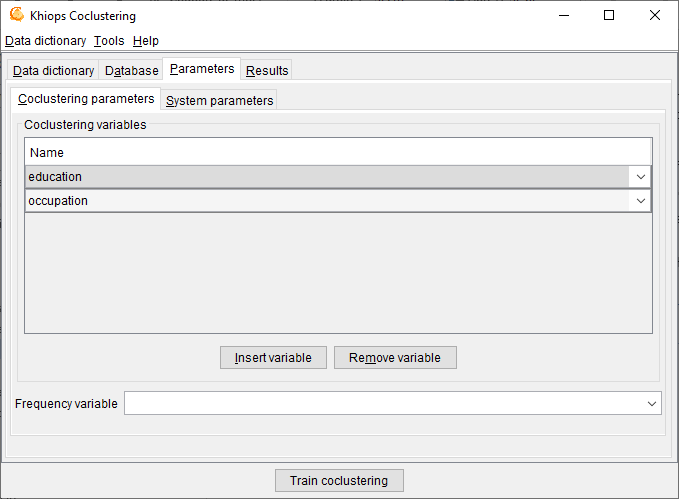

##  Parameters

###  Coclustering parameters

**Coclustering variables**: list of input variables for the coclustering model.

There must be at least two numerical or categorical input coclustering variables. Up to ten variables are allowed.

**Frequency variable**: optional field. Name of a variable that contains the frequency of the records. Using the frequency variable is equivalent to duplicating the records in the input database, where the number of duplicates per record is equal to the frequency.

###  System parameters

**Max number of error messages in log**: allows to control the size of the log, by limiting the number of messages, warning or errors (default: 20).

**Min optimization time in seconds**: allows to specify the min amount of time for the optimization algorithms. By default, this parameter is 0 and the algorithm stops by itself when no significant improvement is expected. Otherwise, the optimization is performed at least as long as specified, then stops after the next built solution.

**Memory limit in Mo**: allows to specify the max amount of memory available for the data analysis algorithms. By default, this parameter is set to the size of the RAM available for the Windows applications. This parameter can be decreased in order to keep memory for the other Windows application, or increased in the limit of the available RAM.

**Max number of processor cores**: allows to specify the max number of processor cores to use. Not used in this version: coclustering algorithms will be parallelized in future versions.

**Temp file directory**: name of the directory to use for temporary files (default: none, the system default temp file directory is then used).