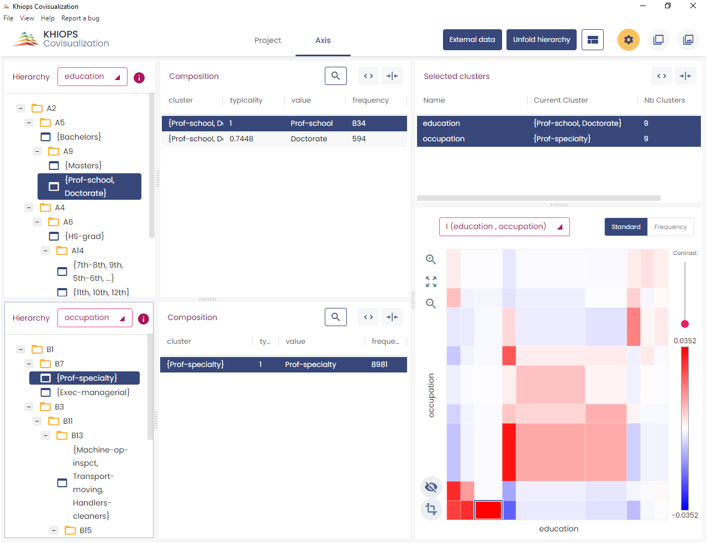
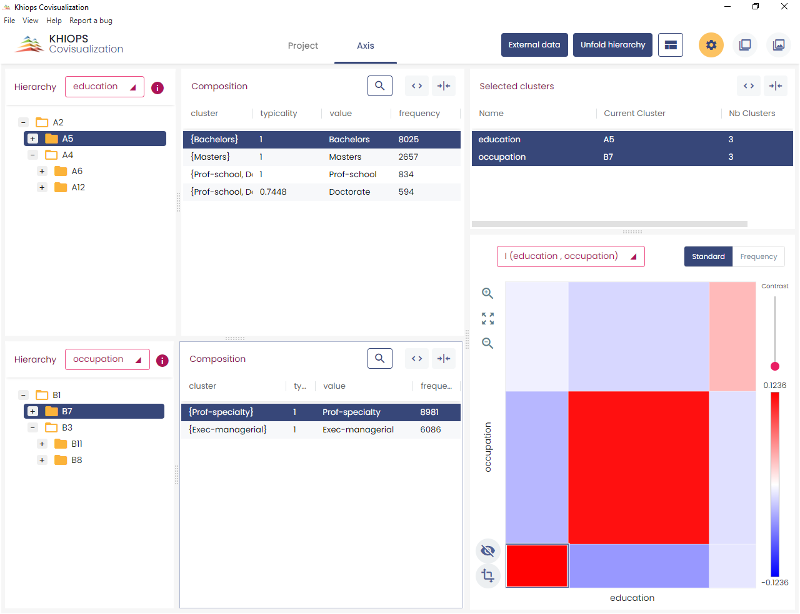

Khiops Coclustering aims at detecting highly informative patterns by the mean of hierarchical coclustering models, suitable for the task of explanatory analysis. This novel type of statistical analysis provides insights in many domains, such as:

  - Text corpus analysis: clusters of texts versus clusters of words

  - Market analysis: clusters of customers versus clusters of products

  - Web log analysis: clusters of cookies versus clusters of web pages

  - Graph analysis: clusters of source versus target nodes

  - Temporal graph analysis: : clusters of source versus target nodes versus temporal intervals

  - Curve corpus analysis: clusters of curves versus interval of X versus intervals of Y

  - …

A coclustering model summarizes the correlation between two or more variables by simultaneously partitioning the values of each variable, into groups of value in the categorical case and into intervals in the numerical case. The cross-product of these univariate partitions forms a multivariate partition, called data grid. By counting the frequencies in the multivariate parts (called cells) of this data grid, we obtain a nonparametric estimator of the joint density of the variables. Each partition is organized into hierarchies, so as to enable an exploratory analysis of the results at any grain level.

For illustration purpose, let us consider the correlation between the education and occupation variables of the Adult database (coming from the US Census Bureau). This database contains about 50000 instances, with 14 values of occupation and 16 values of education.

Applying the **Khiops Coclustering** back-end tool, we obtain a 10\*9 fine-grained data grid. The **Khiops Covisualization** tool enables the exploration of the correlation between the two variables. Displaying the mutual information highlights the over-represented cells (in red), i.e. cells with a frequency higher than expected in case of independent variables, and the under-represented cells (in blue). In the screenshot below, the selected cell indicates a high concentration of education *Prof-school* or *Doctorate* Jointly with occupation *Prof-specialty*.

Folding down both hierarchies allows to obtain a simplified 3\*3 data grid which provides a quick summary with an easier interpretation.

In the screenshot below, the selected cell indicates a high concentration of education *Bachelor*, *Master*, *Prof-school* or *Doctorate* jointly with occupation *Exec-managerial* or *Prof-specialty*.

Beyond the illustrative example, this kind of analysis provides insightful summaries when applied to databases with millions of instances and variables with thousands of values.

**Khiops Coclustering** is the back-end tool for training and managing coclustering models.

The main functionalities are training a coclustering, simplifying a coclustering by applying granularity constraints and preparing the deployment of a coclustering.

The tool and its parameters have been simplified to focus on the coclustering problem. The deployment of coclustering models is left to the back-end **Khiops** tool (see Khiops Guide).

More generally, the Khiops tool is dedicated to supervised data analysis and data management and the Khiops guide contains much more information about data dictionaries, data tables and technical limits than the present guide.