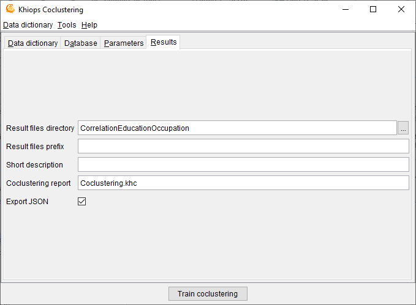

##  Results

**Result files directory**: name of the directory where the results files are stored (default: empty). By default, the results files are stored in the directory of the train database. If a result directory is specified, it can be:

  - an absolute path (example "c:\\project\\scenario1"): the results files are stored in this directory

  - a local path (example "scenario1"): the results files are stored in a sub-directory of the train database directory

  - a relative path (example ".\\scenario1"): the results files are stored in a sub-directory of current directory (Khiops Coclustering executable start directory)

**Result files prefix**: (default: empty). This prefix is added before the name of each result file.

**Coclustering report**: (default: Coclustering.khc) name of the coclustering report, that contains the full definition of the coclustering model. The coclustering report is the input of the *Khiops Covisualization* tool, for versions prior to V10. This option is deprecated, and future versions will output the report in JSON format only.

**Export JSON**: exports the coclustering report under a JSON format. The exported JSON file has the same name as the coclustering report file, with a .khcj extension. This coclustering report is the input of the new *Khiops Covisualization* tool since version 10.1. The JSON file is also useful to inspect the coclustering results from any external tool.
