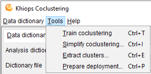
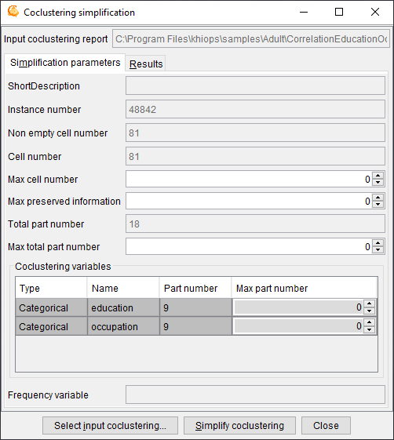
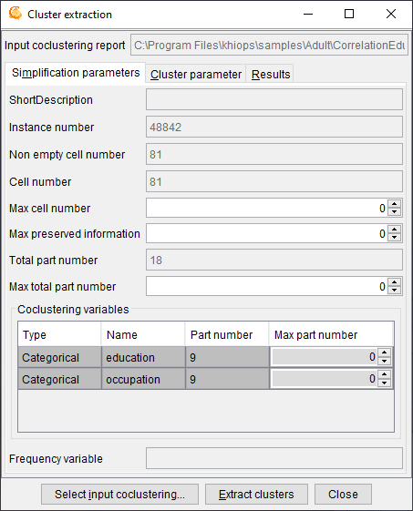
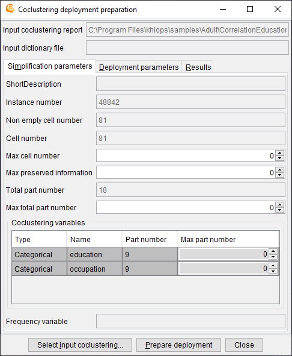
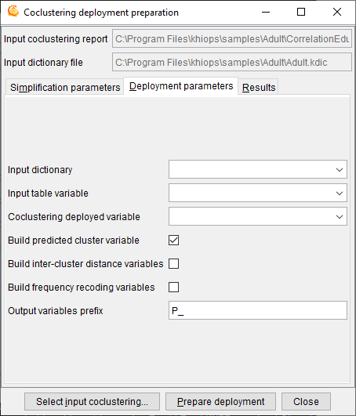

#  Tools

The actions available from the tools menu are :

- Train coclustering : 
trains a coclustering model given the coclustering parameters

- Simplify coclustering... :
builds a simplified coclustering model and opens a new window named *Coclustering simplification*

- Extract clusters... :
extracts clusters in a text file for a given coclustering variable and opens a new window named *Cluster extraction*

- Prepare deployment... :
enables the deployment of a coclustering model by the means of a Khiops deployment dictionary and opens a new window named *Coclustering deployment preparation*

The first action, which trains a coclustering model from the data, is the main functionality of the tool. The required memory and computation time grow with the size of the data. As a rule of thumb, around 1 GB RAM is required per millions of data records and about one hour per million records is necessary to train the first coclustering model. This action is anytime: coclustering models are computed and continuously improved, with new solutions saved as soon as improvements are reached. The intermediate solutions can be used without waiting for the final solution, and the process can be stopped at any time to keep the last best solution.

The three last application actions exploit an existing coclustering model. They use an input coclustering model as well as granularity constraints that indicate whether the coclustering should be exploited at fine or coarse grain level.

##  Coclustering simplification

This window enables the simplification of a coclustering model given granularity constraints.

**Input coclustering report**: name of the coclustering report to post-process.

Use the button **Select input coclustering** to choose an input coclustering report.

Use the button **Simplify coclustering** to build the simplified coclustering report.

The input coclustering is simplified using a bottom-up hierarchical agglomeration of the parts, until all the active simplification constraints are fulfilled (max cell number, max preserved information and max part number per variable).

###  Simplification parameters

**Simplification parameters**: recall of some coclustering statistics (read-only fields) and post-processing parameters to simplify the coclustering

  - Short description

  - Instance number

  - Non empty cell number

  - Cell number

  - **Max cell number** : max number of cells to keep in the simplified coclustering (0 : no constraint)

  - **Max preserved information** : max percentage of information to keep in the simplified coclustering (0 : no constraint). Low percentages correspond to weakly informative coarse models whereas high percentages correspond to highly informative detailed models.

  - Total part number

  - **Max total part number : max number of total part number to keep in the simplified coclustering (0 : no constraint)**

  - **Coclustering variables** (in the array)
    
      - Type
    
      - Name
    
      - Part number
    
      - **Max part number** : max number of parts to keep for this variable in the simplified coclustering (0 : no constraint)

  - Frequency variable

###  Results

**Result files directory**

**Result files prefix**

**Simplified coclustering report**: (default: SimplifiedCoclustering.khcj) name of the simplified coclustering report, that is the most detailed version of the input coclustering report that meets all the simplification constraints.

##  Cluster extraction

This window enables the extraction of clusters for a given coclustering variable and given granularity constraints.

**Input coclustering report**: name of the coclustering report to post-process.

Use the button **Select input coclustering** to choose an input coclustering report.

Use the button **Extract clusters** to extract the clusters from the input coclustering.

The clusters are extracted for a given variable from the simplified coclustering (provided that simplification parameters are specified).

###  Simplification parameters

See [`Simplification parameters`](#simplification-parameters)

###  Cluster parameters

**Coclustering variable**: name of the coclustering variable containing the clusters to extract

###  Results

**Result files directory**

**Result files prefix**

**Cluster table file**: (default: Clusters.txt) name of the text file containing the extracted clusters.

The cluster file is a text file with a header line, on record per line with tabulation as field separator.

In case of a *categorical* variable, the fields are:

  - Cluster: name of the cluster (group of values)

  - Value: name of the value contained in the cluster

  - Frequency: frequency of the value

  - Typicality: interest measure of the value within its cluster

!!! warning "Star value"

    The special value '` * `' represents any value not seen during training the coclustering.
    Please note that this special value cannot be used in a join operation.

In case of a *numerical* variable, the fields are:

  - Cluster: name of the cluster (interval of values)

  - Lower bound: lower bound (excluded) of the interval

  - Upper bound: upper bound (included) of the interval

Infinite lower and upper bounds are represented by empty fields. A cluster containing the missing value has empty fields for both the lower and upper bounds.

##  Prepare deployment

This dialog box deals with the preparation of the deployment of a coclustering model by the means of a Khiops deployment dictionary. Deploying a coclustering model consists in associating each instance of one variable of a coclustering model to the label of its cluster, as well as creating new variables such as the distance of the instance of each cluster.

The obtained coclustering deployment dictionary allows the user to update a database for a given entity of interest by adding new variables.

**Input coclustering report**: name of the coclustering report to post-process.

**Input dictionary file**: name of the dictionary file, that corresponds to the deployment database.

The input dictionary file must be opened from the main window using the "Dictionary file" menu.

Use the button **Select input coclustering** to choose an input coclustering report.

Use the button **Prepare deployment** to build the coclustering deployment dictionary file.

To deploy a coclustering, use the **Deploy model** functionality of the **Khiops** back-end tool and apply the deployment dictionary on new data.

A coclustering model is able to extract correlation information between two or more variables, such as Text\*Word for a text corpus, Cookie\*Page for a web log corpus, Curve\*X\*Y for a curve corpus. Let us take the example of a curve corpus, represented by a database of points with three variables, CurveId, X and Y and one record for each point in the curve corpus. The coclustering model builds clusters of curves and intervals of X and Y, such that curves distributed similarly on the intervals of X and Y tend to be grouped together. When new curves are available, it is interesting to deploy them on the basis of the trained coclustering model. Deploying a new curve consists in creating new variables to enrich the curve description: closest cluster of curve, distance to each cluster of curves, number of points per interval of X or Y.

###  Simplification parameters

See [`Simplification parameters`](#simplification-parameters)

###  Deployment parameters

*Input dictionary*: name of the dictionary that corresponds to the deployment database that contains the instances of interest.

*Input table variable*: name of the table variable in the input dictionary that contains the detailed record for each instance of interest.

*Coclustering deployed variable*: name of the deployed variable, i.e. one of the coclustering variables, which represents the entity of interest.

*Build predicted cluster variable*: indicates that the deployment model must generate a new variable containing the label of the cluster of the entity of interest.

*Build inter-cluster variables*: indicates that the deployment model must generate new variables representing the distance of the entity of interest to each cluster.

*Build frequency recoding variables*: indicates that the deployment model must generate new variables representing the frequency per cluster of the other coclustering variables.

*Output variable prefix*: (default: P\_) prefix added to the deployment variables in the deployment dictionary.

Multi-table functionality is a prerequisite to the deployment of coclustering model. See [`here`](../../api-docs/kdic/dictionary-files.md) for details.

In the case of a curve corpus, curves are represented using a multi-table schema, with curves as the root entity, in 0 to n relationship with their points.

- Root entity: dictionary Curve(CurveId), with two variables
    
      - Categorical CurveId
    
      - Table(Point) curvePoints

- Secondary entity: dictionary Point(CurveId), with three variables
    
      - Categorical CurveId
    
      - Numerical X
    
      - Numerical Y

The curve database consists of two data tables: one for the curves and the other for the points.

In this case, the objective is to deploy new curves, unseen during training. Whereas the coclustering model was trained using a single table point dataset, the deployments need a multi-table curve dataset, since each curve to deploy is represented by an identifier in the root table and a set of points in the secondary table.

The input dictionary is *Curve*, the input table variable is *curvePoints* and the coclustering deployed variable is *CurveId*. When the coclustering deployment model is prepared, it can be used to deploy new curves, that is to create new variables in the curve table:

  - P\_CurveIdPredictedLabel: predicted cluster label for variable CurveId

  - P\_CurveIdDistance <*CurveCluster*\>: distance to curve cluster, for each cluster of curves <*CurveCluster*\>

  - P\_XFrequency <*IntervalX*\>: number of points per interval for each interval of X <*IntervalX*\>

  - P\_YFrequency <*IntervalY*\>: number of points per interval for each interval of Y <*IntervalY*\>

Using the Khiops tool with its "Deploy model" functionality, a curve dataset can be deployed by the mean of the coclustering deployment model.

###  Results

**Result files directory**

**Result files prefix**

**Coclustering dictionary file**: (default: Coclustering.kdic) name of the deployment dictionary that contains the coclustering deployment model.
