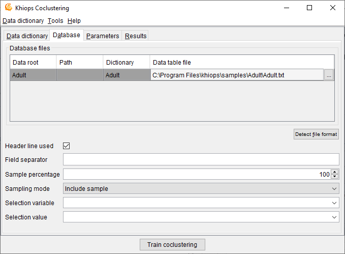

##  Database

**Database file**: name of the database file to analyse. Mandatory field.

**Detect file format**: heuristic help that scans the first few lines to guess the file format. The header line and field separator are updated on success, with a warning or an error in the log window only if necessary.

**Header line used**: (default: true). If the file does not have a header line, Khiops Coclustering considers the leading variables in the dictionary to analyse the fields in the file.

**Field separator**: by default, if nothing is specified, the tabulation is used as the field separator.

Khiops Coclustering can be used to extract a subpart (or its exact complementary) of the records in a database file. This sampling is specified with a sample percentage of the records (to keep or to discard). The sampling is a random sampling, but is reproducible (the random seed is always the same).

**Sample percentage**: percentage of the samples (default: 100)

**Sampling mode**: to include or exclude the records of the sample (default: include sample).

Another way to build samples is to use a selection variable and a selection value.

**Selection variable**: when nothing is specified, all the records are analysed. When a selection variable is specified, the records are selected when the value of their selection variable is equal to the selection value.

**Selection value**: used only when a selection variable is specified. In that case, the value must be a correct value (numerical value if the selection variable is a numerical variable).