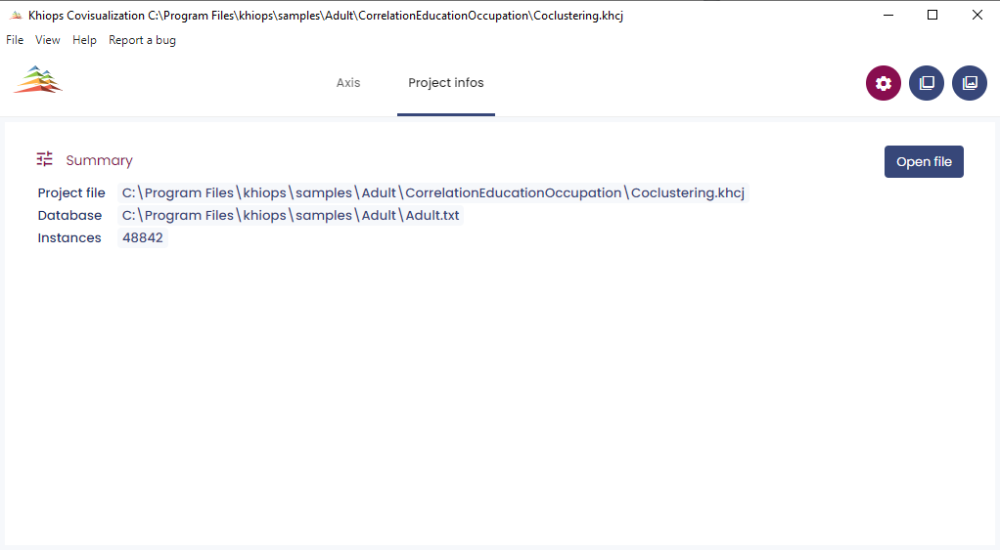
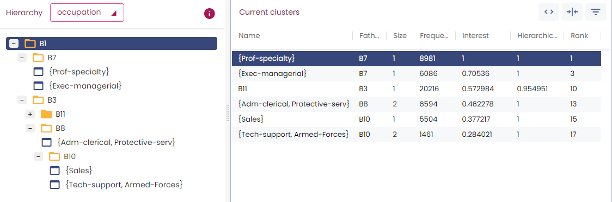
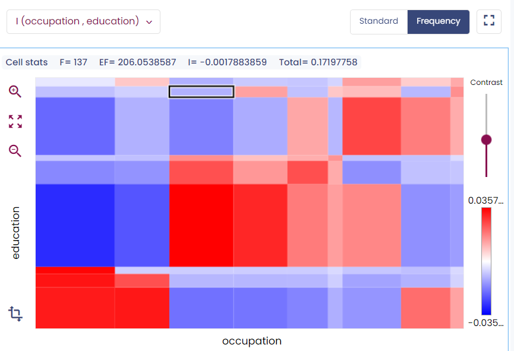
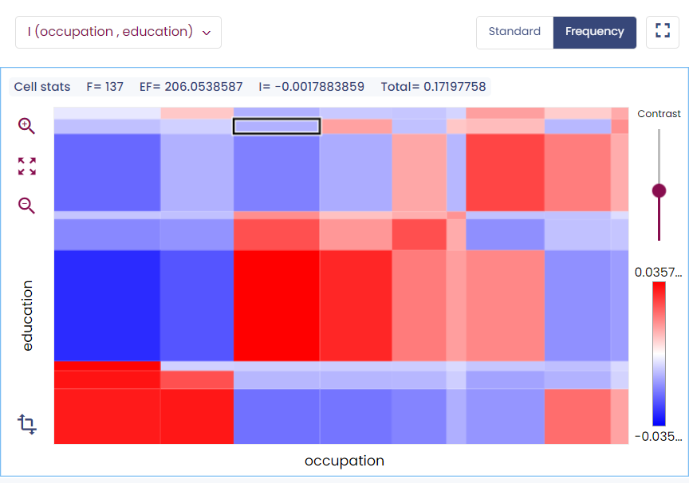
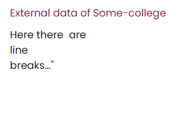
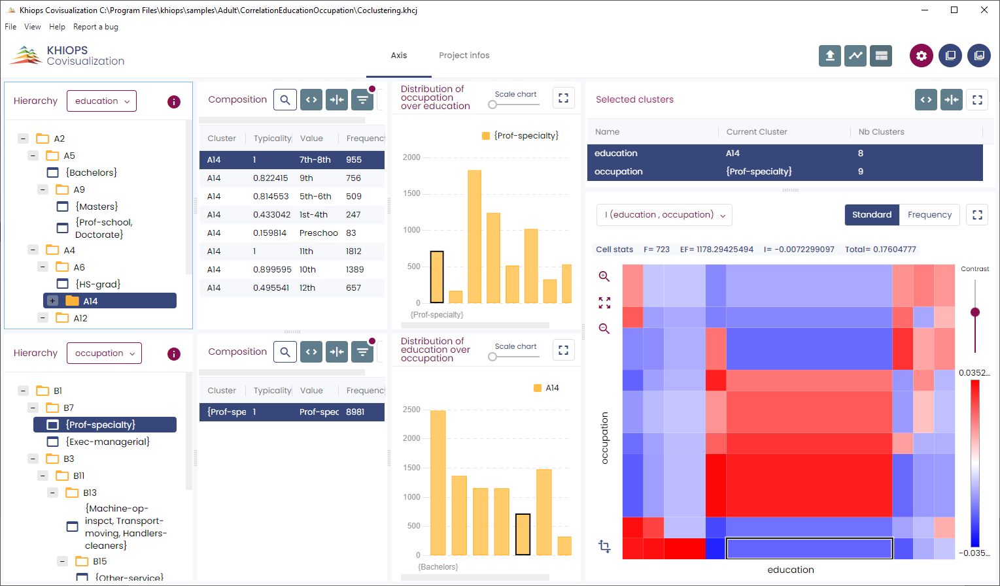
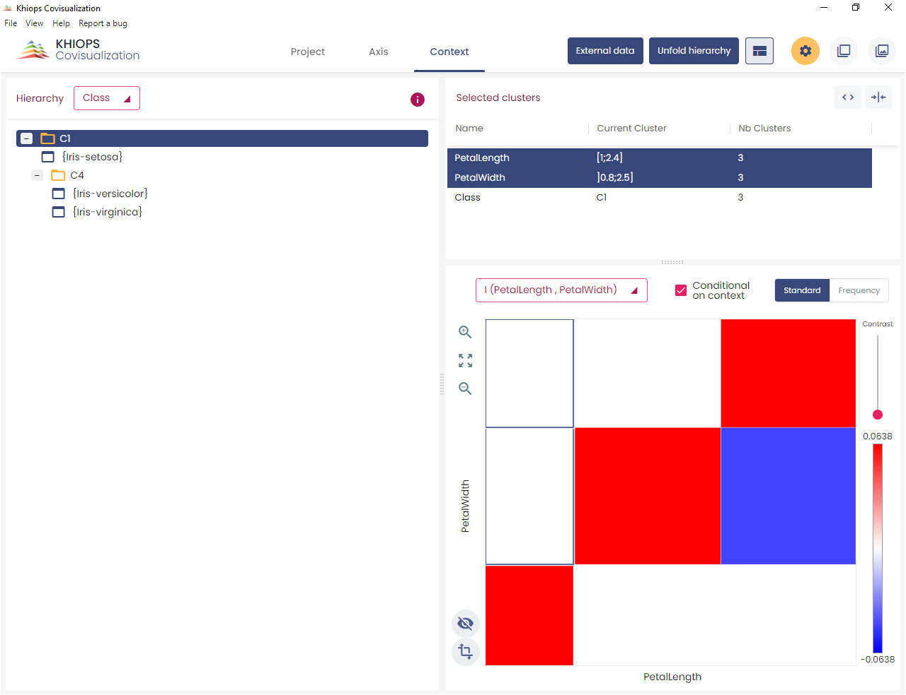

---
hide:
  - navigation
---

## First steps

The entry point of Khiops Covisualization is the khcj file generated by Khiops Coclustering at the end of the analysis. A double-click on this file opens Khiops Covisualization.

Khiops Covisualization is composed of several tabbed panels. The right one is the *Project infos* panel : it presents the report file and database locations.

The left panel is the *Axis* panel : it presents the coclustering.

In case of three (or more) dimensions, there is a third panel: the two "main" dimensions are presented in the left panel as if there were only two dimensions. The other dimensions are contextual, you can view them one by one in the middle pane called the *Context* panel.

The coclustering window in the *Axis* panel is split into three mains parts; there is one part for each variable (or dimension). The right part shows a co-occurrence matrix.

### Managing views

By clicking on the  button, you can add or remove different views on each dimension.

The views manager window reflects the Khiops Covisualization interface. The shaded boxes represent the hidden panels while the white boxes represent the visible panels. You can hide or display a panel by clicking the corresponding checkbox. In the same way you can display only one dimension by clicking the checkboxes before the name of each dimension.

### Screenshot

A useful feature available on all window sections is the screenshot. You can copy to clipboard a selected section by a simple mouse click on one of the top buttons.

A section is selected when it is surrounded by blue lines.

<!--- TODO revoir l'insertion des images iamge14 et image 15 pour supprimer le passage a la ligne --->

Using  (or [Ctrl-C\]) you get a picture in bitmap format that you can import in any image editing tool.
Using  (or \[Ctrl-D\]) you get the raw data (a table in CSV format), that you can import in any text editing tool. 

### Table display

Clicking  opens a list of columns you can hide or display. The red dot indicates that at least one column is hidden

The buttons :  allow to automatically redimension the columns of the table.

The button :  opens a search box.

Long tables are split into pages of at most 500 lines.

### Zoom

The sliding bars allow zooming on the chart.

## The different views and features

We will now explore the various features offered by Khiops Covisualization using a two dimensional example. 
Khiops covisualization allows to explore coclustering of more than 2 dimensions: these features are detailed in the section [`Managing three dimensions or more`](#managing-three-dimensions-or-more).

### Hierarchy view

This view shows the cluster hierarchy. It allows to navigate and to modify the hierarchy of clusters. The hierarchy is presented like a file manager, each directory being a cluster. By opening or closing a cluster, you can choose the appropriate unfolding of the hierarchy.

A cluster is represented in three ways:

  - An unfolded cluster: it contains clusters that are visible in this unfolding. You can close this cluster.

  - A folded cluster: it contains clusters that are not visible in this unfolding. You can open this cluster.

  - A "terminal" cluster: it does not contain any clusters. You can neither open nor close it.

Navigation, selection, folding and unfolding can be done via the arrow keys.

#### How to rename the clusters

Clusters can be renamed by double-clicking on the cluster name. To restore its original name, you have to rename it with an empty string.

  

#### How to automatically unfold hierarchy

The best way to fold or unfold hierarchies is to use the “Select automatically the best unfolding” view. The button on the top of the user interface opens a new window.

  

This window allows choosing the best number of clusters on both dimensions: optimal unfolding of each partition so as to keep the most informative model. The top chart shows the evolution of the level according to the number of clusters, that is the percentage of information kept at each granularity of the hierarchy. This allows obtaining a simplified and easily interpretable hierarchy with few clusters while keeping most of the information. In real cases, 80% of the information often comes from a small fraction of the clusters.

The bottom chart shows the detailed number of clusters for each dimension (a mouse-click on the legend highlights the corresponding curve).

Once the number of clusters is chosen (and therefore the information kept with the coclustering), by clicking the button "Ok", you return to the main window where the hierarchies are now unfolded.

The checkboxes on the bottom of this view allow selecting which hierarchy to unfold. By default all hierarchies are unfolded.

#### How to save the current hierarchy

Once you have chosen the desired granularity of the coclustering, you can generate a simplified coclustering corresponding to the current unfolding via the menu "Save current hierarchy...".

The resulting new file contains only the clusters that are visible in the current unfolding (all folded clusters represented with  become terminal cluster  ).

This is useful to share a simpler coclustering model with other users. In addition, this new model can be deployed by the Khiops Coclustering tool (see the Khiops Coclustering tool guide for more information on the process).

### Current cluster view

This table is a flat view of the hierarchy. Each line of the table contains a terminal or a fold cluster.

The “Current Cluster” view gives useful informations on clusters:

- Father: the cluster containing this cluster.

- Size: the number of different items that belong to this cluster.

- Frequency: the number of occurrence of these items.

- Interest: a value between 0 and 1. Clusters with interest close to 1 are the most informative.

- Hierarchical level: normalized measure between 0 (all is folded) and 1 (all is unfolded); it represents the information kept for the current unfolding of the hierarchy and can be interpreted as a distance to the root cluster.

- Rank: ordering of the clusters in the hierarchical view.

By default, the columns Father, Hierarchical Level and Rank are hidden but they can be displayed using the button .

## Composition view

Given a selected cluster in the hierarchy view, the composition view presents in a table all value items (value in the dimension) which are grouped in this cluster. An item belongs to a cluster if it belongs to one of its sub-cluster.

This table has one line per item, the value of which is displayed in the column “Value”. The column “Cluster” contains the cluster that contains the item in the current unfolding.

The column “Terminal Cluster” contains the smallest cluster in the hierarchy that contains the item. This is not necessarily a cluster visible in the hierarchy view unless the hierarchy is completely unfolded.

The column “Rank” provides the ordering of the clusters in the hierarchy view. A cluster with a rank value of 1 is the first one visible in the hierarchy.

The “Typicality” of an item is a value between 0 and 1: items with typicality close to 1 are the most representative of the cluster, while items with low typicality are the least representative.

The search edit box allows finding values in the selected cluster. You can find all items containing the substring entered in the search edit box. In the example below, the user finds the item with value “clerical”. In the hierarchy, the cluster “Adm-clerical, Protec ..” is highlighted; this is the cluster that owns this item.

A double -click on a line shows the composition of the cluster containing this item. Accordingly, it modifies the selected cluster in the hierarchy view.

### Distribution view

This view allows visualizing the distribution of a dimension on the selected cluster of the other dimension.

In the example below, the upper histogram represents the distribution of "occupation" for the selected cluster "Masters" of education. The lower histogram represents the distribution of "education" for the selected cluster "B11" of "occupation".

When a cluster is selected in a hierarchy, its corresponding bar is highlighted in the histogram. You can select another cluster directly on the Distribution in two ways:

  - by clicking on a bar of the histogram,

  - by navigating in the bar chart with arrow keys

The different views are interactive: when one unfolds a hierarchy, it modifies the distribution view. In the same way, selecting a bar on the chart changes the selected cluster on the hierarchy. A slide-bar allows zooming in the histogram.

### Dimensions views

This view gives a global view of the state of the coclustering at the current level of unfolding: for each dimension it shows the selected cluster and the number of cluster for the current unfolding.

### Co-occurrence matrix view

The co-occurrence matrix allows a direct visualization of both partitions jointly. The current hierarchy of each dimension is represented on one chart. The horizontal axis corresponds to the first dimension, the vertical axis to the second one. Axis can be switched using the  button.

Accordingly, the content of the matrix is modified if you fold or unfold the hierarchy.

Selecting a cell in the matrix (by clicking) amounts to select two clusters, one on each hierarchy. And *vice versa*, selecting a cluster in the hierarchy view amounts to select another cell in the matrix. You can zoom in the matrix with the mouse wheel, by click and drag, or by clicking on the ‘+’ and ‘-‘magnifying glass icons.

#### Criteria

The matrix allows visualizing five criteria. The visualized criterion is chosen by clicking on the combo on the top of the matrix.

The default criterion is the mutual information (I). In this case, the cells are colored according to their contribution to this criterion:

  - In red: cells with frequency higher than expected in case of independence.

  - In blue: cells with frequency lower than expected in case of independence.

The other criteria are the frequency, the conditional probabilities and the Hellinger distance.

Above the matrix, the value of the selected cell for the current criterion is shown as well as its frequency and its expected frequency in case of independence of the two dimensions (EF). Moreover when the criterion is the mutual information, the total mutual information is displayed.

These informations are also displayed on a tooltip by moving the mouse over the cells. Moreover, these tooltips display the clusters that constitute the cell.

#### Axis representation

By default, the axis of the matrix represent the cluster size: range of the interval in case of a numerical cluster and number of values in the group in case of a categorical cluster. You can choose another representation with the button below the matrix. By choosing "Frequency", the axis represent the frequency of the clusters.

#### Contrast

The slide bar located at the right of the matrix increases the color contrast in the matrix : the red cells are redder and blue cells are bluer. The picture bellow shows the same matrix with different contrasts.

#### Summary

### Annotation view

This view is a simple text box that allows annotating each cluster. The annotation is saved int the khcj file.

### External data view

Khiops Covisualization can integrate external data associated to each cluster element. The selection of an item in the composition view display the corresponding data in the "External data" view. There are 3 types of data fields: textual, numerical and categorical. The display is optimized according to the data type. Several fields can be associated for each item.

#### How to import external data

The external data is imported via text files. There is one file for each dimension. The external data files are tab-separated value files; the first line of these files contains the column labels. There is one column for each data field and a "key" column to link data to items.

The following table shows a sample of an external data file. It associates three fields to each item: a text, the age and the weight.

| Name      | Text      | Age | Weight |
| --------- | --------- | --- | ------ |
| Bachelors | Some text | 25  | 60     |
| Masters   | ...       | ... | ...    |

Importing the external files into Khiops Covisualization is performed by clicking on the button "External data..."

A new window appears, to choose the location of the external data file.

Once the file location is filled, you have to choose the join key among the columns of the file and the dimension to which the data belongs. After the import ("Load datas" button), Khiops Covisualization displays these data in the "external data" view.

#### Details on the format of external data files

As presented above, the external data files are tab-separated value files. The text type has a special format. This format allows you to display multiple lines in a text field for an item.

All characters are allowed, however three characters have a special role:

  - The field separator : "\\t" (tab)

  - The new line character : "\\n" (eol)

  - The beginning or end of field indicator : «"» (double-quote)

If a field contains the tab character and/or the new line character, this field must be surrounded by two double-quotes «"». If a field contains the double-quote character, this character must be doubled. The following table summarizes the different correct ways of writing text fields.

<table>
<thead>
<tr class="header">
<th>Key</th>
<th>An example of text</th>
</tr>
</thead>
<tbody>
<tr class="odd">
<td>Bachelors</td>
<td>This text is standard</td>
</tr>
<tr class="even">
<td>HS-Grad</td>
<td>This one too (;*/\|,……)</td>
</tr>
<tr class="odd">
<td>Masters</td>
<td>"By cons, it contains a tab"</td>
</tr>
<tr class="even">
<td>Some-college</td>
<td>
"Here there are

line

breaks…"
</td>
</tr>
<tr class="odd">
<td>10th, 12th</td>
<td>"Here is more complicated, there are ""double quotes""."</td>
</tr>
</tbody>
</table>

### Interaction between views

All views are interactive : an action on a view often changes several other views. Screenshots bellows present several interactions.

## Managing three dimensions or more

With three (or more) dimensions, the two "main" dimensions are presented as if there were only two dimensions. The other dimensions are contextual, you can view them one by one in the "context" tab.

The two dimensions of the co-occurrence matrix are always the main dimensions. By selecting a cluster in a contextual dimension, you project the co-occurrence matrix on this cluster. It allows to view two dimensions on the matrix and to act on a third. For example, with a temporal dimension as context, you can see the evolution over time of the co-occurrence matrix of two other variables.

The indicators of the cells can be computed in two ways :

  - If the "Conditional on context" button is checked, the indicators are computed with the instances associated to the context selected cluster

  - If it is not checked, the indicators are computed with all the instances (and have the same values whatever the context selected cluster)

## Technical limits

In order to be responsive on very large files, some display limitations are taken into account in Khiops Covisualization:

  - The khcj file size should not exceed 400 Mo.

  - The "composition" view displays the first 1 000 items. However the "copy data" feature allows to copy the first 100 000 values.

  - Khiops Covisualization evaluates the available memory and displays the coocurence matrix only if there is enough available memory.

  - There are slight occasional problems of automatic refreshment for large matrices. In this case you can easily refresh the matrix by switching the axis 
    representation (Cf. [`Axis representation`](#axis-representation)).

If the khcj file is too big to be visualized in Khiops Covisualization, you can simplify the coclustering with Khiops Coclustering 
(see [`Tools menu`](coclustering.md#tools)).