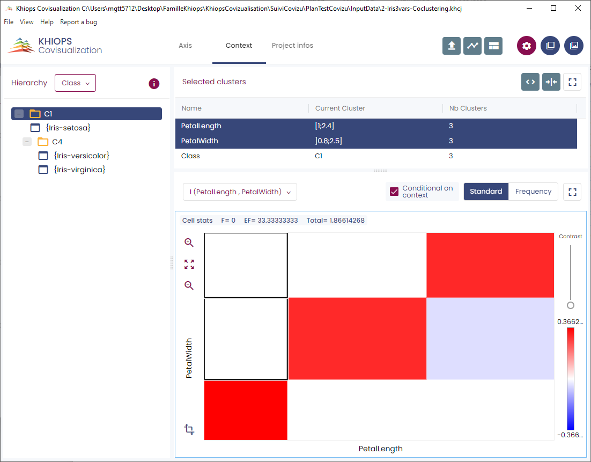

#  Managing three dimensions or more

With three (or more) dimensions, the two "main" dimensions are presented as if there were only two dimensions. The other dimensions are contextual, you can view them one by one in the "context" tab.

The two dimensions of the co-occurrence matrix are always the main dimensions. By selecting a cluster in a contextual dimension, you project the co-occurrence matrix on this cluster. It allows to view two dimensions on the matrix and to act on a third. For example, with a temporal dimension as context, you can see the evolution over time of the co-occurrence matrix of two other variables.

The indicators of the cells can be computed in two ways :

  - If the “Conditional on context” button is checked, the indicators are computed with the instances associated to the context selected cluster

  - If it is not checked, the indicators are computed with all the instances (and have the same values whatever the context selected cluster)

