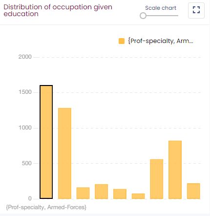

#  First steps

The entry point of Khiops Covisualization is the khcj file generated by Khiops Coclustering at the end of the analysis. A double-click on this file opens Khiops Covisualization.

Khiops Covisualization is composed of several tabbed panes. The first one is the project pane : it presents the report file and database locations.

The second pane is the axis pane : it presents the coclustering.

There is a third pane only with three (or more) dimensions : the two "main" dimensions are presented in the second pane as if there were only two dimensions. The other dimensions are contextual, you can view them one by one in the third pane called the context pane.

The coclustering window in the second pane is split into three mains parts; there is one part for each variable (or dimension). The right part shows a co-occurrence matrix.

##  Managing views

By clicking on the  button, you can add or remove different views on each dimension.

The views manager window reflects the Khiops Covisualization interface. The shaded boxes represent the hidden panels while the white boxes represent the visible panels. You can hide or display a panel by clicking the corresponding checkbox. In the same way you can display only one dimension by clicking the checkboxes before the name of each dimension.

##  Screenshot

A useful feature available on all window sections is the screenshot. You can copy to clipboard a selected section by a simple mouse click on one of the top buttons.

A section is selected when it is surrounded by blue lines.

Using  (or \[Ctrl-C\]) you get a picture in bitmap format that you can import in any image editing tool. Using  (or \[Ctrl-D\]) you get the raw data (a table in CSV format), that you can import in any text editing tool.

##  Table display

Clicking  opens a list of columns you can hide or display. The red dot indicates that at least one column is hidden

 allow to automatically redimension the columns of the table.

 opens a search box.

Long tables are split into pages of at most 500 lines.

##   
 Zoom

The sliding bars allow zooming on the chart.

