---
hide:
  - navigation
---

This documentation describes the Khiops GUI Application, which allows users to access Khiops functionalities 
without writing any code. 
It provides a straightforward interface for the entire data mining process, including data preparation, modeling, evaluation, 
interpretation, and deployment of both supervised and unsupervised models on large multi-table databases.

## Quick start

### Fast path

**Explore you data**

- Enter the name of the file in the **Data table file** field of the **Train database** pane 

- Click on the **Train model** button 

- Click on the **Visualize results** button in the **Results** pane 

**Build a classification model**

- Enter the name of the input file in the **Data table file** field of the **Train database** pane 

- Enter the name of the variable to predict in the **Target variable** field of the **Parameters** pane. 

- Click on the **Train model** button 

- Click on the **Visualize results** button in the **Results** pane 

### What is a data dictionary? 

A data dictionary allows you to define the type and name of variables in a data file, with additional key features:

- selecting variables to include or exclude from analysis,

- organizing data within a multi-table schema, such as a star schema or snowflake schema,
    
- creating new variables through derivation rules,

- storing data transformation workflows derived from machine learning model outputs,

- facilitating data transformation of the input database via the **Deploy model** feature, which includes:
   
    - deploying prediction scores using a prediction model,

    - recoding data with a recoder model,
     
    - generating interpretation indicators with an interpreter model,
     
    - deploying or reinforcing scores using a reinforcer model,
     
    - ...

For comprehensive information on dictionaries, refer to [`Start Using Dictionaries`](../tutorials/kdic_intro.md).

A dictionary file contains one or several dictionaries; details about their format can be found in [`Dictionary files`](../api-docs/kdic/dictionary-files.md).


### Standard path 

**Manage data dictionaries**

- Click on the **Manage dictionaries** sub-menu of the **Data dictionary** menu 
  A dialog box appears, which allows you to build a dictionary from a data file and edit the dictionaries of a dictionary file. 

**Use a data dictionary**

- Click on the **Open** sub-menu of the **Data dictionary** menu 

- Choose the dictionary file (extentions .kdic) 

- Enter the name the dictionary in the **Analysis dictionary** field of the **Train database** pane 


## Train database

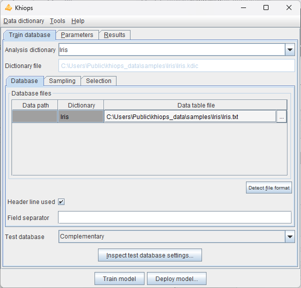 

**Analysis dictionary**: name of dictionary to analyse. Automatically generated from data table file if not specified.

***Dictionary file***: (read-only) name of the current dictionary file.

### Database

**Database files**: name of the database files to analyse.

**Data table file**: name of the data table file. Mandatory field.

**Detect file format**: heuristic help that scans the first few lines to guess the file format. The header line and field separator are updated on success, with a warning or an error in the log window only if necessary.

**Header line used**: (default: true). If the file does not have a header line, Khiops considers the variables in the dictionary to analyse the fields in the file.

**Field separator**: Character used as field separator in the file. It can be space (S), semi-colon (;), comma (,) or any character. By default, if nothing is specified, the tabulation is used as the field separator.

### Sampling

Khiops can be used to extract a subpart (or its exact complementary) of the records in a database file. This sampling is specified with a sample percentage of the records (to keep or to discard). The sampling is a random sampling, but is reproducible (the random seed is always the same).

**Sample percentage**: percentage of the samples (default: 70%)

**Sampling mode**: to include or exclude the records of the sample (default: *include sample*).
This allows to extract a train sample and its exact complementary as a test sample 
(if the same sample percentage is used both in train and test, in *include sample* mode in train and *exclude sample* mode in test).


### Selection

Another way to build train or test samples is to use a selection variable and a selection value.

**Selection variable**: when nothing is specified, all the records are analysed. When a selection variable is specified, the records are selected when the value of their selection variable is equal to the selection value.

**Selection value**: used only when a selection variable is specified. In that case, the value must be a correct value (numerical value if the selection variable is a numerical variable).


!!! info
    For **multi-table** databases, the array of database files may contain multiple entries.
    Each file is identified by a data path that indicates the semantic location of the table.
    This path specifically reflects the sequence of variable names leading to the table, separated by slashes (/).
    In the GUI, these data paths are generated automatically, and one **data table file** must be assigned to each **data path**
    within the multi-table dictionary.
    Additionally, each data table file must be sorted by key. In root tables, keys serve as identifiers,
    meaning that root entities must have unique keys.
    
    ***Data path***: data path of the data table

    - in a multi-table schema, each data path refers to a Table or Entity variable and identifies a data table file,
    
    - the main table has an empty data path,
    
    - in a star schema, the data paths are the names of Table or Entity variables for each secondary table,
    
    - in a snowflake schema, data paths consist of a list of variable names with a '/' separator,
    
    - external tables begin with a data root prefixed with '/', which refers to the name of the referenced root dictionary.
    
    ***Dictionary***: name of the dictionary that describes the data table.

    For in-depth information about multi-table dictionaries, see [`Multi-table Concepts`](../tutorials/kdic_multi_table.md)


### Specification of test database

**Test database**: specification of the test database, according to one of the following choices:

- Complementary (default): same as the train database, with 'Sampling mode' inverted in the test database, in order to get test samples that are the exact complementary of the train samples,

- Specific: specific parameters for the test database,

- None: no test database is used.


### Inspect test database settings

This action allows to inspect the test database parameters.

The test parameters are editable only in the case of a specific test database.

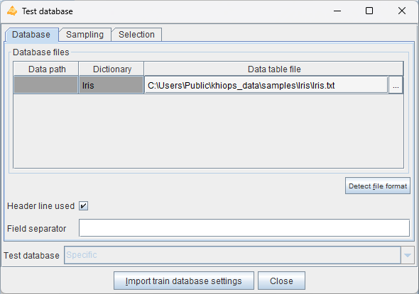

The test database is defined exactly in the same way as the train database.

In the case of a specific database, there is an additional 'Import train database settings' button to import the train database parameters. 
It allows to fill all the test database fields, by copying them from the 'Train database' pane. 
The only change is the 'Sampling mode' which value is inverted in the test parameters, in order to get a test sample that is the exact complementary of the train sample.

## Parameters

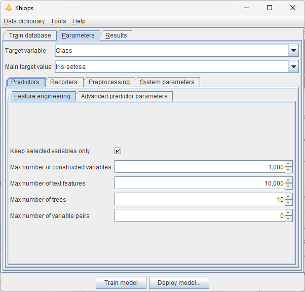

**Target variable**: name of the target variable. The learning task is classification if the target variable is categorical, regression if it is numerical. If the target variable is not specified, the task is unsupervised learning.

**Main target value**: value of the target variable in case of classification, for the lift curves in the evaluation reports.

### Predictors

#### Feature engineering

Khiops performs automatic feature engineering by constructing variables from multi-table schema, tokenizing text variables, building trees and analysing pairs of variables.

**Keep selected variables only**: in supervised analysis, constructed variables are included in the data preparation reports only if they are selected in the Naive Bayes Selective predictor.

**Max number of constructed variables**: max number of variables to construct (default: 1000). The constructed variables allow to extract numerical or categorical values resulting from computing formula applied to existing variable (e.g. YearDay of a Date variable, Mean of a Numerical Variable from a Table Variable).

**Max number of text features**: max number of text features to construct (default: 10,000). Text features are constructed from variables of type Text or TextList available in the main table or any secondary tables. 
By default, features are created using words.

**Max number of trees**: max number of trees to construct. The constructed trees allow to combine variables, either native or constructed (default: 10).

**Max number of pairs of variables**: max number of pairs of variables to analyze during data preparation (default: 0). The pairs of variables are preprocessed using a bivariate discretization method. Pairs of variables are not available in regression analysis.

By default, few features are constructed to get a good trade-off between accuracy, interpretability and deployment speed. 
Maximum interpretability and deployment speed can be achieved by choosing no feature to be built. 
Conversely, choosing more features to construct allows to train more accurate predictors at the cost of computation time and loss of interpretability.

- Variable construction

    - allows to exploit a multi-table schema, by automatically flattening the schema into an analysis table that summarizes the information in the schema,
    
    - being automatic, robust and scalable, accelerates the data mining process to obtain accurate predictors,
  
    - constructed variables remain understandable by the mean of human readable names, in the limit of their complexity,
  
    - recommendation: increase incrementally with 10, 100, 1000, 10000… variables to construct, to find a good trade-off between computation time and accuracy.

- Text features

    - allows to exploit text variables defined in the main table or any secondary tables, by tokenizing them into list of tokens,
  
    - eliminates the need for manual preprocessing or feature engineering, making the process faster, easier, and fully interpretable,

    - this is particularly valuable for databases where text data is embedded within tabular datasets and can complement other variables,
  
    - while Khiops approach to text data is not designed to replace specialized models (e.g. LLMs), it provides a lightweight, automated, and interpretable solution for incorporating textual insights into tabular analyses, with minimal effort.

- Trees
  
    - allows to leverage the assumption of the Selective Naive Bayes predictor that considers the input variables independently, to improve accuracy,
  
    - combines native or constructed variables to extract complex information,
  
    - tree-based variables are categorical variables, which values are the identifiers of the leaves of a tree; they are pre-processed like other categorical variables (although they do not appear in the preparation report), then used by the classifier, for potentially improved predictor performance,
  
    - tree based variables are black-boxes, with potentially improved accuracy at the expense of loss of understandability,
  
    - recommendation: increase incrementally with 10, 20, 50, 100… trees to construct, to find a good trade-off between computation time and accuracy.

- Variables pairs
  
    - allows to understand the correlation between variables either in supervised classification (not available in regression) or unsupervised learning tasks,
  
    - the analysis of pairs of variables is a time consuming operation,
  
    - in the supervised case, a variable pair is considered to be informative if it brings more information than both variables individually (see criterion DeltaLevel); non informative pairs are summarized in analysis reports, but not used in predictors,
  
    - recommendation: build variable pairs for exploratory analysis of correlations rather than to improve the accuracy of predictors.

Constructed variables are stored in the output dictionaries (recoding or modeling dictionary), with formulae that allow to compute their values during model deployment.

!!! note

    Constructed variables and text features are generated independently.
    Trees and pairs can exploit constructed variables, but not text features.

#### Advanced predictor parameters

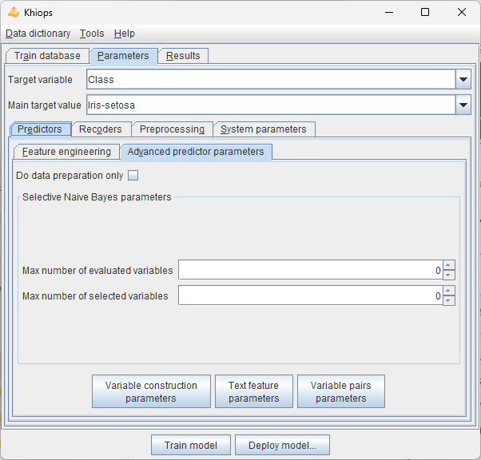

**Do data preparation only**: do the data preparation step only. Do not perform the modeling step in supervised analysis.

##### Selective Naive Bayes parameters

These parameters are user constraints that allow to control the variable selection process. Their use might decrease the performance, compared to the default mode (without user constraints).

**Max number of evaluated variables**: max number of variables originating from the data preparation, to use as input variables in the multivariate selection of the Selective Naive Bayes predictor. The evaluated variables are those having the highest predictive importance (Level). This parameter allows to simplify and speed up the training phase (default: 0, means that all the variables are evaluated).

**Max number of selected variables**: max number of variables originating from the multivariate variable selection, to use in the final Selective Naive Bayes predictor predictor. The selected variables are those with the largest importance in the multivariate selection. This parameter allows to simplify and speed up the deployment phase (default: 0, means that all the necessary variables are selected).

#### Variable construction parameters

Automatic variable construction exploits the set of construction rules specified in the **Variable construction parameters** window.

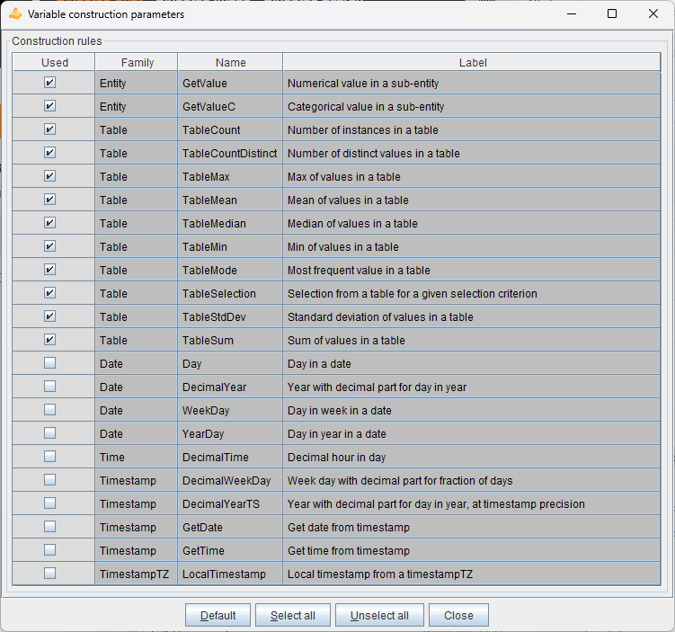

!!! warning

    The construction rules applied to Date, Time, Timestamps or TimestampsTZ variables enable the extraction of numerical values at various periodicities 
    (e.g. year day, month day or week day from a Date variable). 
    By default, these date and time rules are not selected. They are interesting for exploratory analysis. For supervised analysis, 
    they should be used with caution, as the deployment period may differ from the training period.

The **Select all** and **Unselect all** buttons allow to choose all or no construction rules, and the **Default** button restores the initial selection. The **Used** checkboxes allow to select construction rules one by one.

!!! note

    In case of *multi-table* databases, construction rules can be applied to Entity or Table variables. 
    They allow to extract values from sub-tables, such as the mean of the costs of sales of a customer. 
    The TableSelection rule can be combined with other rules in order to be applied on a subset of the sub-tables
    (e.g. mean cost of sales of a customer for sales related to a given category of products).
    Given the combinatorial number of potential selection formula, thousands of variables can be constructed automatically.

Several heuristics are applied during the variable construction process, whenever possible:

- Constructed variable do not exploit key variables of secondary tables in multi-table dictionaries, since they are mostly redundant with the key variables of the main table.

- Constructed variables that exploit the same derivation rules as existing initial variables (used or unused) would be redundant. They are not constructed and new variables are constructed instead.

- Constructed variables that exploit different parts of the same partition of a secondary table (via the TableSelection construction rule) may be grouped in a sparse variable block.

- To optimize the overall computation time, temporary variables are also constructed, since they can be reused as operands of several constructed variables. Still, if a temporary variable exploits the same derivation rule as an existing initial variable, the temporary variable is not constructed and the initial variable is used instead.

#### Text feature parameters

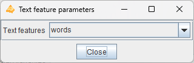

**Text features**: type of constructed text features :

- words : text words obtained with an automatic tokenization process,

- ngrams: ngrams of bytes; generic, fast, robust, but less interpretable,

- tokens : text tokens whose interpretability and interest depend on the quality of the input text preprocessing.

The **words** automatic tokenization process uses separator or control characters as delimiters.
The obtained words are either sequences of punctuation characters or sequences of any other character.

The **tokens** tokenization process simply uses the blank character as delimiter.
This method assumes that the text has been already preprocessed (eg. lemmatization).


#### Variable pairs parameters

These parameters allow you to choose to analyze all potential variables pair, or to select individual variable pairs or families of variable pairs involving certain variables to analyze first.

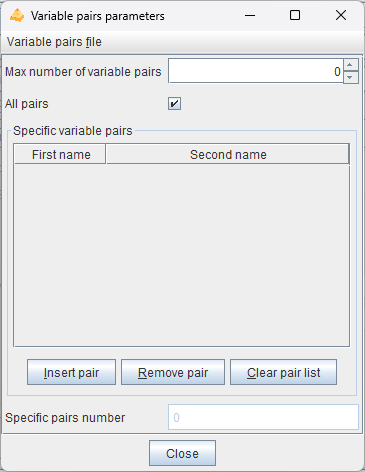

**Max number of variable pairs**: max number of pairs of variables to analyze during data preparation (default: 0). The pairs of variables are preprocessed using a bivariate discretization method. Pairs of variables are not available in regression analysis.

If the number of pairs specified is greater than this maximum value, the pairs are chosen first for the specific pairs, then for the pairs involving the variables with the highest level in the supervised case and by alphabetic order otherwise.

**All pairs**: Analyzes all possible variable pairs.

**Specific variables pairs**: Allows to specify a list of variables pairs. A variable pair can be specified with a single variable to indicate that all pairs involving that variable should be analyzed.

- **Insert pair**: Adds a variable pair

- **Remove pair**: Removes a variable pair

- **Insert pair**: Removes all specific variable pairs

The list of specific variable pairs is cleaned up on closure, removing pairs with syntactically invalid names and redundant pairs.

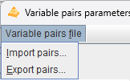

**Variable pairs file**

- **Import pairs…**: Imports a list of variable pairs from a tabular text file with two columns. Invalid or redundant pairs are ignored during import.

- **Export pairs…**: Exports the list of variable pairs to a tabular text file with two columns. Only valid and distinct pair are exported.

### Recoders

Khiops builds recoders in case of a supervised or unsupervised learning task, to enable the recoding of an input database. The recoded database may then be exploited outside the tool to build alternative predictors while benefiting from Khiops’ preprocessing.

**Build recoder:** Builds a recoding dictionary that recodes the input database with a subset of initial or preprocessed variables.

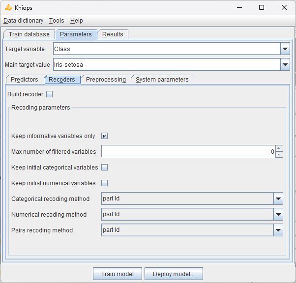

**Keep informative variables only**: if true, all the noninformative variables are discarded, in their initial or recoded representation (default: true).

**Max number of filtered variables:** max number of variables originating from the univariate data preparation (discretizations and value groupings), to keep at the end the data preparation. The filtered variables are the ones having the highest univariate predictive importance, aka Level. (default: 0, means that all the variables are kept).

**Keep initial categorical variables**: (default: false) keep the initial categorical variables before preprocessing.

**Keep initial numerical variables**: (default: false) keep the initial numerical variables before preprocessing.

**Categorical recoding method**: (default: part Id)

- part Id: identifier of the part (group of values)

- part label: comprehensible label of the part, like in reports

- 0-1 binarization: binarization of the part (generates as many Boolean variables as number of parts)

- conditional info: negative log of the conditional probability of the source variable given the target variable (-log(p(X|Y)). 
 Potentially a good representation for distance based classifiers, such as k-nearest neighbours or support vector machines

- none: do not recode the variable

**Numerical recoding method**: (default: part id)

- part Id

- part label

- 0-1 binarization

- conditional info

- center-reduction: (X – Mean(X)) / StdDev(X)

- 0-1 normalization: (X – Min(X)) / (Max(X) – Min(X))

- rank normalization: mean normalized rank (rank between 0 and 1) of the instances

- none

**Pairs recoding method**: (default: part Id)

- part Id

- part label

- 0-1 binarization

- conditional info

- none

### Preprocessing

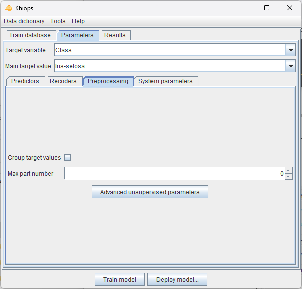

**Group target values**: in case of classification task, indicates that the preprocessing methods should consider building discretization by partitioning both the input values (in intervals or groups of values) and the target values into groups. This is potentially useful in case of classification tasks with numerous target values, by automatically and optimally reducing the number of target values using groups.

**Max part number**: max number of parts generated by preprocessing methods.
When this interpretability constraint is enabled, it takes precedence over the preprocessing method's selection criterion
The default value is 0, which allows the method to determine the optimal number automatically:

- for MODL supervised or unsupervised methods, it sets the optimal number of intervals or value groups,
 
- for the EqualWidth or EqualFrequency unsupervised discretization methods, it defaults to 10 intervals,

- for the BasicGrouping unsupervised value grouping method, it defaults to 10 groups.

Note: Missing values are treated as a special value (minus infinity) which is smaller than any actual value. If missing values are both informative and numerous, the discretization algorithm builds a special interval containing all missing values. Otherwise, missing values are included in the first built interval, containing the smallest actual values.

#### Advanced unsupervized parameters

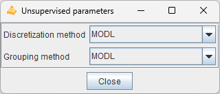

**Discretization method**: name of the discretization method in case of unsupervised analysis (default: MODL):

- MODL: Bayes optimal discretization method, the criterion allows to find the most probable discretization given the data

- EqualFrequency: builds intervals having the same frequency (by default: 10 intervals)

- EqualWidth: which builds intervals having the same width (by default: 10 intervals) |

**Grouping method**: name of the value grouping method in case of unsupervised analysis (default: MODL).

- MODL: Bayes optimal value grouping method, the criterion allows to find the most probable value grouping given the data. A "garbage" group is used to unconditionally group the infrequent values (the frequency threshold is automatically adjusted)

- BasicGrouping: builds one group for each frequent explanatory values (by default: 10 groups, the last one containing all the infrequent values)

### System parameters

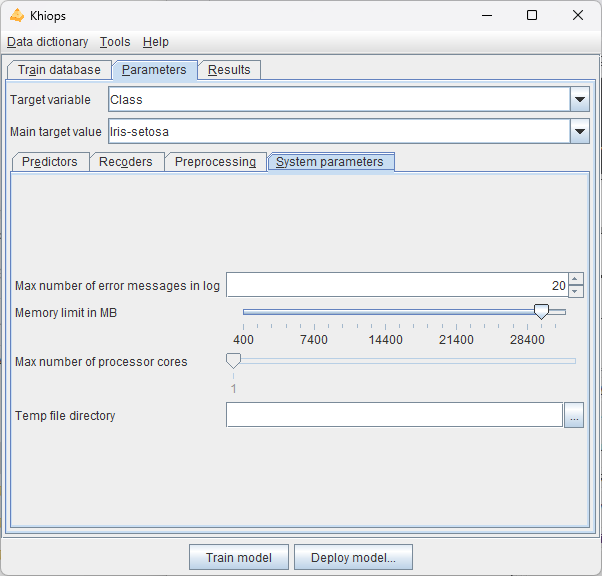

**Max number of error messages in log**: allows to control the size of the log, by limiting the number of messages, warning or errors (default: 20).

**Memory limit in MB**: allows to specify the max amount of memory available for the data analysis algorithms. By default, this parameter is set to the limit of the available RAM. This parameter can be decreased in order to keep memory for the other applications.

**Max number of processor cores**: allows to specify the max number of processor cores to use.

**Temp file directory**: name of the directory to use for temporary files (default: none, the system default temp file directory is then used).

The resources fields related to memory, processor cores and temp file directory allow the user to upper-bound the system resources used by Khiops. Given this, Khiops automatically manages the available system resources to perform at best the data analysis tasks.


## Results

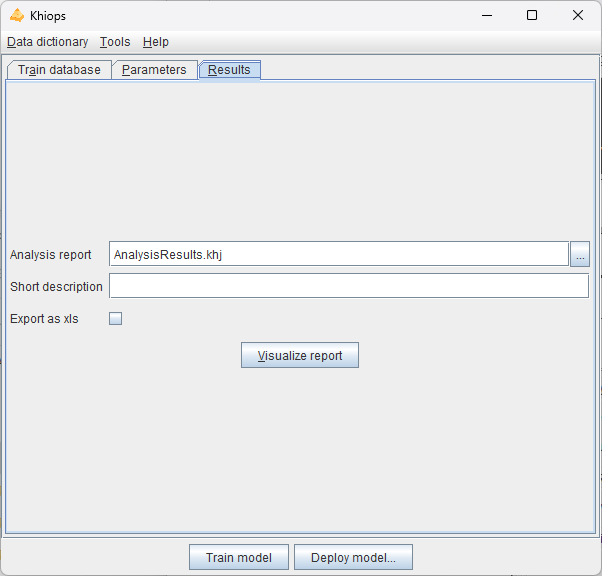

**Analysis report**: (default: AnalysisResults.khj). Name of the analysis report file in JSON format.
An additionnal dictionary file with extension *.model.kdic* is built, which contains the trained models.
By default, the result files are stored in the train database directory, unless an absolute path is specified.
The JSON file is useful to inspect the modeling results from any external tool.

**Short description**: (default: empty) brief description to summarize the current analysis, which will be included in the reports.

**Export as xls**: (default: false) option to export each report to a tabular file that can be opened using Excel, with the following extensions:

- *.PreparationReport.xls*: data preparation report produced after the univariate data analysis on the train database,

- *.TextPreparationReport.xls*: data preparation report for text variables,

- *.TreePreparationReport.xls*: data preparation report for tree variables,

- *.Preparation2DReport.xls*: data preparation report for bivariate analysis,

- *.ModelingReport.xls*: modeling report produced once the predictors have been trained,

- *.TrainEvaluationReport.xls*: evaluation report produced after the evaluation of the predictors on the train database,

- *.TestEvaluationReport.xls*: evaluation report produced after the evaluation of the predictors on the train database.

**Visualize report**: visualize report if available, using Khiops visualization tool.

## Data dictionary menu

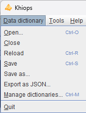


#### Open

An open dialog box asks the name of the dictionary file to open.

In case of invalid dictionary file, the current dictionaries are kept in memory.

#### Close

The dictionaries are removed (from memory only). The potential pending modifications are lost if they have not been saved.

#### Reload

Reload the current dictionary file into memory

#### Save

The memory dictionaries are saved under the current dictionary file.

#### Save as

A save dialog box asks the name of the dictionary file to save.

#### Export as JSON

A save dialog box asks the name of the JSON file to export the dictionaries under a JSON format, with a .kdicj extension.

#### Manage dictionaries

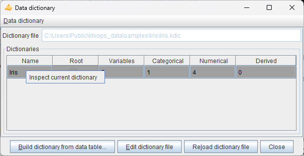

This action opens a dialog box that enables you to create a dictionary from a data file, edit the dictionaries within a dictionary file, 
inspect individual dictionaries, and select the variables to be used for analysis.

**Dictionary file**: (read-only) name of the dictionary file related to the data to analyse. Read-only field that shows the name of the current dictionary file.

**Dictionaries**: list of available dictionaries, with statistics describing the used variables (Name, Variables, Categorical, Numerical, Derived).

##### Data dictionary menu

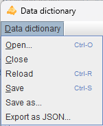

This menu performs the sames actions as the **Data dictionary** menu of the main window.

##### Inspect current dictionary

You can inspect a dictionary and choose the variables for analysis by selecting a dictionary from the **Dictionaries** list and then right-clicking on **Inspect current dictionary**.

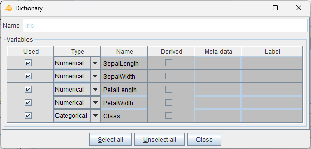

##### Build dictionary from data table

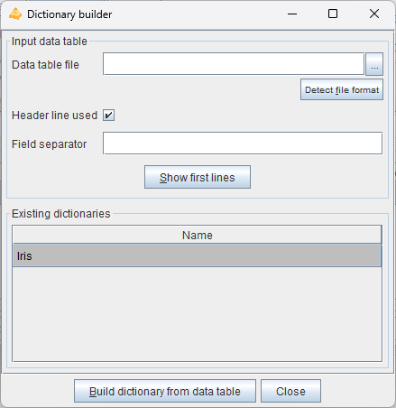

This action opens a dialog box that allows to build dictionaries from data tables, then saves them in a dictionary file.

**Data table file**: name of the data table file to analyse. Mandatory field.

**Detect file format**: heuristic help that scans the first few lines to guess the file format. The header line and field separator are updated on success, with a warning or an error in the log window only if necessary.

**Header line used**: (default: true). If the file has a header line, Khiops will use the header line fields as variables names; otherwise, the variables will be names Var1, Var2...

**Field separator**: by default, if nothing is specified, the tabulation is used as the field separator.

**Show first lines**: shows first lines of data table in log window.

**Build dictionary from data table**: starts the analysis of the data table file to build a dictionary. The first lines of the file are analyzed in order to determine the type of the variables: Categorical, Numerical, Date, Time or Timestamp. After analysis, the user can choose the name of the dictionary.

**Close**: closes the window. If dictionaries have been built, proposes to save them in a dictionary file

The values in the data table file are parsed in order to guess their type.

- values with format YYYY-MM-DD (e.g. 2014-01-15) are recognized as Date variables,

- values with format HH:MM:SS (e.g. 11:35:20) are recognized as Time variables,

- values with format YYYY-MM-DD HH:MM:SS are recognized as Timestamp variables,

- values with format YYYY-MM-DD HH:MM:SS.zzzzzz are recognized as TimestampTZ variables, with time zone information,

- for other Date, Time, Timestamp or TimestampTZ formats (e.g. Date format DD/MM/YYYY), a specific meta-data value is used (see paragraph 3.2.2. Dictionary) to specify the format used for the variable,
  
  - DateFormat: see [`Date rules`](../api-docs/kdic/date-rules.md)
  
  - TimeFormat: see [`Time rules`](../api-docs/kdic/time-rules.md)
  
  - TimestampFormat: see [`Timestamp rules`](../api-docs/kdic/timestamp-rules.md) 
  
  - TimestampTZFormat: see [`TimestampTZ rules`](../api-docs/kdic/timestamp-tz-rules.md)

- other values with numerical format are recognized as Numerical values,

- other values are recognized as Categorical values or Text values if their length exceeds  100 characters.

!!! warning

    Dictionaries are built automatically for convenience, but they should be checked carefully by the data miner. 
    For example, zip codes are made of digits and recognized as Numerical variables, whereas they are Categorical variables. 
    Values such as 20101123 or 20030127 are recognized as Date with format YYYYMMDD, whereas they could be Numerical.

!!! warning

    The Date, Time, Timestamp or TimestampTZ formats can be erroneous (example: 2010-10-10 is ambiguous w.r.t. the format: "YYYY-MM-DD" or "YYYY-DD-MM"). 
    The meta-data must be corrected directly in the dictionary file is necessary. 
    In some cases, a date, time or timestamp variable may have a format not recognized by Khiops. 
    This is the case for example for formats where the century is not specified (e.g: "YY-MM-DD"). 
    In that case, the corresponding variable should be declared as Categorical (and not used), and a new variable can be built using derivation rules, as illustrated below.

    ```kdic
    Unused Categorical MyDate ; // Date with unrecognized format "YY-MM-DD"*
    Date MyCorrectDate = AsDate(Concat("20", MyDate), "YYYY-MM-DD"); // Correction if all centuries are 20th*
    Unused Numerical MyCentury = If(LE(AsNumerical(Left(MyDate, 2)), 15), 20, 19); // 20th for year below 15, 19th otherwise*
    Date MyCorrectDate2 = AsDate(Concat(AsCategorical(MyCentury), MyDate), "YYYY-MM-DD"); // Correction using MyCentury
    ```

!!! note

    In case of *multi-table* databases, after building and checking the resulting dictionary file, the data miner has to modify the dictionary file using a text editor 
    in order to specify the relations between the dictionaries of the multi-table database. 
    See [`Multi-table dictionary`](../api-docs/kdic/multi-table-rules-introduction.md)

##### Edit dictionary file

Edit the current dictionary file with the default system text editor. 
Typically, this is the text editor associated with the *.txt* extension. 
If a tool is linked to the *.kdic* extension, that tool will be used instead.

To update the dictionary, save it from the text editor, then use the **Reload dictionary file** button.


#### Quit

Quits the application.


## Tools menu

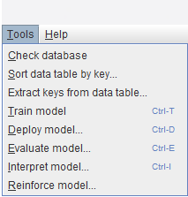

### Check database

!!! Prerequisite

    The train database must be specified, and the dictionary related to the train database must be loaded in memory.

This action checks the integrity of the train database.

This action reads each line of the train database to perform the integrity checks. 
During formatting checks, the number of fields in the train database is compared to the number of native variables in the dictionary. Data conversion checks are performed for the fields corresponding to numerical, date, time and timestamp variables. 
Error messages are displayed in the message log window.

!!! note

    Errors encountered during database checking are always shown.
    However, they are automatically corrected, such as replacing empty or invalid numerical values with a system missing value,
    and discarding unnecessary values.
    As a result, data analysis is still performed, although its reliability may be compromised if database errors are present.

!!! warning

    Fields containing separators are managed when they are enclosed in double quotes. 
    However, multi-line fields are intentionally not supported, as this encoding can be error-prone, 
    missing a single double quote may cause the entire file to be misread.
    Errors related to multi-line field encoding are detected and corrected as much as possible.
    Consequently, data analysis can still be performed, but an error is generated to indicate that 
    its reliability is probably compromised.


!!! warning

    In case of *multi-tables* database, data tables must be sorted by key. 
    Sort errors are reported but cannot be corrected, and therefore, no data analysis can be performed.


### Sort data table by key

!!! Prerequisite

    The dictionary of the input data table must be loaded in memory.

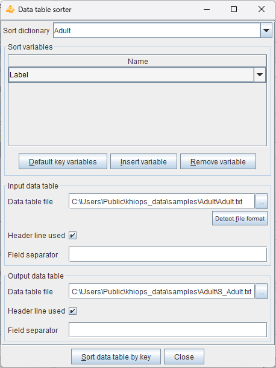

This action allows to sort a data table according to sort variables. 
It is dedicated to the preparation of *multi-table* databases, 
which requires all data table files to be sorted by key, for efficiency reasons.

The parameters of the dialog box are the following.

**Sort dictionary**: dictionary that describes all native of the database file. Native variables are the variables stored in date files, of type Numerical, Categorical, Date, Time or Timestamp, and not derived using a formula.

**Sort variables: must be native (not derived) and Categorical**

- **Default key variables**: the sort variables are the key variables retrieved from the sort dictionary.

- **Insert variable**: inserts a variable in the list of sort variables.

- **Remove variable**: removes a variable from the list of sort variables.

**Input data table**:

- Data table file
  
- Detect file format

- Header line used

- Field separator

**Output database**:

- Data table file

- Header line used

- Field separator

The **Sort data table by key** action reads the input data, sorts the lines by key, and writes the sorted output data.

All native variables (either used or not in the sort dictionary) are written in the output database, whereas derived variables are ignored: the output database has the same content as the input database, except that the lines are now sorted by key.

Note that this feature is very low-level and performs only minimal checks. For example, even the header line can be invalid w.r.t. all native variables defined in the dictionary, provided that the mandatory key fields for sorting are correct.


### Extract keys from data table

!!! Prerequisite

    The dictionary of the input data table must be loaded in memory and the input data table must be sorted by the keys of its dictionary.

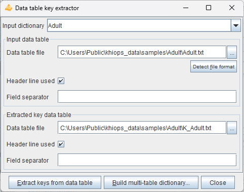

This action allows to extract keys from a sorted input data table. It is dedicated to the preparation of *multi-table* databases, where a root entity has to be extracted from a detailed 0-n entity. For example, in case of a web log file with cookies, page, timestamp in each log, extracting keys allow to build a table with unique cookies from the table of logs.

The parameters of the dialog box are the following.

**Input dictionary**: dictionary that describes the content of the input data table.

**Input data table**:

- Data table file
  
- Detect file format

- Header line used

- Field separator

**Extracted key data table**:

- Data table file

- Header line used

- Field separator

The **Extract keys from data table** action reads the input data, remove duplicate keys and store the unique resulting keys in the output data table.

The **Build multi-table dictionary** action builds a root dictionary with a Table variable based on the input dictionary, then saves the dictionary file.

### Train model

!!! Prerequisite
    
    The train database must be specified.

    **Fast path**: if the dictionary related to the train database is not available, it will be automatically inferred from the data.

    **Standard path**: the available dictionary, checked by the data analyst, must be loaded in memory.

If the name of the **Target variable** is missing, the data analysis is restricted to unsupervised descriptive statistics.
Otherwise, the learning task is classification or regression according to the type of the target variable (categorical or numerical).

The analysis starts by loading the database into memory. 
Data chunks are potentially used in order to be consistent with the available RAM memory. 
Khiops then performs discretizations for numerical variables, value groupings for categorical variables. 
Variables are also constructed according to whether the feature engineering options are activated.
Finally, the requested predictors are trained and evaluated.

An analysis report with extension *.khj* is produced according to it specification in the **Results** pane.
Additionally, model dictionaries are created and saved in a dictionary file with the extension *.model.kdic*
are created, which can be deployed using the **Deploy Model** feature.

The analysis report mainly includes data preparation reports for each family of generated variables, 
detailing univariate statistics such as discretizations and value groupings. 
It also contains a modeling summary that highlights the selected variables, 
as well as train and test evaluation reports.

The built dictionaries (available according to the activated options) are:

- SNB_<Dic\>: dictionary containing the prediction and prediction score formulae for a Selective Naive Bayes predictor,

- R_<Dic\>: dictionary containing the recoded variables (discretizations and value groupings), 
  generated when **Build recoder** is activated in the **Parameters/Recoders** pane.


**The predictor dictionaries**

At the end of the data analysis, Khiops builds predictors and saves them by means of dictionaries 
including variables dedicated to prediction. 
The formulae used to compute prediction variables are stored in the dictionaries, 
enabling the deployment of prediction scores on unseen data. 
The data miner can select or unselect variables to deploy using the "Unused" keyword in
the modeling dictionary. 
For example, to produce a score file, the data miner can select a key variable, in order to enable joins in databases, and the variable related to the probability of the class value of interest.

The main output variables in a classification dictionary with a target variable named <class\> are:

- Predicted<class\>: predicted value

- Prob<class\><value\>: probability of each target value named <value\>

The main output variables in a regression dictionary with a target variable named <target\> are:

- M<target\>: predicted mean of the target

- SD<target\>: predicted standard deviation of the target

Other interesting variables are related to the prediction of the normalized rank of the target value (rank between 0 and 1):

- MR<target\>: predicted mean of the target rank

- SDR<target\>: predicted standard deviation of the target rank

- CPR<i\><target\>: cumulative probability of the target rank, i.e. probability that the target rank is below i

!!! Note
    
    It is noteworthy that in case of regression, Khiops is able to predict the full conditional distribution of the target values. 
    For example, the regression variables TargetRankCumulativeProbAt(rank) available in the regression dictionary enable to predict the conditional probability of 
    the target variable for any interval of values (more precisely interval of normalized target ranks, i.e. target partile).


!!! Note

    In case of *multi-table* database, automatic variable construction allows to explore 
    complex representation spaces from multiple tables by creating many variables in the root entity to summarize the content of the sub-entities.

### Deploy model

!!! Prerequisite

    At least one dictionary must be loaded into memory. 
    This can be any type of dictionary, such as a modeling dictionary for classification or regression, 
    a recoder dictionary, an interpretation dictionary, or a reinforcement dictionary.

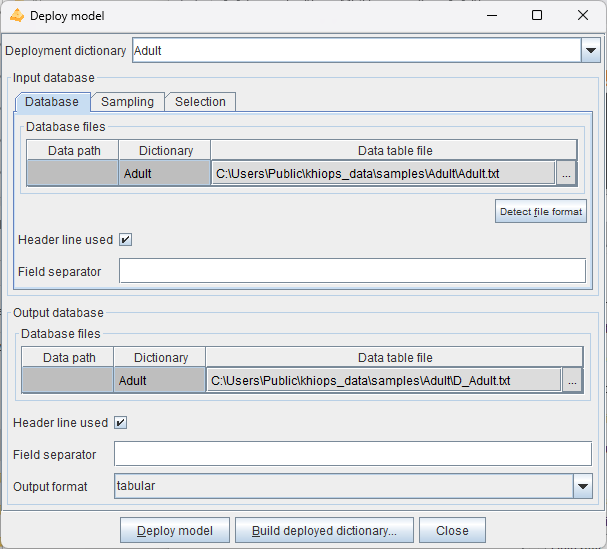

This action opens a dialog box allowing to specify an input and output database, and a dictionary describing the variables to keep, discard or derive. 
This allows to recode a database or to deploy a predictor on new data. The parameters of the dialog box are the following.

**Deployment dictionary**: dictionary used to select or derive new variables.

**Input database**:

- Database
  
    - Data table file

    - Detect file format

    - Header line used

    - Field separator

- Sampling

    - Sample percentage

    - Discard mode

- Selection
    
    - Selection variable

    - Selection value

**Output database**:

- Data table file

- Header line used

- Field separator

- Output format: tabular (default): standard tabular format; sparse: extended tabular format, with sparse fields in case of blocks of variables

The **Deploy model** action reads the input data, applies the deployment dictionary to select all or part of the variables and add derived variables, 
and writes the output data.

This action enables the deployment of any model dictionary, whether for classification, regression,
interpretation, reinforcement, or other purposes.
It can also be used to recode data according to the deployment dictionary's specifications,
resulting in variables that are used, discarded, or newly created through various derivation rules.

The **Build deployment dictionary** action creates an output dictionary that enables to read and analyses the output files: it contains the deployed variables only, 
without any derivation rule in the dictionary.


!!! Note

    For *multi-table* databases, there are potentially several lines in the array of the input and output 
    database files. One input data table file must be specified for each table in the multi-table dictionary.
    During deployment, only the specified output data table files will be written, while any files associated
    with unused secondary tables in the multi-table dictionary will be omitted from the deployment.
    For the output database, only the data table files that are excluded will be written.


### Evaluate model

!!! Prerequisite

    At least one dictionary must be loaded in memory, and it must correspond to a predictor dictionary.

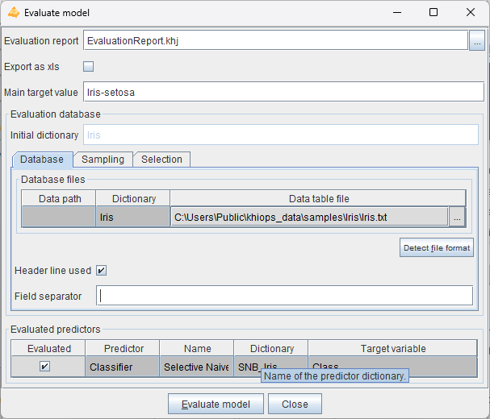

This action opens a dialog box allowing to specify an evaluation report, an evaluation database and to choose the predictor(s) to evaluate. 
The parameters of the dialog box are the following.

**Evaluation report**: name of the evaluation report file.
The JSON file is useful to inspect the modeling results from any external tool.

**Export as xls**: (default: false). Option to export each report to a tabular file that can be opened using Excel, with the following extensions:

**Main target modality**: value of the target variable in case of classification, for the lift curves in the evaluation reports.

**Evaluation database**:

- Initial dictionary: (read-only) name of the dictionary related to the database.

- Database
  
    - Data table file

    - Detect file format

    - Header line used

    - Field separator

- Sampling

    - Sample percentage

    - Discard mode

- Selection
    
    - Selection variable

    - Selection value

**Evaluated predictors**: List of the predictor dictionaries, which are dictionaries among the loaded dictionaries that are recognized as predictor dictionaries. 
This array allows to choose (parameter "Evaluated" which predictor to evaluate).

- Evaluated: to choose whether to evaluate the predictor

- Predictor: Classifier or Regressor

- Name: label of the predictor

- Dictionary: name of the predictor dictionary

- Target variable: name of the target variable (for classification or regression)

The **Evaluate model** action applies the evaluated predictors to the evaluation database and writes an evaluation report.
Unlike the *Train model* action, which trains predictors and evaluates them immediately on the train and 
test databases, the *Evaluate model* action enables a deffered evaluation of predictors that were trained earlier.


!!! Note

    For *multi-table* databases, there are potentially several lines in the array of evaluation database files.


### Interpret model

!!! Prerequisite

    At least one dictionary must be loaded in memory, and it must correspond to a predictor dictionary.

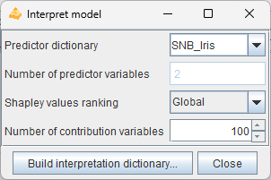

This action opens a dialog box allowing to build an interpretation dictionary from a predictor dictionary.
The interpretation dictionary calculates the individual importance of predictor variables using 
[Shapley values:octicons-link-external-16:][shapley-values]{:target="_blank"}.

[shapley-values]: https://en.wikipedia.org/wiki/Shapley_value "Visit the Wikipedia page"


The parameters of the dialog box are the following.

**Predictor dictionary**: name of the predictor dictionary.

**Number of predictor variables**: (read-only) number of variables used by the predictor.

**Shapley value ranking**: ranking of the Shapley values produced by the interpretation model:

- Global: predictor variables are ranked by decreasing global importance,

- Individual: predictor variables are ranked by decreasing individual Shapley value.

**Number of contribution variables**: number of predictor variables exploited the interpretation model.

**Build interpretation dictionary**: builds an interpretation dictionary that computes the Shapley values.

The interpretation model produces the following variables according to the ranking of the Shapley values:
		
- **Global**: the value of each contribution variable is output, as well as the Shapley value for
          each target value and predictor variable, based on their global importance,

    - each contribution variable in the interpretation dictionary, associated with a specific target value and predictor variable, 
      is identified by the following meta-data tags:
      *<Target="target value"\>* and *<ContributionVariable="variable name"\>*,

    - the predictor interpreted variables are *used* in the dictionary,

- **Individual**: three variables are output for each target value and ranked individual
		importance: name, part and Shapley value of the predictor variable,

    - the three contribution variables for each rank (from rank 1 to maximum) are identified by specific meta-data tags:
      *<ContributionVariableRank=rank\>*, *<ContributionPartRank=rank\>* and *<ContributionValueRank=rank\>*,

    - all these variables also exploit the meta-data tag: *<Target="target value"\>*.


### Reinforce model

!!! Prerequisite

    At least one dictionary must be loaded in memory, and it must correspond to a predictor dictionary.

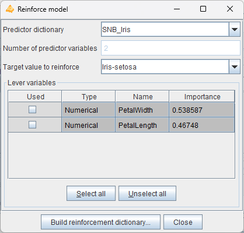

This action opens a dialog box allowing to build a reinforcement dictionary from a predictor dictionary.
The parameters of the dialog box are the following.

**Predictor dictionary**: name of the predictor dictionary.

**Number of predictor variables**: (read-only) number of variables used by the predictor.

**Target value to reinforce**: target value for which one try to increase the probability of occurrence.

**Lever variable**: choice of predictor variables used to reinforce a prediction

- Used: indicates whether the variable is used as a lever variable,

- Type

- Name

- Importance

**Build reinforcement dictionary**: builds a reinforcement dictionary that computes the reinforcement variables
for the specified target value.

The reinforcement model produces the following variables for the target value to reinforce, 
all of them exploiting the meta-data tag *<Target="target value"\>*:

- Initial score, containing the conditional probability of the target value before reinforcement,
  with meta-data tag *<ReinforcementInitialScore\>*,

- Four variables are output per rank (from 1 to maximum) of lever variable sorted by decreasing reinforcement level:

    - name of the lever variable, with meta-data tag *<ReinforcementVariableRank=rank\>*,
  
    - reinforcement part, with meta-data tag *<ReinforcementPartRank=rank\>*,
  
    - final score after reinforcement, with meta-data tag *<ReinforcementFinalScoreRank=rank\>*,

    - class change tag, with meta-data tag *<ReinforcementClassChangeTagRank=rank\>*.


## Help menu

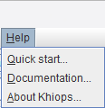

The actions available from the help menu are

- **Quick start**: provides a brief guide to help users get started with the tool.

- **Documentation**: gives an overview of the available documentation and additional resources.

- **About Khiops**: displays version information about the software.