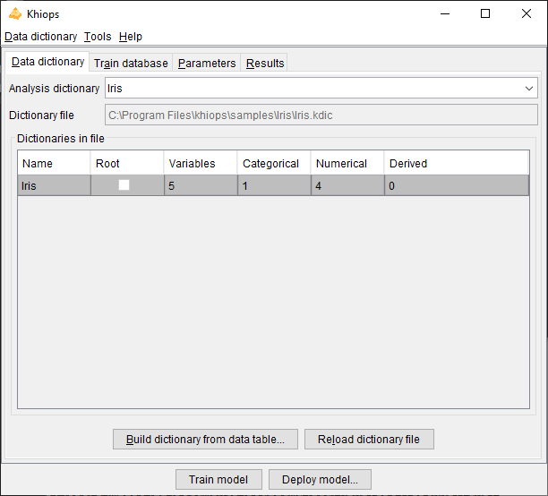
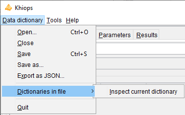
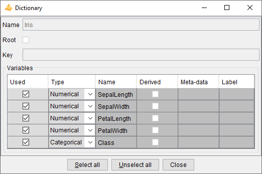
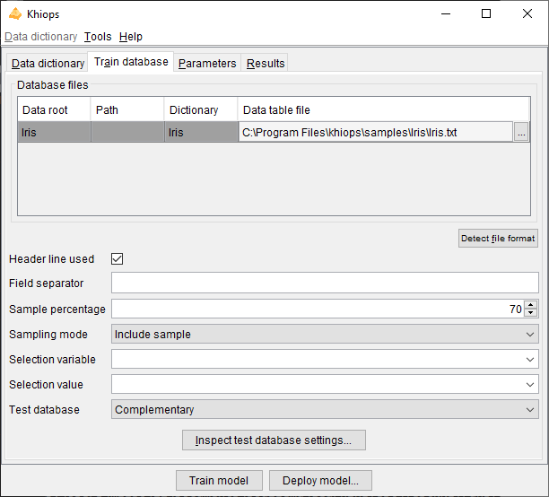
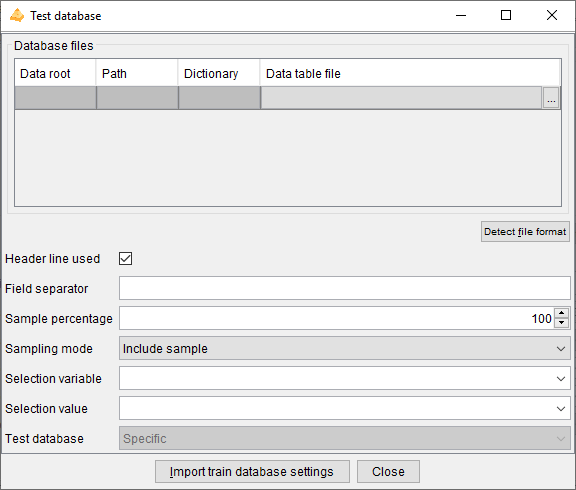
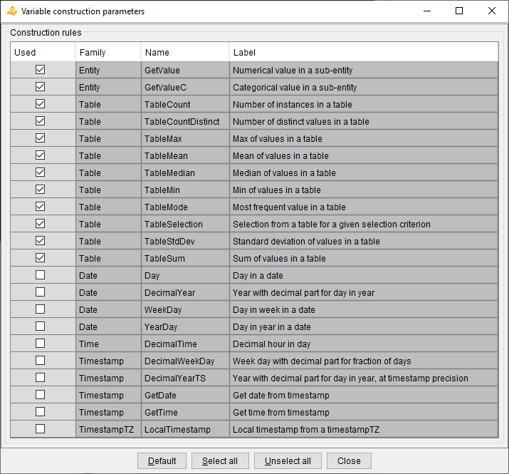

---
hide:
  - navigation
---

Khiops is an automatic data preparation and scoring tool for supervised learning and unsupervised learning in the case of large multi-tables databases. 

It allows to perform univariate and bivariate descriptive statistics, to evaluate the predictive importance of explanatory variables, to discretize numerical variables, to group the values of categorical variables, to recode input data according to these discretizations and value groupings. It allows to perform multi-table relational mining with automatic variable construction. Khiops also produces a scoring model for supervised learning tasks, according to a Selective Naive Bayes approach extended with trees, either for classification or for regression. 

Khiops run on multi-cores machines under multiple platforms. It is available both in user interface mode and in batch mode, such that it can easily be embedded as a software component in a data mining deployment project. 

This documentation describes the parameters of Khiops GUI Application and all its functionalities, the management of the data dictionaries and the list of derivation rules that enable to construct new variables, and finally the analysis and evaluation reports. The user interface is presented as well, together with a quick start of the tool.

## Dictionary file



A dictionary file is a text file with the extension .kdic. It contains the definition of one or several dictionaries, each one describing the set of variables to use 
in a data analysis. The dictionaries can be automatically built from the data table file owing to a file parsing, automatically enriched during data preparation or 
modeling, or manually modified by the Data Miner using a text editor (for example Notepad). The dictionary files built by Khiops use tabulations as field separators, 
which allows direct copy-paste interactions with Excel. This provides a way to quickly sort, select and modify large numbers of variable definitions.
See [`Dictionary files`](../api-docs/kdic/dictionary-files.md) for more details on dictionary files format.

Khiops allows to **Open** a **Dictionary file**. Opening a dictionary file amounts to loading its dictionaries into memory and making them available for data analysis. The **Save** and **Save as** actions write dictionaries to a dictionary file, whereas the **Close** action cleans the memory. The **Build dictionary from file** action builds dictionaries from data files and save them in a dictionary file. The **Reload dictionary file** action reads again a dictionary file, which may have been modified using an external text editor. The list of available dictionaries can be browsed using Khiops.

**Analysis dictionary**: name of the dictionary related to the data to analyze. Mandatory field.

**Dictionary file**: name of the dictionary file related to the data to analyse. Read-only field that shows the name of the current dictionary file.

**Dictionaries in file**: list of available dictionaries, with statistics describing the used variables (Name, Variables, Categorical, Numerical, Derived).

Dictionary files are opened only during the execution of the actions. They are then loaded into memory and available everywhere inside Khiops.

### Build dictionary from data table


This action opens a dialog box that allows to build dictionaries from data tables, then saves them in a dictionary file.

**Data table file**: name of the data table file to analyse. Mandatory field.

**Detect file format**: heuristic help that scans the first few lines to guess the file format. The header line and field separator are updated on success, with a warning or an error in the log window only if necessary.

**Header line used**: (default: true). If the file has a header line, Khiops will use the header line fields as variables names; otherwise, the variables will be names Var1, Var2...

**Field separator**: by default, if nothing is specified, the tabulation is used as the field separator.

**Show first lines**: shows first lines of data table in log window.

**Build dictionary from data table**: starts the analysis of the data table file to build a dictionary. The first lines of the file are analyzed in order to determine the type of the variables: Categorical, Numerical, Date, Time or Timestamp. After analysis, the user can choose the name of the dictionary.

**Close**: closes the window. If dictionaries have been built, proposes to save them in a dictionary file

The values in the data table file are parsed in order to guess their type.

- values with format YYYY-MM-DD (e.g. 2014-01-15) are recognized as Date variables,

- values with format HH:MM:SS (e.g. 11:35:20) are recognized as Time variables,

- values with format YYYY-MM-DD HH:MM:SS are recognized as Timestamp variables,

- values with format YYYY-MM-DD HH:MM:SS.zzzzzz are recognized as TimestampTZ variables, with time zone information,

- for other Date, Time, Timestamp or TimestampTZ formats (e.g. Date format DD/MM/YYYY), a specific meta-data value is used (see paragraph 3.2.2. Dictionary) to specify the format used for the variable,
  
  - DateFormat: see [`Date rules`](../api-docs/kdic/date-rules.md)
  
  - TimeFormat: see [`Time rules`](../api-docs/kdic/time-rules.md)
  
  - TimestampFormat: see [`Timestamp rules`](../api-docs/kdic/timestamp-rules.md) 
  
  - TimestampTZFormat: see [`TimestampTZ rules`](../api-docs/kdic/timestamp-tz-rules.md)

- other values with numerical format are recognized as Numerical values,

- other values are recognized as Categorical values.

Dictionaries are built automatically for convenience, but they should be checked carefully by the data miner. 
For example, zip codes are made of digits and recognized as Numerical variables, whereas they are Categorical variables. 
Values such as 20101123 or 20030127 are recognized as Date with format YYYYMMDD, whereas they could be Numerical.

The Date, Time or Timestamp formats can be erroneous (example: 2010-10-10 is ambiguous w.r.t. the format: "YYYY-MM-DD" or "YYYY-DD-MM"). 
The meta-data must be corrected directly in the dictionary file is necessary. 
In some cases, a date, time or timestamp variable may have a format not recognized by Khiops. 
This is the case for example for formats where the century is not specified (e.g: "YY-MM-DD"). 
In that case, the corresponding variable should be declared as Categorical (and not used), and a new variable can be built using derivation rules, as illustrated below.

```cpp
Unused Categorical MyDate ; // Date with unrecognized format "YY-MM-DD"*
Date MyCorrectDate = AsDate(Concat("20", MyDate), "YYYY-MM-DD"); // Correction if all centuries are 20th*
Unused Numerical MyCentury = If(LE(AsNumerical(Left(MyDate, 2)), 15), 20, 19); // 20th for year below 15, 19th otherwise*
Date MyCorrectDate2 = AsDate(Concat(AsCategorical(MyCentury), MyDate), "YYYY-MM-DD"); // Correction using MyCentury
```

<!---[](../assets/images-khiops-guides/khiops/Multi-tablePicto.png)--->

In case of *multi-table* databases, after building and checking the resulting dictionary file, the data miner has to modify the dictionary file using a text editor 
in order to specify the relations between the dictionaries of the multi-table database. 
See [`Multi-table dictionary`](../api-docs/kdic/multi-table-rules-introduction.md)

### Reload dictionary file

Reload the current dictionary file into memory.

This action allows to modify the dictionary file using an external text editor (Notepad for example), to save the modifications, and to take them into account into Khiops by reloading the dictionary file.

In case of invalid dictionary file, the current dictionaries are kept in memory.

### Dictionary file menu



#### Open

An open dialog box asks the name of the dictionary file to open.

In case of invalid dictionary file, the current dictionaries are kept in memory.

#### Close

The dictionaries are removed (from memory only). The potential pending modifications are lost if they have not been saved.

#### Save

The memory dictionaries are saved under the current dictionary file.

#### Save as

A save dialog box asks the name of the dictionary file to save.

#### Export as JSON

A save dialog box asks the name of the JSON file to export the dictionaries under a JSON format, with a .kdicj extension.

#### Dictionaries in file/Inspect current dictionary



Allows to inspect and partly modify a dictionary chosen among the list of available dictionaries. 
The dictionary to inspect must be selected among the dictionaries in file.

The action is available both from the menu and using a right click button on the selected dictionary.

During the inspection of a dictionary, the list of its variables can be browsed into a sub-window. 
For each variable, the following properties are displayed: **Used**, **Type**, **Name**, **Derived**, **Meta-data** and **Label**.

The Data Miner can choose whether to keep or not the variable for data analysis, using the **Used** property. 
The **Select all** and **Unselect all** buttons allow to choose all or no variables.

It is also possible to change the **Type** of variables: Numerical, Categorical, Date, Time or Timestamp.

Remark: for complex or large scale modifications in a dictionary, it is preferable to update the dictionary file using an external text editor (Notepad, WordPad…), 
to save the file with the external editor, and then to reload the dictionary.

<!---[](../assets/images-khiops-guides/khiops/Multi-tablePicto.png)--->
For *multi-table* dictionaries, the **Root** property indicates whether the dictionary relates to a Root entity, and the **Key** field recall the key variables of
the dictionary. 
The type of variables is extended to store the relationships among entities: **Entity** for 0 to 1 relationship and **Table** for 0 to n relationship.

#### Quit

Quits the application.

## Train database



**Database files**: name of the database files to analyse.

**Data table file**: name of the data table file. Mandatory field.

**Detect file format**: heuristic help that scans the first few lines to guess the file format. The header line and field separator are updated on success, with a warning or an error in the log window only if necessary.

**Header line used**: (default: true). If the file does not have a header line, Khiops considers the variables in the dictionary to analyse the fields in the file.

**Field separator**: Character used as field separator in the file. It can be space (S), semi-colon (;), comma (,) or any character. By default, if nothing is specified, the tabulation is used as the field separator.

Khiops can be used to extract a subpart (or its exact complementary) of the records in a database file. This sampling is specified with a sample percentage of the records (to keep or to discard). The sampling is a random sampling, but is reproducible (the random seed is always the same).

**Sample percentage**: percentage of the samples (default: 70%)

**Sampling mode**: to include or exclude the records of the sample (default: include sample). This allows to extract a train sample and its exact complementary as a test sample (if the same sample percentage is used both in train and test, in include sample mode in train and exclude sample mode in test).

Another way to build train or test samples is to use a selection variable and a selection value.

**Selection variable**: when nothing is specified, all the records are analysed. When a selection variable is specified, the records are selected when the value of their selection variable is equal to the selection value.

**Selection value**: used only when a selection variable is specified. In that case, the value must be a correct value (numerical value if the selection variable is a numerical variable).

**Test database**: specification of the test database, according to one of the following choices:

- Complementary (default): same as the train database, with 'Sampling mode' inverted in the test database, in order to get test samples that are the exact complementary of the train samples,

- Specific: specific parameters for the test database,

- None: no test database is used.

<!---[](../assets/images-khiops-guides/khiops/Multi-tablePicto.png)--->
For *multi-table* databases, there are potentially several lines in the array of database files. 
The data path (Data root, Path) represents the semantic path of the table, that is, its source dictionary followed by the chain of variable names leading to it. 
All these names separated by a backquote " \` " form the data path. In the GUI, data paths are automatically build, and one data table file must be specified per 
data path in the multi-table dictionary. Each data table file must be sorted by key. In root tables, keys play for role of identifiers, so that root entities must 
be unique per key. This is not the case for sub-entities in zero to many relationship with the root entity.

### Inspect test database settings

This action allows to inspect the test database parameters.

The test parameters are editable only in the case of a specific test database.



The test database is defined exactly in the same way as the train database.

In the case of a specific database, there is an additional button to import the train database parameters. 
It allows to fill all the test database fields, by copying them from the 'Train database' pane. 
The only change is the 'Sampling mode' which value is inverted in the test parameters, in order to get a test sample that is the exact complementary of the train sample.

## Parameters


**Target variable**: name of the target variable. The learning task is classification if the target variable is categorical, regression if it is numerical. If the target variable is not specified, the task is unsupervised learning.

**Main target value**: value of the target variable in case of classification, for the lift curves in the evaluation reports.

### Predictors

Khiops builds predictors only in case of a supervised learning task.

**Selective Naive Bayes predictor**: builds a Selective Naive Bayes predictor (default: true).

The Selective Naive Bayes predictor performs a "soft" variable selection by directly optimizing the variable weights. This improves the accuracy, the interpretability and the deployment time, with few selected variables.

The variable weights are reported in the evaluation report. The overall training time is O(NK log(NK)) where N is the number of instances and K the number of variables. 
As the algorithm is parallelized, it efficiently benefits from multi-core machines.

#### Feature engineering

Khiops performs automatic feature engineering by constructing variables from multi-table schema, building trees and analysing pairs of variables.

**Max number of constructed variables**: max number of variables to construct (default: 100). The constructed variables allow to extract numerical or categorical values resulting from computing formula applied to existing variable (e.g. YearDay of a Date variable, Mean of a Numerical Variable from a Table Variable).

**Max number of trees**: max number of trees to construct. The constructed trees allow to combine variables, either native or constructed (default: 10). Construction of trees is not available in regression analysis.

**Max number of pairs of variables**: max number of pairs of variables to analyze during data preparation (default: 0). The pairs of variables are preprocessed using a bivariate discretization method. Pairs of variables are not available in regression analysis.

By default, few features are constructed to get a good trade-off between accuracy, interpretability and deployment speed. Maximum interpretability and deployment speed can be achieved by choosing no feature to be built. Conversely, choosing more feature to construct allows to train more accurate predictors at the cost of computation time and loss of interpretability.

- variable construction

    - allows to exploit a multi-table schema, by automatically flattening the schema into an analysis table that summarizes the information in the schema
    
    - being automatic, robust and scalable, accelerates the data mining process to obtain accurate predictors
  
    - constructed variables remain understandable by the mean of human readable names, in the limit of their complexity
  
    - recommendation: increase incrementally with 10, 100, 1000, 10000… variables to construct, to find a good trade-off between computation time and accuracy

- trees
  
    - allows to leverage the assumption of the Selective Naive Bayes classifier that considers the input variables independently, to improve accuracy
  
    - combines natives or constructed variables to extract complex information
  
    - tree-based variables are categorical variables, which values are the identifiers of the leaves of a tree; they are pre-processed like other categorical variables (although they do not appear in the preparation report), then used by the classifier, for potentially improved classification performance
  
    - tree based variables are black-boxes, with potentially improved accuracy at the expense of loss of understandability
  
    - recommendation: increase incrementally with 10, 20, 50, 100… trees to construct, to find a good trade-off between computation time and accuracy

- variables pairs
  
    - allows to understand the correlation between variables either in supervised classification (not available in regression) or unsupervised learning tasks
  
    - the analysis of pairs of variables is a time consuming operation
  
    - in the supervised case, a variable pair is considered to be informative if it brings more information than both variables individually (see criterion DeltaLevel); non informative pairs are summarized in analysis reports, but not used in predictors.
  
    - recommendation: build variable pairs for exploratory analysis of correlations rather than to improve the accuracy of predictors

Constructed variables are stored in the output dictionaries (recoding or modeling dictionary), with formula that allow to compute their values during model deployment.

#### Advanced predictor parameters


**Baseline predictor**: builds a baseline model (default: false).

The baseline classifier predicts the train majority class whereas the baseline regressor predicts the train mean of the target variable.

**Number of univariate predictors**: number of univariate predictors, built and evaluated.

The univariate predictors are chosen according to their predictive importance, which is assessed during the analysis of the train database. Each evaluation of a univariate predictor requires a read pass of the test database (default: 0).

#### Selective Naive Bayes parameters

These parameters are user constraints that allow to control the variable selection process. Their use might decrease the performance, compared to the default mode (without user constraints).


**<span class="underline">Train parameters</span>**

**Max number of evaluated variables**: max number of variables originating from the data preparation, to use as input variables in the multivariate selection of the Selective Naive Bayes predictor. The evaluated variables are those having the highest predictive importance (Level). This parameter allows to simplify and speed up the training phase (default: 0, means that all the variables are evaluated).

**<span class="underline">Selection parameters</span>**

**Max number of selected variables**: max number of variables originating from the multivariate variable selection, to use in the final Selective Naive Bayes predictor or MAP Naive Bayes predictor. The selected variables are those with the largest importance in the multivariate selection. This parameter allows to simplify and speed up the deployment phase (default: 0, means that all the necessary variables are selected).

#### Variable construction parameters

New variables can be constructed manually by the data miner using the construction language described in Appendix exploits efficiently a subset of construction rules, defined below.



Automatic variable construction exploits the set of construction rules specified in the **Variable construction parameters** window.

!!! warning

    The construction rules applied to Date, Time or Timestamps variables allow to extract numerical values at different periodicities 
    (e.g. year day, month day or week day from a Date variable). 
    By default, these date and time rules are not selected. They are interesting for exploratory analysis. For supervised analysis, 
    they should be used with caution as the deployment period may be different from the training period.

The **Select all** and **Unselect all** buttons allow to choose all or no construction rules, and the **Default** button restores the initial selection. The **Used** checkboxes allow to select construction rules one by one.

<!---[](../assets/images-khiops-guides/khiops/Multi-tablePicto.png)--->
In case of *multi-table* databases, construction rules can be applied to Entity or Table variables. They allow to extract values from sub-entities, such as the mean of the costs of sales of a customer. The TableSelection rule can be combined with other rules in order to be applied on a subset of the sub-tables (e.g. mean cost of sales of a customer for sales related to a given category of products). Given the combinatorial number of potential selection formula, thousands of variables can be constructed automatically.

Several heuristics are applied during the variable construction process, whenever possible:

- Constructed variable do not exploit key variables of secondary tables in multi-table dictionaries, since they are mostly redundant with the key variables of the main table.

- Constructed variables that exploit the same derivation rules as existing initial variables (used or unused) would be redundant. They are not constructed and new variables are constructed instead.

- Constructed variables that exploit different parts of the same partition of a secondary table (via the TableSelection construction rule) may be grouped in a sparse variable block.

- To optimize the overall computation time, temporary variables are also constructed, since they can be reused as operands of several constructed variables. Still, if a temporary variable exploits the same derivation rule as an existing initial variable, the temporary variable is not constructed and the initial variable is used instead.

#### Variable pairs parameters

These parameters allow you to choose to analyze all potential variables pair, or to select individual variable pairs or families of variable pairs involving certain variables to analyze first.


**Max number of pairs of variables**: max number of pairs of variables to analyze during data preparation (default: 0). The pairs of variables are preprocessed using a bivariate discretization method. Pairs of variables are not available in regression analysis.

If the number of pairs specified is greater than this maximum value, the pairs are chosen first for the specific pairs, then for the pairs involving the variables with the highest level in the supervised case and by alphabetic order otherwise.

**All pairs**: Analyzes all possible variable pairs.

**Specific variables pairs**: Allows to specify a specific list of variables pairs. A variable pair can be specified with a single variable to indicate that all pairs involving that variable should be analyzed.

- **Insert pair**: Adds a variable pair

- **Remove pair**: Removes a variable pair

- **Insert pair**: Removes all specific variable pairs

The list of specific variable pairs is cleaned up on closure, removing pairs with syntactically invalid names and redundant pairs.


**Variable pairs file**

- **Import pairs…**: Imports a list of variable pairs from a tabular text file with two columns. Invalid or redundant pairs are ignored during import.

- **Export pairs…**: Exports the list of variable pairs to a tabular text file with two columns. Only valid and distinct pair are exported.

### Recoders

Khiops builds recoders in case of a supervised or unsupervised learning task, to enable the recoding of an input database. The recoded database may then be exploited outside the tool to build alternative predictors while benefiting from Khiops’ preprocessing.

**Build recoder:** Builds a recoding dictionary that recodes the input database with a subset of initial or preprocessed variables.


**Keep informative variables only**: if true, all the noninformative variables are discarded, in their initial or recoded representation (default: true).

**Max number of filtered variables:** max number of variables originating from the univariate data preparation (discretizations and value groupings), to keep at the end the data preparation. The filtered variables are the ones having the highest univariate predictive importance, aka Level. (default: 0, means that all the variables are kept).

**Keep initial categorical variables**: (default: false) keep the initial categorical variables before preprocessing.

**Keep initial numerical variables**: (default: false) keep the initial numerical variables before preprocessing.

**Categorical recoding method**: (default: part Id)

- part Id: identifier of the part (interval, group of values or cell in case of bivariate recoded variable)

- part label: comprehensible label of the part, like in reports

- 0-1 binarization: binarization of the part (generates as many Boolean variables as number of parts)

- conditional info: negative log of the conditional probability of the source variable given the target variable (-log(p(X|Y)). 
 Potentially a good representation for distance based classifiers, such as k-nearest neighbours or support vector machines

- none: do not recode the variable

**Numerical recoding method**: (default: part id)

- part Id

- part label

- 0-1 binarization

- conditional info

- center-reduction: (X – Mean(X)) / StdDev(X)

- 0-1 normalization: (X – Min(X)) / (Max(X) – Min(X))

- rank normalization: mean normalized rank (rank between 0 and 1) of the instances

- none

**Pairs recoding method**: (default: part Id)

- part Id

- part label

- 0-1 binarization

- conditional info

- none

### Preprocessing


**Group target values**: in case of classification task, indicates that the preprocessing methods should consider building discretization by partitioning both the input values (in intervals or groups of values) and the target values into groups. This is potentially useful in case of classification tasks with numerous target values, by automatically and optimally reducing the number of target values using groups.

#### Discretization

**Supervised method**: name of the discretization method in case of classification or regression (default: MODL).

**Unsupervised method**: name of the discretization method in case of unsupervised analysis (default: EqualFrequency).

**Min interval frequency**: (default: 0, automatically set). Min number of instances in each interval. When this user constraint is active, it has priority over the criterion of the discretization method.

**Max interval number**: (default: 0, automatically set). Max number of intervals produced by the discretization. When this user constraint is active, it has priority over the criterion of the discretization method. By default (value 0), the MODL methods chose the optimal interval number automatically, whereas the unsupervised methods (EqualWidth and EqualFrequency) build discretizations with at most 10 intervals.

The user constraints help improving the comprehensibility of the discretization intervals, but may decrease their statistical quality.


| Name | Min freq. | Max nb. | Comment |
| -----| ----------|---------|---------|
| *MODL* | :white_check_mark: | :white_check_mark: | Bayes optimal discretization method: the criterion allows to find the most probable discretization given the data. Bottom-up greedy heuristic, with deep post-optimizations. |
| *EqualFrequency* |  | :white_check_mark: | EqualFrequency discretization method, which builds intervals having the same frequency (by default: 10 intervals) |
| *EqualWidth* | | :white_check_mark: | EqualWidth discretization method, which builds intervals having the same width (by default: 10 intervals) |

All the methods are available for classification tasks. For regression tasks, the only available discretization method is MODL: it discretizes both the input variable and the target variable. In unsupervised tasks, the only available methods are EqualFrequency and EqualWith.

Note: Missing values are treated as a special value (minus infinity) which is smaller than any actual value. If missing values are both informative and numerous, the discretization algorithm builds a special interval containing all missing values. Otherwise, missing values are included in the first built interval, containing the smallest actual values.

#### Value grouping

**Supervised method**: name of the value grouping method in case of classification or regression (default: MODL).

**Unsupervised method**: name of the value grouping method in case of unsupervised analysis (default: BasicGrouping).

**Min group frequency**: (default: 0, automatically set). When this user constraint is active, all the explanatory values with frequency below the threshold are unconditionally grouped in a "garbage" group.

**Max group number**: (default: 0, automatically set). When this constraint is active, the value grouping method does not stop the grouping until the required number of group is reached. By default (value 0), the MODL methods choose the optimal group number automatically, whereas the unsupervised method (BasicGrouping) build at most 10 groups.

The user constraints help improving the comprehensibility of the value groups, but may decrease their statistical quality.

| Name | Min freq. | Max nb. | Comment |
| -----| ----------|---------|---------|
| *MODL* | :white_check_mark: | :white_check_mark: | Bayes optimal value grouping method: the criterion allows to find the most probable value grouping given the data. A "garbage" group is used to unconditionally group the infrequent values (the frequency threshold is automatically adjusted). Bottom-up greedy heuristic, with deep post-optimizations. |
| *BasicGrouping* |  | :white_check_mark: | Basic value grouping method that builds one group for each frequent explanatory values. The infrequent values (below the frequency threshold) are unconditionally grouped in a "garbage" group. The remaining infrequent values are also grouped until the required number of groups is reached. When no user constraint is specified, the min frequency is set to 2 and the max number of groups is set to 10. <br> Remark : when the max number of groups is set to 2, the value grouping method builds two groups, the first one containing the mode (most frequent value) and the second one containing all the other values. <br> Remark : using the min frequency set to 1 and max group number set to a large number (e.g. 10 000) is a way of collecting the statistics on all the values of a variable |

All the methods are available for classification tasks. For regression tasks, the only available value grouping method is MODL: it groups the values of the input variable and discretizes the target variable. In unsupervised tasks, the only available method is BasicGrouping.

### System parameters

**Max number of items in reports**: allows to control the size of reports, by limiting the number of reported items, such as the number of lines or rows in contingency tables, the number of detailed groups of values or the number of values in each detailed group (default: 1 000 000).

**Max number of error messages in log**: allows to control the size of the log, by limiting the number of messages, warning or errors (default: 20).

**Memory limit in MB**: allows to specify the max amount of memory available for the data analysis algorithms. By default, this parameter is set to the limit of the available RAM. This parameter can be decreased in order to keep memory for the other applications.

**Max number of processor cores**: allows to specify the max number of processor cores to use.

**Temp file directory**: name of the directory to use for temporary files (default: none, the system default temp file directory is then used).

The resources fields related to memory, processor cores and temp file directory allow the user to upper-bound the system resources used by Khiops. Given this, Khiops automatically manages the available system resources to perform at best the data mining tasks.

The following tasks of Khiops benefit from a parallel implementation on multi-core machines:

- sort functionality to sort large tables,

- extraction of an identifier table from a sorted log table,

- check of database,

- deployment for single or multi-tables schemas,

- univariate preprocessing: discretization and value grouping,

- bivariate preprocessing,

- learning of a Selective Naïve Bayes predictor

- evaluation of a predictor.

The learning of trees will be parallelized in a future version of the tool.

## Results


**Result files directory**: name of the directory where the results files are stored (default: empty). By default, the results files are stored in the directory of the train database. If a result directory is specified, it can be:

- an absolute path (example "c:\\project\\scenario1"): the results files are stored in this directory

- a local path (example "scenario1"): the results files are stored in a sub-directory of the train database directory

- a relative path (example ".\\scenario1"): the results files are stored in a sub-directory of current directory (Khiops executable start directory)

**Result files prefix**: (default: empty). This prefix is added before the name of each result file.

**Short description**: (default: empty). Brief description to summarize the current analysis, which will be included in the reports.

The following result file names allow to specify the name of each report or model resulting from an analysis. When a file name is missing, the corresponding report is not produced.

**Preparation report**: name of the data report file produced after the univariate data analysis on the train database (default: PreparationReport.xls).

**2D preparation report**: name of the report file produced after the bivariate data analysis on the train database (default: Preparation2DReport.xls).

**Modeling dictionary file**: name of the dictionary file that contains the trained predictors (default: Modeling.kdic). This dictionary file can then be used to deploy the predictors on new data.

**Modeling report**: name of the report file produced once the predictors have been trained (default: ModelingReport.xls).

**Train evaluation report**: name of the report file produced after the evaluation of the predictors on the train database (default: TrainEvaluationReport.xls).

**Test evaluation report**: name of the report file produced after the evaluation of the predictors on the test database (default: TestEvaluationReport.xls).

**JSON report**: name of the JSON file that contains the results of all the reports (default: AllReports.khj). The JSON file is useful to inspect the modeling results from any external tool. For example, the khiops-python library enables to exploit any Khiops modeling results from python.

## Tools menu


### Check database

Prerequisite: the train database must be specified, and the dictionary related to the train database must be loaded in memory.

This action checks the integrity of the train database.

This action reads each line of the train database to perform the integrity checks. During formatting checks, the number of fields in the train database is compared to the number of native variables in the dictionary. Data conversion checks are performed for the fields corresponding to numerical, date, time and timestamp variables. Error messages are displayed in the message log window.

Remark: errors during database checking are always displayed, but they are autocorrected (empty or erroneous numerical values are replaced by a system missing value, superfluous values are discarded). Therefore, a data analysis can always be performed, even though it might not be reliable in case of database errors.

<!---[](../assets/images-khiops-guides/khiops/Multi-tablePicto.png)--->
In case of *multi-tables* database, data tables must be sorted by key. Sort errors are reported but cannot be corrected, and therefore, no data analysis can be performed.

<!--- ## --->
##Sort data table by key

Prerequisite: the dictionary of the input data table must be loaded in memory.


This action allows to sort a data table according to sort variables. It is dedicated to the preparation of *multi-table* databases, which requires all data table files to be sorted by key, for efficiency reasons.

The parameters of the dialog box are the following.

**Sort dictionary**: dictionary that describes all native of the database file. Native variables are the variables stored in date files, of type Numerical, Categorical, Date, Time or Timestamp, and not derived using a formula.

**Sort variables: must be native (not derived) and Categorical**

- **Default key variables**: the sort variables are the key variables retrieved from the sort dictionary

- **Insert variable**: inserts a variable in the list of sort variables

- **Remove variable**: removes a variable from the list of sort variables

**Input data table**:

- Database file
  
  - Detect file format

- Header line used

- Field separator

**Output database**:

- Database file

- Header line used

- Field separator

The "**Sort data table by key**" action reads the input data, sorts the lines by key, and writes the sorted output data.

All native variables (either used or not in the sort dictionary) are written in the output database, whereas derived variables are ignored: the output database has the same content as the input database, except that the lines are now sorted by key.

Note that this feature is very low-level and performs only minimal checks. For example, even the header line can be invalid w.r.t. all native variables defined in the dictionary, provided that the mandatory key fields for sorting are correct.

<!--- --->
##Extract keys from data table

Prerequisite: the dictionary of the input data table must be loaded in memory and the input data table must be sorted by the keys of its dictionary.


This action allows to extract keys from a sorted input data table. It is dedicated to the preparation of *multi-table* databases, where a root entity has to be extracted from a detailed 0-n entity. For example, in case of a web log file with cookies, page, timestamp in each log, extracting keys allow to build a table with unique cookies from the table of logs.

The parameters of the dialog box are the following.

**Input dictionary**: dictionary that describes the content of the input data table.

**Input data table**:

- Database file
  
  - Detect file format

- Header line used

- Field separator

**Extracted key data table**:

- Database file

- Header line used

- Field separator

The "**Extract keys from data table**" action reads the input data, remove duplicate keys and store the unique resulting keys in the output data table.

The "**Build multi-table dictionary**" action builds a root dictionary with a Table variable based on the input dictionary, then saves the dictionary file.

### Train model

Prerequisite: the train database must be specified, and the dictionary related to the train database must be loaded in memory.

If the name of the class variable is missing, the data analysis is restricted to unsupervised descriptive statistics. Otherwise, the learning task is classification or regression according to the type of the target variable (categorical or numerical).

The analysis starts by loading the database into memory. Data chunks are potentially used in order to be consistent with the available RAM memory. Khiops then performs discretizations for numerical variables, value groupings for categorical variables. Variables are also constructed according to whether the feature engineering options are activated. Finally, the requested predictors are trained and evaluated.

A data preparation report describing the univariate statistics (discretizations and value groupings) is then produced, as well as new dictionaries related to data preparation or to the built predictors. The built dictionaries (available according to the activated options) are:

- R_<Dic\>: dictionary containing the recoding variables (discretizations and value groupings),

- SNB_<Dic\>: dictionary containing the prediction and prediction score formulae for a Selective Naive Bayes predictor,

- BU_<Dic\>_<variable\>: dictionary containing the prediction and prediction score formulae for the k<sup>th</sup> univariate predictor, corresponding to variable <variable\>.

A modeling report summarizes the features of the built predictors.

An evaluation report is also produced on the train and test datasets.

<span class="underline">The predictor dictionaries</span>

At the end of the data analysis, Khiops builds predictors and saves them by means of dictionaries including variables dedicated to prediction. The formulae used to compute prediction variables are stored in the dictionaries, enabling the deployment of prediction scores on unseen data. The data miner can select or unselect variables to deploy using the "Unused" keyword in the modeling dictionary. For example, to produce a score file, the data mining can select a key variable, in order to enable joins in databases, and the variable related to the probability of the class value of interest.

The main output variables in a classification dictionary with a target variable named <class\> are:

- Predicted<class\>: predicted value

- Prob<class\><value\>: probability of each target value named <value\>

The main output variables in a regression dictionary with a target variable named <target\> are:

- M<target\>: predicted mean of the target

- SD<target\>: predicted standard deviation of the target

Other interesting variables are related to the prediction of the normalized rank of the target value (rank between 0 and 1):

- MR<target\>: predicted mean of the target rank

- SDR<target\>: predicted standard deviation of the target rank

- CPR<i\><target\>: cumulative probability of the target rank, i.e. probability that the target rank is below i

It is noteworthy that in case of regression, Khiops is able to predict the full conditional distribution of the target values. 
For example, the regression variables TargetRankCumulativeProbAt(rank) available in the regression dictionary enable to predict the conditional probability of 
the target variable for any interval of values (more precisely interval of normalized target ranks, i.e. target partile).

<!---[](../assets/images-khiops-guides/khiops/Multi-tablePicto.png)--->
In case of *multi-table* database, automatic variable construction allows to explore 
complex representation spaces from multiple tables by creating many variables in the root entity to summarize the content of the sub-entities.

### Deploy model

Prerequisite: at least one dictionary must be loaded in memory.


This action opens a dialog box allowing to specify an input and output database, and a dictionary describing the variables to keep, discard or derive. 
This allows to recode a database or to deploy a predictor on new data. The parameters of the dialog box are the following.

**Deployment dictionary**: dictionary used to select or derive new variables.

**Input database**:

- Data table file
  
    - Detect file format

- Header line used

- Field separator

- Sample percentage

- Discard mode

- Selection variable

- Selection value

**Output database**:

- Data table file

- Header line used

- Field separator

- Output format: tabular (default): standard tabular format; sparse: extended tabular format, with sparse fields in case of blocks of variables

The "**Deploy model**" action reads the input data, applies the deployment dictionary to select all or part of the variables and add derived variables, 
and writes the output data.

This action can be used to generate a data preparation file, containing the recoded variables. It also can be used to deploy a scoring model, owing to the 
prediction variables contained in the predictor dictionaries.

The "**Build deployment dictionary**" action creates an output dictionary that enables to read and analyses the output files: it contains the deployed variables only, 
without any derivation rule in the dictionary.

<!---[](../assets/images-khiops-guides/khiops/Multi-tablePicto.png)--->
For *multi-table* databases, there are potentially several lines in the array of the input and output 
database files. One input data table file must be specified for each entity in the multi-table dictionary. For the output database, all or some of the data table file 
can be specified: the deployment writes only the output data table files that are specified (and not "Unused" in the multi-table dictionary).

### Evaluate model

Prerequisite: at least one dictionary must be loaded in memory, and correspond to a predictor dictionary.


This action opens a dialog box allowing to specify an evaluation report, an evaluation database and to choose the predictor(s) to evaluate. 
The parameters of the dialog box are the following.

**Evaluation report**: name of the evaluation report file

**Export JSON**: exports the evaluation report under a JSON format. The exported JSON file has the same name as the evaluation report file, with a .khj extension. 
The JSON file is useful to inspect the evaluation results from any external tool.

**Main target modality**: value of the target variable in case of classification, for the lift curves in the evaluation reports.

**Evaluation database**:

- Data table file
  
    - Detect file format

- Header line used

- Field separator

- Sample percentage

- Discard mode

- Selection variable

- Selection value

**Evaluated predictors**: List of the predictor dictionaries, which are dictionaries among the loaded dictionaries that are recognized as predictor dictionaries. 
This array allows to choose (parameter "Evaluated" which predictor to evaluate).

- Evaluated: to choose whether to evaluate the predictor

- Predictor: Classifier or Regressor

- Name: label of the predictor

- Dictionary: name of the predictor dictionary

- Target variable: name of the target variable (for classification or regression)

The "**Evaluate model**" applies the evaluated predictors on the evaluation database and writes an evaluation report. 
Whereas the "Train model " action trains predictors and evaluates them immediately on the train and test databases, the "Evaluate model" action allows a differed 
evaluation of previously trained predictors.

<!---[](../assets/images-khiops-guides/khiops/Multi-tablePicto.png)--->
For *multi-table databases*, there are potentially several lines in the array of the evaluation database files.

## Help menu


The actions available from the help menu are

- **Documentation…**

Shows a summary of the available documentation and other resources.

- **About Khiops…**