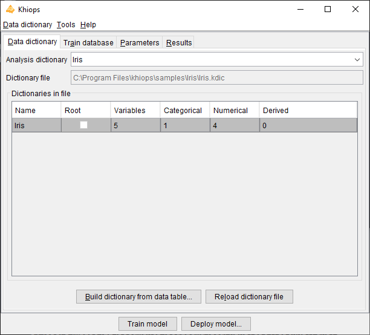
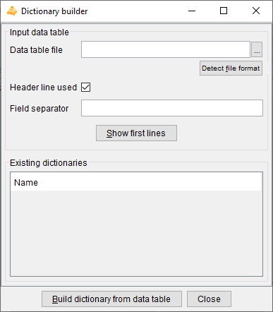
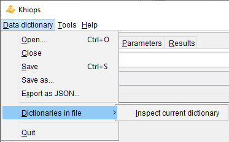
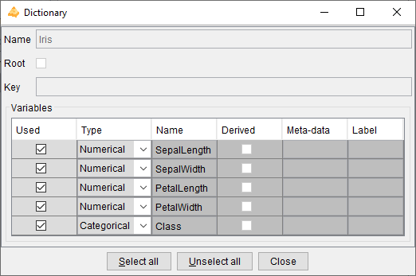

# Dictionary file



A dictionary file is a text file with the extension .kdic. It contains the definition of one or several dictionaries, each one describing the set of variables to use 
in a data analysis. The dictionaries can be automatically built from the data table file owing to a file parsing, automatically enriched during data preparation or 
modeling, or manually modified by the Data Miner using a text editor (for example Notepad). The dictionary files built by Khiops use tabulations as field separators, 
which allows direct copy-paste interactions with Excel. This provides a way to quickly sort, select and modify large numbers of variable definitions.
See [`Dictionary files`](../../api-docs/kdic/dictionary-files.md) for more details on dictionary files format.

Khiops allows to **Open** a **Dictionary file**. Opening a dictionary file amounts to loading its dictionaries into memory and making them available for data analysis. The **Save** and **Save as** actions write dictionaries to a dictionary file, whereas the **Close** action cleans the memory. The **Build dictionary from file** action builds dictionaries from data files and save them in a dictionary file. The **Reload dictionary file** action reads again a dictionary file, which may have been modified using an external text editor. The list of available dictionaries can be browsed using Khiops.

**Analysis dictionary**: name of the dictionary related to the data to analyze. Mandatory field.

**Dictionary file**: name of the dictionary file related to the data to analyse. Read-only field that shows the name of the current dictionary file.

**Dictionaries in file**: list of available dictionaries, with statistics describing the used variables (Name, Variables, Categorical, Numerical, Derived).

Dictionary files are opened only during the execution of the actions. They are then loaded into memory and available everywhere inside Khiops.

## Build dictionary from data table



This action opens a dialog box that allows to build dictionaries from data tables, then saves them in a dictionary file.

**Data table file**: name of the data table file to analyse. Mandatory field.

**Detect file format**: heuristic help that scans the first few lines to guess the file format. The header line and field separator are updated on success, with a warning or an error in the log window only if necessary.

**Header line used**: (default: true). If the file has a header line, Khiops will use the header line fields as variables names; otherwise, the variables will be names Var1, Var2...

**Field separator**: by default, if nothing is specified, the tabulation is used as the field separator.

**Show first lines**: shows first lines of data table in log window.

**Build dictionary from data table**: starts the analysis of the data table file to build a dictionary. The first lines of the file are analyzed in order to determine the type of the variables: Categorical, Numerical, Date, Time or Timestamp. After analysis, the user can choose the name of the dictionary.

**Close**: closes the window. If dictionaries have been built, proposes to save them in a dictionary file

The values in the data table file are parsed in order to guess their type.

- values with format YYYY-MM-DD (e.g. 2014-01-15) are recognized as Date variables,

- values with format HH:MM:SS (e.g. 11:35:20) are recognized as Time variables,

- values with format YYYY-MM-DD HH:MM:SS are recognized as Timestamp variables,

- values with format YYYY-MM-DD HH:MM:SS.zzzzzz are recognized as TimestampTZ variables, with time zone information,

- for other Date, Time, Timestamp or TimestampTZ formats (e.g. Date format DD/MM/YYYY), a specific meta-data value is used (see paragraph 3.2.2. Dictionary) to specify the format used for the variable,
  
  - DateFormat: see [`Date rules`](../../api-docs/kdic/date-rules.md)
  
  - TimeFormat: see [`Time rules`](../../api-docs/kdic/time-rules.md)
  
  - TimestampFormat: see [`Timestamp rules`](../../api-docs/kdic/timestamp-rules.md) 
  
  - TimestampTZFormat: see [`TimestampTZ rules`](../../api-docs/kdic/timestamp-tz-rules.md)

- other values with numerical format are recognized as Numerical values,

- other values are recognized as Categorical values.

Dictionaries are built automatically for convenience, but they should be checked carefully by the data miner. 
For example, zip codes are made of digits and recognized as Numerical variables, whereas they are Categorical variables. 
Values such as 20101123 or 20030127 are recognized as Date with format YYYYMMDD, whereas they could be Numerical.

The Date, Time or Timestamp formats can be erroneous (example: 2010-10-10 is ambiguous w.r.t. the format: "YYYY-MM-DD" or "YYYY-DD-MM"). 
The meta-data must be corrected directly in the dictionary file is necessary. 
In some cases, a date, time or timestamp variable may have a format not recognized by Khiops. 
This is the case for example for formats where the century is not specified (e.g: "YY-MM-DD"). 
In that case, the corresponding variable should be declared as Categorical (and not used), and a new variable can be built using derivation rules, as illustrated below.

```cpp
Unused Categorical MyDate ; // Date with unrecognized format "YY-MM-DD"*
Date MyCorrectDate = AsDate(Concat("20", MyDate), "YYYY-MM-DD"); // Correction if all centuries are 20th*
Unused Numerical MyCentury = If(LE(AsNumerical(Left(MyDate, 2)), 15), 20, 19); // 20th for year below 15, 19th otherwise*
Date MyCorrectDate2 = AsDate(Concat(AsCategorical(MyCentury), MyDate), "YYYY-MM-DD"); // Correction using MyCentury
```

<!---[](../../assets/images-khiops-guides/khiops/Multi-tablePicto.png)--->

In case of *multi-table* databases, after building and checking the resulting dictionary file, the data miner has to modify the dictionary file using a text editor 
in order to specify the relations between the dictionaries of the multi-table database. 
See [`Multi-table dictionary`](../../api-docs/kdic/multi-table-rules-introduction.md)

## Reload dictionary file

Reload the current dictionary file into memory.

This action allows to modify the dictionary file using an external text editor (Notepad for example), to save the modifications, and to take them into account into Khiops by reloading the dictionary file.

In case of invalid dictionary file, the current dictionaries are kept in memory.

## Dictionary file menu



### Open

An open dialog box asks the name of the dictionary file to open.

In case of invalid dictionary file, the current dictionaries are kept in memory.

### Close

The dictionaries are removed (from memory only). The potential pending modifications are lost if they have not been saved.

### Save

The memory dictionaries are saved under the current dictionary file.

### Save as

A save dialog box asks the name of the dictionary file to save.

### Export as JSON

A save dialog box asks the name of the JSON file to export the dictionaries under a JSON format, with a .kdicj extension.

### Dictionaries in file/Inspect current dictionary



Allows to inspect and partly modify a dictionary chosen among the list of available dictionaries. 
The dictionary to inspect must be selected among the dictionaries in file.

The action is available both from the menu and using a right click button on the selected dictionary.

During the inspection of a dictionary, the list of its variables can be browsed into a sub-window. 
For each variable, the following properties are displayed: **Used**, **Type**, **Name**, **Derived**, **Meta-data** and **Label**.

The Data Miner can choose whether to keep or not the variable for data analysis, using the **Used** property. 
The **Select all** and **Unselect all** buttons allow to choose all or no variables.

It is also possible to change the **Type** of variables: Numerical, Categorical, Date, Time or Timestamp.

Remark: for complex or large scale modifications in a dictionary, it is preferable to update the dictionary file using an external text editor (Notepad, WordPad…), 
to save the file with the external editor, and then to reload the dictionary.

<!---[](../../assets/images-khiops-guides/khiops/Multi-tablePicto.png)--->
For *multi-table* dictionaries, the **Root** property indicates whether the dictionary relates to a Root entity, and the **Key** field recall the key variables of
the dictionary. 
The type of variables is extended to store the relationships among entities: **Entity** for 0 to 1 relationship and **Table** for 0 to n relationship.

### Quit

Quits the application.
