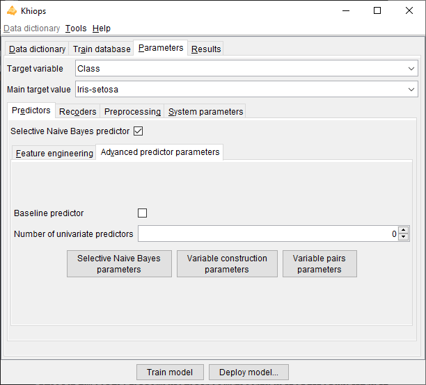
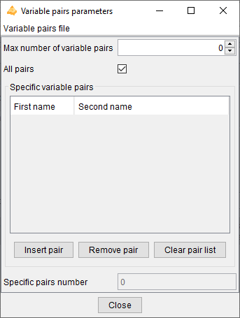

# Parameters

**Target variable**: name of the target variable. The learning task is classification if the target variable is categorical, regression if it is numerical. If the target variable is not specified, the task is unsupervised learning.

**Main target value**: value of the target variable in case of classification, for the lift curves in the evaluation reports.

## Predictors

Khiops builds predictors only in case of a supervised learning task.

**Selective Naive Bayes predictor**: builds a Selective Naive Bayes predictor (default: true).

The Selective Naive Bayes predictor performs a "soft" variable selection by directly optimizing the variable weights. This improves the accuracy, the interpretability and the deployment time, with few selected variables.

The variable weights are reported in the evaluation report. The overall training time is O(NK log(NK)) where N is the number of instances and K the number of variables. 
As the algorithm is parallelized, it efficiently benefits from multi-core machines.

### Feature engineering

Khiops performs automatic feature engineering by constructing variables from multi-table schema, building trees and analysing pairs of variables.

**Max number of constructed variables**: max number of variables to construct (default: 100). The constructed variables allow to extract numerical or categorical values resulting from computing formula applied to existing variable (e.g. YearDay of a Date variable, Mean of a Numerical Variable from a Table Variable).

**Max number of trees**: max number of trees to construct. The constructed trees allow to combine variables, either native or constructed (default: 10). Construction of trees is not available in regression analysis.

**Max number of pairs of variables**: max number of pairs of variables to analyze during data preparation (default: 0). The pairs of variables are preprocessed using a bivariate discretization method. Pairs of variables are not available in regression analysis.

By default, few features are constructed to get a good trade-off between accuracy, interpretability and deployment speed. Maximum interpretability and deployment speed can be achieved by choosing no feature to be built. Conversely, choosing more feature to construct allows to train more accurate predictors at the cost of computation time and loss of interpretability.

- variable construction

	- allows to exploit a multi-table schema, by automatically flattening the schema into an analysis table that summarizes the information in the schema
	
	- being automatic, robust and scalable, accelerates the data mining process to obtain accurate predictors
  
    - constructed variables remain understandable by the mean of human readable names, in the limit of their complexity
  
    - recommendation: increase incrementally with 10, 100, 1000, 10000… variables to construct, to find a good trade-off between computation time and accuracy

- trees
  
    - allows to leverage the assumption of the Selective Naive Bayes classifier that considers the input variables independently, to improve accuracy
  
    - combines natives or constructed variables to extract complex information
  
    - tree-based variables are categorical variables, which values are the identifiers of the leaves of a tree; they are pre-processed like other categorical variables (although they do not appear in the preparation report), then used by the classifier, for potentially improved classification performance
  
    - tree based variables are black-boxes, with potentially improved accuracy at the expense of loss of understandability
  
    - recommendation: increase incrementally with 10, 20, 50, 100… trees to construct, to find a good trade-off between computation time and accuracy

- variables pairs
  
    - allows to understand the correlation between variables either in supervised classification (not available in regression) or unsupervised learning tasks
  
    - the analysis of pairs of variables is a time consuming operation
  
    - in the supervised case, a variable pair is considered to be informative if it brings more information than both variables individually (see criterion DeltaLevel); non informative pairs are summarized in analysis reports, but not used in predictors.
  
    - recommendation: build variable pairs for exploratory analysis of correlations rather than to improve the accuracy of predictors

Constructed variables are stored in the output dictionaries (recoding or modeling dictionary), with formula that allow to compute their values during model deployment.

### Advanced predictor parameters

**Baseline predictor**: builds a baseline model (default: false).

The baseline classifier predicts the train majority class whereas the baseline regressor predicts the train mean of the target variable.

**Number of univariate predictors**: number of univariate predictors, built and evaluated.

The univariate predictors are chosen according to their predictive importance, which is assessed during the analysis of the train database. Each evaluation of a univariate predictor requires a read pass of the test database (default: 0).

### Selective Naive Bayes parameters

These parameters are user constraints that allow to control the variable selection process. Their use might decrease the performance, compared to the default mode (without user constraints).

**Train parameters**

**Max number of evaluated variables**: max number of variables originating from the data preparation, to use as input variables in the multivariate selection of the Selective Naive Bayes predictor. The evaluated variables are those having the highest predictive importance (Level). This parameter allows to simplify and speed up the training phase (default: 0, means that all the variables are evaluated).

**Selection parameters**

**Max number of selected variables**: max number of variables originating from the multivariate variable selection, to use in the final Selective Naive Bayes predictor or MAP Naive Bayes predictor. The selected variables are those with the largest importance in the multivariate selection. This parameter allows to simplify and speed up the deployment phase (default: 0, means that all the necessary variables are selected).

### Variable construction parameters

New variables can be constructed manually by the data miner using the construction language described in Appendix exploits efficiently a subset of construction rules, defined below.

Automatic variable construction exploits the set of construction rules specified in the **Variable construction parameters** window.

!!! warning

    The construction rules applied to Date, Time or Timestamps variables allow to extract numerical values at different periodicities 
    (e.g. year day, month day or week day from a Date variable). 
    By default, these date and time rules are not selected. They are interesting for exploratory analysis. For supervised analysis, 
    they should be used with caution as the deployment period may be different from the training period.

The **Select all** and **Unselect all** buttons allow to choose all or no construction rules, and the **Default** button restores the initial selection. The **Used** checkboxes allow to select construction rules one by one.

<!------>
In case of *multi-table* databases, construction rules can be applied to Entity or Table variables. They allow to extract values from sub-entities, such as the mean of the costs of sales of a customer. The TableSelection rule can be combined with other rules in order to be applied on a subset of the sub-tables (e.g. mean cost of sales of a customer for sales related to a given category of products). Given the combinatorial number of potential selection formula, thousands of variables can be constructed automatically.

Several heuristics are applied during the variable construction process, whenever possible:

- Constructed variable do not exploit key variables of secondary tables in multi-table dictionaries, since they are mostly redundant with the key variables of the main table.

- Constructed variables that exploit the same derivation rules as existing initial variables (used or unused) would be redundant. They are not constructed and new variables are constructed instead.

- Constructed variables that exploit different parts of the same partition of a secondary table (via the TableSelection construction rule) may be grouped in a sparse variable block.

- To optimize the overall computation time, temporary variables are also constructed, since they can be reused as operands of several constructed variables. Still, if a temporary variable exploits the same derivation rule as an existing initial variable, the temporary variable is not constructed and the initial variable is used instead.

### Variable pairs parameters

These parameters allow you to choose to analyze all potential variables pair, or to select individual variable pairs or families of variable pairs involving certain variables to analyze first.

**Max number of pairs of variables**: max number of pairs of variables to analyze during data preparation (default: 0). The pairs of variables are preprocessed using a bivariate discretization method. Pairs of variables are not available in regression analysis.

If the number of pairs specified is greater than this maximum value, the pairs are chosen first for the specific pairs, then for the pairs involving the variables with the highest level in the supervised case and by alphabetic order otherwise.

**All pairs**: Analyzes all possible variable pairs.

**Specific variables pairs**: Allows to specify a specific list of variables pairs. A variable pair can be specified with a single variable to indicate that all pairs involving that variable should be analyzed.

- **Insert pair**: Adds a variable pair

- **Remove pair**: Removes a variable pair

- **Insert pair**: Removes all specific variable pairs

The list of specific variable pairs is cleaned up on closure, removing pairs with syntactically invalid names and redundant pairs.

**Variable pairs file**

- **Import pairs…**: Imports a list of variable pairs from a tabular text file with two columns. Invalid or redundant pairs are ignored during import.

- **Export pairs…**: Exports the list of variable pairs to a tabular text file with two columns. Only valid and distinct pair are exported.

## Recoders

Khiops builds recoders in case of a supervised or unsupervised learning task, to enable the recoding of an input database. The recoded database may then be exploited outside the tool to build alternative predictors while benefiting from Khiops’ preprocessing.

**Build recoder:** Builds a recoding dictionary that recodes the input database with a subset of initial or preprocessed variables.

**Keep informative variables only**: if true, all the noninformative variables are discarded, in their initial or recoded representation (default: true).

**Max number of filtered variables:** max number of variables originating from the univariate data preparation (discretizations and value groupings), to keep at the end the data preparation. The filtered variables are the ones having the highest univariate predictive importance, aka Level. (default: 0, means that all the variables are kept).

**Keep initial categorical variables**: (default: false) keep the initial categorical variables before preprocessing.

**Keep initial numerical variables**: (default: false) keep the initial numerical variables before preprocessing.

**Categorical recoding method**: (default: part Id)

- part Id: identifier of the part (interval, group of values or cell in case of bivariate recoded variable)

- part label: comprehensible label of the part, like in reports

- 0-1 binarization: binarization of the part (generates as many Boolean variables as number of parts)

- conditional info: negative log of the conditional probability of the source variable given the target variable (-log(p(X|Y)). 
 Potentially a good representation for distance based classifiers, such as k-nearest neighbours or support vector machines

- none: do not recode the variable

**Numerical recoding method**: (default: part id)

- part Id

- part label

- 0-1 binarization

- conditional info

- center-reduction: (X – Mean(X)) / StdDev(X)

- 0-1 normalization: (X – Min(X)) / (Max(X) – Min(X))

- rank normalization: mean normalized rank (rank between 0 and 1) of the instances

- none

**Pairs recoding method**: (default: part Id)

- part Id

- part label

- 0-1 binarization

- conditional info

- none

## Preprocessing

**Group target values**: in case of classification task, indicates that the preprocessing methods should consider building discretization by partitioning both the input values (in intervals or groups of values) and the target values into groups. This is potentially useful in case of classification tasks with numerous target values, by automatically and optimally reducing the number of target values using groups.

### Discretization

**Supervised method**: name of the discretization method in case of classification or regression (default: MODL).

**Unsupervised method**: name of the discretization method in case of unsupervised analysis (default: EqualFrequency).

**Min interval frequency**: (default: 0, automatically set). Min number of instances in each interval. When this user constraint is active, it has priority over the criterion of the discretization method.

**Max interval number**: (default: 0, automatically set). Max number of intervals produced by the discretization. When this user constraint is active, it has priority over the criterion of the discretization method. By default (value 0), the MODL methods chose the optimal interval number automatically, whereas the unsupervised methods (EqualWidth and EqualFrequency) build discretizations with at most 10 intervals.

The user constraints help improving the comprehensibility of the discretization intervals, but may decrease their statistical quality.

| Name | Min freq. | Max nb. | Comment |
| -----| ----------|---------|---------|
| *MODL* | :white_check_mark: | :white_check_mark: | Bayes optimal discretization method: the criterion allows to find the most probable discretization given the data. Bottom-up greedy heuristic, with deep post-optimizations. |
| *EqualFrequency* |  | :white_check_mark: | EqualFrequency discretization method, which builds intervals having the same frequency (by default: 10 intervals) |
| *EqualWidth* | | :white_check_mark: | EqualWidth discretization method, which builds intervals having the same width (by default: 10 intervals) |

All the methods are available for classification tasks. For regression tasks, the only available discretization method is MODL: it discretizes both the input variable and the target variable. In unsupervised tasks, the only available methods are EqualFrequency and EqualWith.

Note: Missing values are treated as a special value (minus infinity) which is smaller than any actual value. If missing values are both informative and numerous, the discretization algorithm builds a special interval containing all missing values. Otherwise, missing values are included in the first built interval, containing the smallest actual values.

### Value grouping

**Supervised method**: name of the value grouping method in case of classification or regression (default: MODL).

**Unsupervised method**: name of the value grouping method in case of unsupervised analysis (default: BasicGrouping).

**Min group frequency**: (default: 0, automatically set). When this user constraint is active, all the explanatory values with frequency below the threshold are unconditionally grouped in a "garbage" group.

**Max group number**: (default: 0, automatically set). When this constraint is active, the value grouping method does not stop the grouping until the required number of group is reached. By default (value 0), the MODL methods choose the optimal group number automatically, whereas the unsupervised method (BasicGrouping) build at most 10 groups.

The user constraints help improving the comprehensibility of the value groups, but may decrease their statistical quality.

| Name | Min freq. | Max nb. | Comment |
| -----| ----------|---------|---------|
| *MODL* | :white_check_mark: | :white_check_mark: | Bayes optimal value grouping method: the criterion allows to find the most probable value grouping given the data. A "garbage" group is used to unconditionally group the infrequent values (the frequency threshold is automatically adjusted). Bottom-up greedy heuristic, with deep post-optimizations. |
| *BasicGrouping* |  | :white_check_mark: | Basic value grouping method that builds one group for each frequent explanatory values. The infrequent values (below the frequency threshold) are unconditionally grouped in a "garbage" group. The remaining infrequent values are also grouped until the required number of groups is reached. When no user constraint is specified, the min frequency is set to 2 and the max number of groups is set to 10.   Remark : when the max number of groups is set to 2, the value grouping method builds two groups, the first one containing the mode (most frequent value) and the second one containing all the other values.   Remark : using the min frequency set to 1 and max group number set to a large number (e.g. 10 000) is a way of collecting the statistics on all the values of a variable |

All the methods are available for classification tasks. For regression tasks, the only available value grouping method is MODL: it groups the values of the input variable and discretizes the target variable. In unsupervised tasks, the only available method is BasicGrouping.

## System parameters

**Max number of items in reports**: allows to control the size of reports, by limiting the number of reported items, such as the number of lines or rows in contingency tables, the number of detailed groups of values or the number of values in each detailed group (default: 1 000 000).

**Max number of error messages in log**: allows to control the size of the log, by limiting the number of messages, warning or errors (default: 20).

**Memory limit in MB**: allows to specify the max amount of memory available for the data analysis algorithms. By default, this parameter is set to the limit of the available RAM. This parameter can be decreased in order to keep memory for the other applications.

**Max number of processor cores**: allows to specify the max number of processor cores to use.

**Temp file directory**: name of the directory to use for temporary files (default: none, the system default temp file directory is then used).

The resources fields related to memory, processor cores and temp file directory allow the user to upper-bound the system resources used by Khiops. Given this, Khiops automatically manages the available system resources to perform at best the data mining tasks.

The following tasks of Khiops benefit from a parallel implementation on multi-core machines:

- sort functionality to sort large tables,

- extraction of an identifier table from a sorted log table,

- check of database,

- deployment for single or multi-tables schemas,

- univariate preprocessing: discretization and value grouping,

- bivariate preprocessing,

- learning of a Selective Naïve Bayes predictor

- evaluation of a predictor.

The learning of trees will be parallelized in a future version of the tool.
