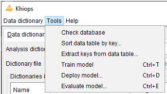
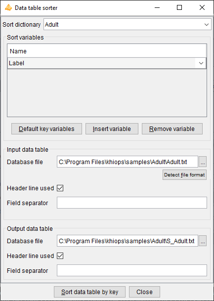
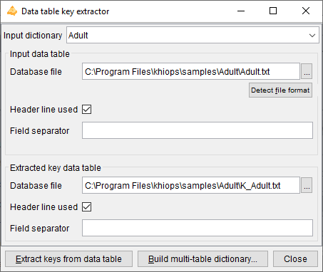
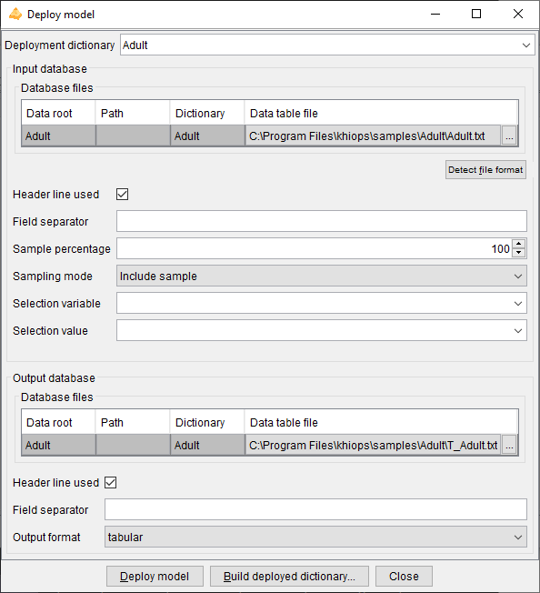
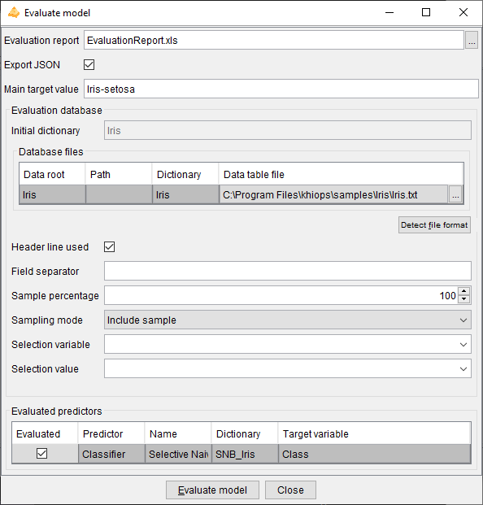

# Tools menu

### Check database

Prerequisite: the train database must be specified, and the dictionary related to the train database must be loaded in memory.

This action checks the integrity of the train database.

This action reads each line of the train database to perform the integrity checks. During formatting checks, the number of fields in the train database is compared to the number of native variables in the dictionary. Data conversion checks are performed for the fields corresponding to numerical, date, time and timestamp variables. Error messages are displayed in the message log window.

Remark: errors during database checking are always displayed, but they are autocorrected (empty or erroneous numerical values are replaced by a system missing value, superfluous values are discarded). Therefore, a data analysis can always be performed, even though it might not be reliable in case of database errors.

In case of multi-tables database, data tables must be sorted by key. Sort errors are reported but cannot be corrected, and therefore, no data analysis can be performed.

###  Sort data table by key

Prerequisite: the dictionary of the input data table must be loaded in memory.

This action allows to sort a data table according to sort variables. It is dedicated to the preparation of multi-table databases, which requires all data table files to be sorted by key, for efficiency reasons.

The parameters of the dialog box are the following.

**Sort dictionary**: dictionary that describes all native of the database file. Native variables are the variables stored in date files, of type Numerical, Categorical, Date, Time or Timestamp, and not derived using a formula.

**Sort variables: must be native (not derived) and Categorical**

- **Default key variables**: the sort variables are the key variables retrieved from the sort dictionary

- **Insert variable**: inserts a variable in the list of sort variables

- **Remove variable**: removes a variable from the list of sort variables

**Input data table**:

- Database file
  
  - Detect file format

- Header line used

- Field separator

**Output database**:

- Database file

- Header line used

- Field separator

The "**Sort data table by key**" action reads the input data, sorts the lines by key, and writes the sorted output data.

All native variables (either used or not in the sort dictionary) are written in the output database, whereas derived variables are ignored: the output database has the same content as the input database, except that the lines are now sorted by key.

Note that this feature is very low-level and performs only minimal checks. For example, even the header line can be invalid w.r.t. all native variables defined in the dictionary, provided that the mandatory key fields for sorting are correct.

###  Extract keys from data table

Prerequisite: the dictionary of the input data table must be loaded in memory and the input data table must be sorted by the keys of its dictionary.

This action allows to extract keys from a sorted input data table. It is dedicated to the preparation of multi-table databases, where a root entity has to be extracted from a detailed 0-n entity. For example, in case of a web log file with cookies, page, timestamp in each log, extracting keys allow to build a table with unique cookies from the table of logs.

The parameters of the dialog box are the following.

**Input dictionary**: dictionary that describes the content of the input data table.

**Input data table**:

- Database file
  
  - Detect file format

- Header line used

- Field separator

**Extracted key data table**:

- Database file

- Header line used

- Field separator

The "**Extract keys from data table**" action reads the input data, remove duplicate keys and store the unique resulting keys in the output data table.

The "**Build multi-table dictionary**" action builds a root dictionary with a Table variable based on the input dictionary, then saves the dictionary file.

### Train model

Prerequisite: the train database must be specified, and the dictionary related to the train database must be loaded in memory.

If the name of the class variable is missing, the data analysis is restricted to unsupervised descriptive statistics. Otherwise, the learning task is classification or regression according to the type of the target variable (categorical or numerical).

The analysis starts by loading the database into memory. Data chunks are potentially used in order to be consistent with the available RAM memory. Khiops then performs discretizations for numerical variables, value groupings for categorical variables. Variables are also constructed according to whether the feature engineering options are activated. Finally, the requested predictors are trained and evaluated.

A data preparation report describing the univariate statistics (discretizations and value groupings) is then produced, as well as new dictionaries related to data preparation or to the built predictors. The built dictionaries (available according to the activated options) are:

- R\_\<Dic\>: dictionary containing the recoding variables (discretizations and value groupings),

- SNB\_\<Dic\>: dictionary containing the prediction and prediction score formulae for a Selective Naive Bayes predictor,

- BU\_\<Dic\>\_\<variable\>: dictionary containing the prediction and prediction score formulae for the kth univariate predictor, corresponding to variable \<variable\>.

A modeling report summarizes the features of the built predictors.

An evaluation report is also produced on the train and test datasets.

The predictor dictionaries

At the end of the data analysis, Khiops builds predictors and saves them by means of dictionaries including variables dedicated to prediction. The formulae used to compute prediction variables are stored in the dictionaries, enabling the deployment of prediction scores on unseen data. The data miner can select or unselect variables to deploy using the "Unused" keyword in the modeling dictionary. For example, to produce a score file, the data mining can select a key variable, in order to enable joins in databases, and the variable related to the probability of the class value of interest.

The main output variables in a classification dictionary with a target variable named \<class\> are:

- Predicted\<class\>: predicted value

- Prob\<class\>\<value\>: probability of each target value named \<value\>

The main output variables in a regression dictionary with a target variable named \<target\> are:

- M\<target\>: predicted mean of the target

- SD\<target\>: predicted standard deviation of the target

Other interesting variables are related to the prediction of the normalized rank of the target value (rank between 0 and 1):

- MR\<target\>: predicted mean of the target rank

- SDR\<target\>: predicted standard deviation of the target rank

- CPR\<i\>\<target\>: cumulative probability of the target rank, i.e. probability that the target rank is below i

It is noteworthy that in case of regression, Khiops is able to predict the full conditional distribution of the target values. For example, the regression variables TargetRankCumulativeProbAt(rank) available in the regression dictionary enable to predict the conditional probability of the target variable for any interval of values (more precisely interval of normalized target ranks, i.e. target partile).

In case of multi-table database, automatic variable construction allows to explore complex representation spaces from multiple tables by creating many variables in the root entity to summarize the content of the sub-entities.

### Deploy model

Prerequisite: at least one dictionary must be loaded in memory.

This action opens a dialog box allowing to specify an input and output database, and a dictionary describing the variables to keep, discard or derive. This allows to recode a database or to deploy a predictor on new data. The parameters of the dialog box are the following.

**Deployment dictionary**: dictionary used to select or derive new variables.

**Input database**:

- Data table file
  
  - Detect file format

- Header line used

- Field separator

- Sample percentage

- Discard mode

- Selection variable

- Selection value

**Output database**:

- Data table file

- Header line used

- Field separator

- Output format: tabular (default): standard tabular format; sparse: extended tabular format, with sparse fields in case of blocks of variables

The "**Deploy model**" action reads the input data, applies the deployment dictionary to select all or part of the variables and add derived variables, and writes the output data.

This action can be used to generate a data preparation file, containing the recoded variables. It also can be used to deploy a scoring model, owing to the prediction variables contained in the predictor dictionaries.

The "**Build deployment dictionary**" action creates an output dictionary that enables to read and analyses the output files: it contains the deployed variables only, without any derivation rule in the dictionary.

For multi-table databases, there are potentially several lines in the array of the input and output database files. One input data table file must be specified for each entity in the multi-table dictionary. For the output database, all or some of the data table file can be specified: the deployment writes only the output data table files that are specified (and not “Unused” in the multi-table dictionary).

### Evaluate model

Prerequisite: at least one dictionary must be loaded in memory, and correspond to a predictor dictionary.

This action opens a dialog box allowing to specify an evaluation report, an evaluation database and to choose the predictor(s) to evaluate. The parameters of the dialog box are the following.

**Evaluation report**: name of the evaluation report file

**Export JSON**: exports the evaluation report under a JSON format. The exported JSON file has the same name as the evaluation report file, with a .khj extension. The JSON file is useful to inspect the evaluation results from any external tool.

**Main target modality**: value of the target variable in case of classification, for the lift curves in the evaluation reports.

**Evaluation database**:

- Data table file
  
  - Detect file format

- Header line used

- Field separator

- Sample percentage

- Discard mode

- Selection variable

- Selection value

**Evaluated predictors**: List of the predictor dictionaries, which are dictionaries among the loaded dictionaries that are recognized as predictor dictionaries. This array allows to choose (parameter "Evaluated" which predictor to evaluate).

- Evaluated: to choose whether to evaluate the predictor

- Predictor: Classifier or Regressor

- Name: label of the predictor

- Dictionary: name of the predictor dictionary

- Target variable: name of the target variable (for classification or regression)

The "**Evaluate model**" applies the evaluated predictors on the evaluation database and writes an evaluation report. Whereas the "Train model " action trains predictors and evaluates them immediately on the train and test databases, the "Evaluate model" action allows a differed evaluation of previously trained predictors.

For multi-table databases, there are potentially several lines in the array of the evaluation database files.
