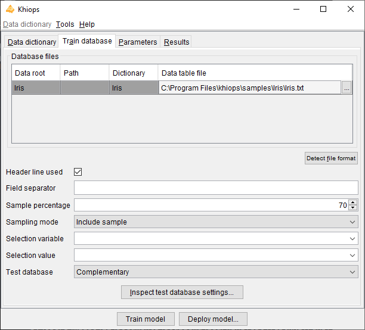
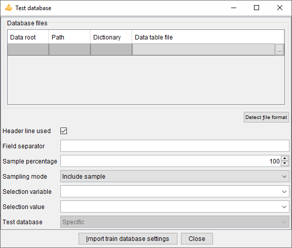

# Train database

**Database files**: name of the database files to analyse.

**Data table file**: name of the data table file. Mandatory field.

**Detect file format**: heuristic help that scans the first few lines to guess the file format. The header line and field separator are updated on success, with a warning or an error in the log window only if necessary.

**Header line used**: (default: true). If the file does not have a header line, Khiops considers the variables in the dictionary to analyse the fields in the file.

**Field separator**: Character used as field separator in the file. It can be space (S), semi-colon (;), comma (,) or any character. By default, if nothing is specified, the tabulation is used as the field separator.

Khiops can be used to extract a subpart (or its exact complementary) of the records in a database file. This sampling is specified with a sample percentage of the records (to keep or to discard). The sampling is a random sampling, but is reproducible (the random seed is always the same).

**Sample percentage**: percentage of the samples (default: 70%)

**Sampling mode**: to include or exclude the records of the sample (default: include sample). This allows to extract a train sample and its exact complementary as a test sample (if the same sample percentage is used both in train and test, in include sample mode in train and exclude sample mode in test).

Another way to build train or test samples is to use a selection variable and a selection value.

**Selection variable**: when nothing is specified, all the records are analysed. When a selection variable is specified, the records are selected when the value of their selection variable is equal to the selection value.

**Selection value**: used only when a selection variable is specified. In that case, the value must be a correct value (numerical value if the selection variable is a numerical variable).

**Test database**: specification of the test database, according to one of the following choices:

- Complementary (default): same as the train database, with 'Sampling mode' inverted in the test database, in order to get test samples that are the exact complementary of the train samples,

- Specific: specific parameters for the test database,

- None: no test database is used.

<!------>
For *multi-table* databases, there are potentially several lines in the array of database files. 
The data path (Data root, Path) represents the semantic path of the table, that is, its source dictionary followed by the chain of variable names leading to it. 
All these names separated by a backquote " \` " form the data path. In the GUI, data paths are automatically build, and one data table file must be specified per 
data path in the multi-table dictionary. Each data table file must be sorted by key. In root tables, keys play for role of identifiers, so that root entities must 
be unique per key. This is not the case for sub-entities in zero to many relationship with the root entity.

## Inspect test database settings

This action allows to inspect the test database parameters.

The test parameters are editable only in the case of a specific test database.

The test database is defined exactly in the same way as the train database.

In the case of a specific database, there is an additional button to import the train database parameters. 
It allows to fill all the test database fields, by copying them from the 'Train database' pane. 
The only change is the 'Sampling mode' which value is inverted in the test parameters, in order to get a test sample that is the exact complementary of the train sample.
