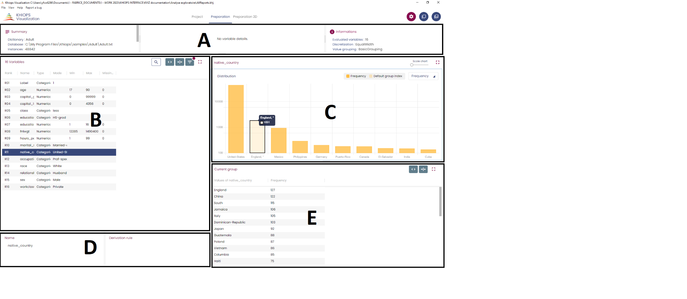
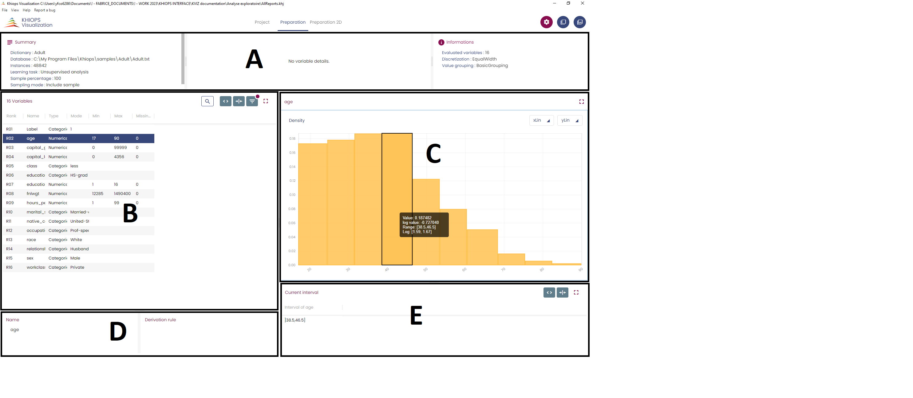
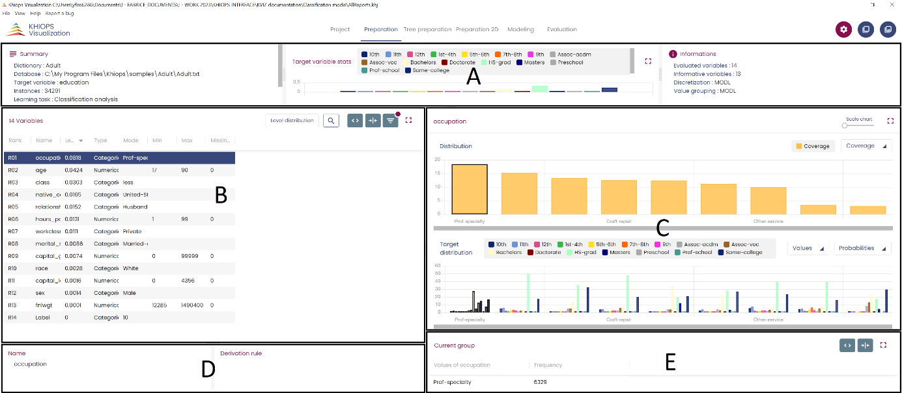
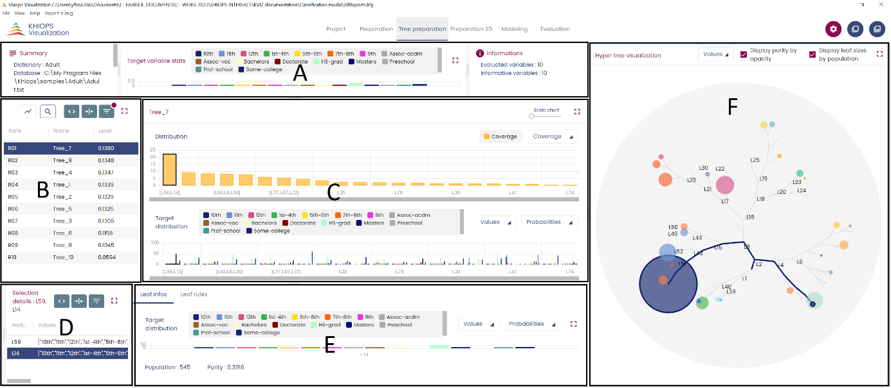

---
hide:
  - navigation
---

## First step

The entry point of Khiops Visualization is the khj file generated by Khiops at the end of the analysis. A double-click on this file opens Khiops Visualization.

Khiops Visualization is composed of several tabbed panes.

Depending on the analysis type, the panes and their contents are not the same. Khiops Visualization can be composed with 5 panels:

  - Preparation: displays the Preparation report.

  - Tree preparation : displays the preparation report for tree variables

  - Preparation 2D: displays the 2D preparation report.

  - Modeling: displays the modeling report.

  - Evaluation: displays on one panel the test, train and evaluation reports.

  - Project Infos : displays the report file and database locations plus some short comments on the analysis

As supervised and non-supervised (hereafter descriptive) analysis have different goals and produce different kinds of results, the visualization interface and the content of the tabs are slightly different for both analysis. This is described in the following sections.

## Descriptive analysis visualization

In case of non-supervised analysis, the report is organized in the following tabs :

  - Preparation

  - Preparation 2D (only in case of constructed bivariate variables)

  - Project information

For the figures below, unless otherwise specified, we used the Adult database.

### Preparation tab

The general layout of this tab is as follows (see the two figures below) : Panel A shows some information related to the data and the analysis. Panel B stores the list of the variables as a table together with some descriptive statistics information.

Clicking on a line of the table in panel B displays the histogram of the corresponding variable in panel C and information about the variable (Name and derivation rule (if any)) in panel D. Clicking on a bin of the histogram displays information about this bin in panel E.

Categorical and numerical variables have different histograms.

For categorical variables, the number of the bins is automatically set to its optimal value from an MDL approach.

In the case of a variable with many categories, a specific bin ("Default group index") may gather many modalities and is shown with a different color. This specific bin is given the name of its most populated modality and clicking on the bin makes its content is available in panel E. As it may gather many small modalities, it may appear as the dominant bin of the distribution and the name might be misleading, therefore the different color.

The Coverage/Frequency toggle allows to display either the coverage (in %, linear scale) or the populations (in log scale).

The figure above shows the histogram of the variable "native_country" which has 41 modalities. The default group is selected, and its content is displayed in panel E.

For numerical variables, the bounds of the bins is also automatically set to its optimal value from an MDL approach.

Different representations of the histogram are available. The y-axis shows the density and can be plotted in linear or log scale.

The x-axis can also be plotted in linear or log scale ; for the log scale representation, the variable range is split in (up to) three areas :

   - the bins in the negative range, excluding any bin containing zero (even as a bound)

   - the bins containing zero (one or two bins, if zero is a bound)

   - the bins in the positive range, excluding any bin containing zero (even as a bound)

The log scale for the negative range is log10(-x), running to infinity toward the left.

The log scale foe the positive range is log10(x), running to infinity towards the right.

The bins containing zero are given an arbitrary width, set to 1/10 of the figure.

This allows to plot informative histograms of challenging heavy-tailed distributions such as Cauchy distribution. The figure below shows the histogram of this distribution in log-log scale.

\<\<insert Numerical Cauchy histogram figure here\>\>

### Preparation 2D

The general layout is similar to the Preparation tab, except for panel C which shows the bivariate discretization of the pair selected in panel B.

This discretization is the cartesian product of the parts of each variable. By default, the information displayed on the subtab "Matrix" is the mutual information between both groupings, allowing to analyze the correlations between the variables of the pair. Other information such as the frequencies in each cell can be selected from the menu.

The subtab "Cells" displays the information about the cell statistics as a table.

### Project information

This tab shows information related to the project, in particular, the content of the "Short description" field.

##  Supervised analysis visualization

There are two different reports depending on the categorical or numerical nature of the target variable.

### Classification

The target variable is categorical.

The report is organized in the following tabs :

   - Preparation

   - Tree Preparation (only in case of constructed decision tree variables)

   - Preparation 2D (only in case of constructed bivariate variables)

   - Modeling

   - Evaluation

   - Project information

For the figures below, we used the Adult database, with "education" as a target variable (excluding "education num" from the predictors) and randomly selecting 70% of the data for the train set and the remaining 30% for the test set.

#### Preparation

Panel A shows some information related to the data and the analysis (left) and the histogram of the target modalities (right).

Panel B stores the list of the variables as a table together with some descriptive statistics information.

Clicking on a line of the table in panel B displays the information about the parts obtained from the optimal supervised grouping the selected variable selected in panel C and information about the variable (Name and derivation rule(if any)) in panel D.

Panel C shows the histogram of the group populations (top) and for each group, the distribution of the target modalities conditional to the group (bottom).

Group population histogram can be displayed in linear or log scale from the menu above the figure.

For the target modalities conditional to the group histogram, displayed target modalities can be selected from the "Values" menu and histogram can be displayed as probabilities or lift ("Probabilities/Lift" toggle).

Clicking on a bin of the population histogram or on the corresponding target conditional histogram displays information about the selected group in panel E.

#### Tree Preparation

Decision trees are treated as categorical variables with as many modalities as terminal leaves.

The general layout of panels A, B, C and the information they display are similar to the Preparation tab.

Panel D shows the content of a selected group of leaves as a table of the leaves in the group and their target modalities statistics. Clicking on a leaf displays information about this leaf in panel E : subtab "Leaf infos" shows the histogram of the target modalities conditional to this leaf, together with the leaf population and leaf purity ; subtab "Leaf rules" gives the list of tests leading to this leaf, starting from the root node.

The left panel (panel F) is a hypertree visualization of the selected decision tree. Only terminal leaves are clickable ; clicking on a leaf dynamically points to the relevant leaf and group of leaves information in the other panels. The population and purity of the leaves can be visualized by their size and color density. This can be toggled on and off and the "values" menu allows to select some of the target modalities only.

#### Preparation 2D

The general layout is similar to the Preparation tab, except for panel C which shows the bivariate supervised discretization of the pair selected in panel B.

This discretization is the cartesian product of the parts for each variable. By default, the information displayed on the subtab "Matrix" is the mutual information between a cell of the cartesian product and a modality of the target variable (selected from the "Target" menu), allowing to analyze the information brought by the variables as a pair to the target variable. Other information such as the frequencies in each cell can be selected from the menu.

The subtab "Cells" displays the information about the cell statistics as a table.

Clicking on a cell displays the target modalities histogram conditional to this cell (bottom of panel C) and the information about the parts of the selected cell in panel E.

#### Modeling

The general layout is similar to the Preparation tab. Panel B shows information related to those variables used in the model only. The table shows for each variable its level, weight (in the weighted naive Bayes model) and its importance (computed as the geometric mean of the level and the weight).

#### Evaluation

This tab gathers information about the performance of the model.

Panel A shows which datasets are concerned by the analysis.

Panel B gives some performance indicators for the model : accuracy, compression rate, area under the lift curve (auc) and gini coefficient.

Panel C shows the lift curves : the target modality can be chosen from the menu at the top and the "Filter curves" menu allows to choose which curves are displayed. The lift curve plots the target modality coverage as a function of the population selected according to the model score.

Panel D shows a confusion matrix with the predicted values (prefixed by \$) and the actual values.

#### Project information

This tab shows information related to the project, in particular, the content of the "Short description" field.

### Regression

The target variable is numerical.

The report is organized in the following tabs :

   - Preparation

   - Modeling

   - Evaluation

   - Project information

For the figures below, we used the Adult database, with "education_num" as a target variable (excluding "education" from the predictors) and randomly selecting 70% of the data for the train set and the remaining 30% for the test set.

#### Preparation

Panel A shows some information related to the data and the analysis.

Panel B stores the list of the variables as a table together with some descriptive statistics information.

Clicking on a line of the table in panel B displays the information about the parts obtained from the optimal supervised grouping the selected variable selected in panel C and information about the variable (Name and derivation rule (if any)) in panel D.

The top of Panel C shows the histogram of the group populations obtained from the optimal supervised grouping for the predictive variable.

The bottom of panel C shows the optimal grouping of the (predictive variable, target variable) pair.

Note that the discretization of the target variable depends on the predictive variable, which is useful for interpretation purposes.

By default, the mutual information brought by each cell is given (red means positive association and blue negative association) ; other information can be selected from the menu.

The toggle Standard/Frequency selects a representation mode

   - in "Standard" mode the span of group is proportional to the number of modalities in the group for categorical variables or constant for numerical variables
   
   - in "Frequency" mode, the span of a group is proportional to its population

Clicking on a cell of the cartesian product shows information about the selected group in panel E.

#### Modeling

The general layout is similar to the Preparation tab. Panel B shows information related to those variables used in the model only. The table shows for each variable its level, weight (in the weighted naive Bayes model) and its importance (computed as the geometric mean of the level and the weight).

#### Evaluation

This tab gathers information about the performance of the model.

Panel A shows which datasets are concerned by the analysis.

Panel B gives some performance indicators for the model : rmse, mae, nlpd (negative log predictive density, see <https://en.wikipedia.org/wiki/Negative_log_predictive_density> for details) and their equivalents for rank regression (for the rank negative log predictive density, see [this paper](https://www.jmlr.org/papers/volume8/hue07a/hue07a.pdf) for details).

Panel C shows the REC curves (for details about REC curves, see <https://dl.acm.org/doi/10.5555/3041838.3041844>) : the target modality can be chosen from the menu at the top and the "Filter curves" menu allows to choose which curves are displayed.

#### Project information

This tab shows information related to the project, in particular, the content of the "Short description" field.

## Controls elements

Control elements appear at the top right of panels.

At the top right of the screen,

from left to right :

  - allows to set some environments variables such as the number of significant digits or the clear/dark mode. These settings are kept across sessions ;

  - allows to copy the figure of a selected panel (select a panel by clicking in it ; a selected panel appears with a light blue border). This can be pasted in any other document ;

  - allows to copy the data of a selected panel.

At the top right of panel A

from left to right

  - allows to open a bar plot of the levels of the variables in decreasing order ;

  - allows to open a search box on the variable names (fill at least two characters) ;

  - allows to fit the table to the panel size ;

  - allows to fit the columns of the table to their content ;

  - allows to select/unselect columns to the table ;

  - allows to open the panel in full screen. The control

at the top right of the full screen panel allows to go back to the multi-panel interface.

At the top right of panel B

allows to modifiy the horizontal scale of the histogram (by default, all groups appear in the figure, which may be messy when there are many groups).

Additional elements apply to bivariate cartesian product visualizations.

On the left side of the panel (in full screen mode, here), from top to bottom

 - allows to zoom in the figure (horizontal and vertical sliders allow to move in the figure) ;

 - allows to reset the figure to its original scale ;

 - allows to zoom out of the figure

 - allows to transpose the figure.

## Technical limits

In order to be responsive on very large files, some display limitations are taken into account in Khiops Visualization:

  - Only the 10 000 most frequent values are displayed per group.
