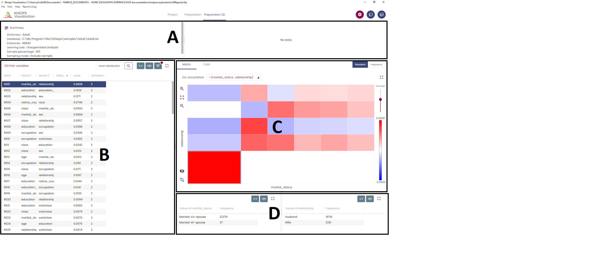

---
hide:
  - navigation
---

## First step

The entry point of Khiops Visualization is the khv file generated by Khiops at the end of the analysis. A double-click on this file opens Khiops Visualization.

Khiops Visualization is composed of several tabbed panes. The first one is the project pane : it presents the report file and database locations.

Depending on the analysis type, the panes and their contents are not the same. Khiops Visualization can be composed with 5 panes:

  - Preparation: displays the Preparation report.

  - Tree preparation : displays the preparation report for tree variables

  - Preparation 2D: displays the 2D preparation report.

  - Modeling: displays the modeling report.

  - Evaluation: displays on one pane the test, train and evaluation reports.

The description of the criteria used in these reports can be found [`here`](#criteria-definition).

## Functionalities

### Screenshot

A useful feature available on all window sections is the screenshot. You can copy to clipbopard a selected section by a simple mouse click on one of the top buttons. A section is selected when it is surrounded by blue lines.

Using  (or \[Ctrl-C\]) you get a picture in bitmap format, that you can import in any image editing tool.

Using  (or \[Ctrl-D\]) you get the raw data (a table in CSV format), that you can import in any text editing tool.

### Table display

Clicking  opens a list of columns you can hide or display.

The red dot indicates that at least one column is hidden

 allow to automatically redimension the columns of the table.

 opens a search box.

Long tables are split into pages of at most 500 lines.

### Zoom

The sliding bars allow zooming on the chart.

### Tree preparation

This pane allows to explore each tree in an interactive manner. A typical screenshot is given below.

The upper left (orange rectangle) is like the other preparation panes and allows to select the tree variable and visualize the groups of leaves (leaves are considered as modalities of the tree variable and grouped accordingly) and the conditional class histograms.

The right sub-pane (A) is a visualization of the tree structure in a hyperbolic space; dragging a leaf to the center magnifies the neighboring area of the tree.

Leaf area can be made proportional to its population, leaf opacity can be made proportional to its target class distribution purity (the more, the purer). The tree is also given as a hierarchy (B).

Sub-pane (C) describes the content of the selected group of leaves

A sub-pane at the bottom (D) gives the information related to the chosen leaf, with two sub-sub-panes: the leaf infos displays the histogram of the target values, and the leaf rules provides the sequence of tree rules (ordered from top to bottom) leading to it.

There are multiple selection modes. Basically, everything that is clickable in one panel selects what is relevant in the others. For example, a click on a leaf in the hypertree (A) select the other leaves of the same group in (A) and (B), the information on the related group in variable sub-pane (in orange rectangle) and in (C), and the information related to the selected leaf in (D).

## Criteria definition

Depending on the analysis type, the panes and their contents are not the same. Khiops Visualization can be composed with 5 panes:

  - Criteria used in the Preparation pane : 

|Evaluation criteria |   |
|---|---|
| Rank  | Rank of the variable, sorted by decreasing importance of Level.  This rank is also a convenient identifier, which eases search operations in report files.|
|Name   | Name of the variable  |
|Level   | Evaluation of the predictive importance of the variable.  The Level is a value between 0 (variable without predictive interest) and 1 (variable with optimal predictive importance).|
| Parts  | Number of groups/intervals resulting from the discretization/grouping preprocessing of the variable.  |
| Values  | Number of initial values of the variable.  |
| *Specific criteria to categorical variables*  |   |
| Mode  | Most frequent initial value.  |
|Mode coverage   | Coverage of the mode  |
| *Specific criteria to numerical variables*  |   |
| Min |Min value of the variable   |
| Max  | Max value of the variable  |
| Mean  | Mean value  |
| Std  | Standard deviation  |
| Missing number   | Number of missing values  |
| Derivation rule (optional field)   | Derivation rule used to compute the variable. User defined, or automatically constructed by the variable construction functionality of Khiops. See [`Dictionary rules`](../api-docs/kdic/dictionary-files.md) for more details  |

  - Criteria used in the Preparation 2D pane 

This pane is available if the "*Max number of pairs of variables*" is not zero.

| Evaluation criteria  |   |
|---|---|
| Rank	| Rank of the pair of variables, sorted by decreasing importance of Level. Only informative pairs of variable with Level > 0 are presented.   This rank is also a convenient identifier, which eases search operations in report files	
| Name 1| Name of the first variable in the pair |
| Name 2| Name of the second variable in the pair |
| DeltaLevel | Evaluation of the relative predictive importance of the pair of variables.   DeltaLevel = Level – Level1 – Level2  The DeltaLevel is strictly positive if and only if the variable pair is informative, that is if it brings more information than both variables taken individually.|
| Level | Evaluation of the total predictive importance of the pair of variables.  The Level is a value between 0 (variable without predictive interest) and 1 (variable with optimal predictive importance).
| Level 1 | Recalls the univariate predictive importance of the first variable |
| Level 2 | Recalls the univariate predictive importance of the second variable |
| Variables | Number of active variables in the pair:   0: there is no information in the pair   1: the information in the pair reduces to the information in one variable   2: the two variables are jointly informative |
| Parts 1 | Number of intervals or groups of values in the first variable |
| Parts 2 | Number of intervals or groups of values in the second variable |
| Cells | Number of non-empty cells in the data grid resulting from the cross-product of the two univariate partitions |

Note: in case of unsupervised analysis, the fields DeltaLevel, Level1 and Level2 are not relevant and thus not reported.

  - Modeling: displays the modeling report
It summarizes the list of trained predictors, with their name and number of used variables.

Predictor details are reported as well.

For the Selective Naive Bayes predictor, each selected variable is described using the following criteria

| Evaluation criteria |  | |
|---|---|---|
| Level | univariate evaluation | Evaluation of the predictive importance of the variable taken individually. The Level is a value between 0 (variable without predictive interest) and 1 (variable with optimal predictive importance) |
| Weight | multivariate evaluation | Evaluation of the predictive importance of the variable taken relative to all the variables used by the predictor. Many Selective Naive Bayes predictors are built with different variables subsets, and weighted according their predictive interest. Averaging many predictors by predictors weights amounts to building one single predictor with variable weights. The Weight is a value between 0 (variable used in no predictors) and 1 (variable used in all good predictors). A variable (even with slight predictive interest and thus a small Level) that is used by many good predictors can have a high weight. On the opposite, a variable with a high Level can have a small weight in case of redundant variables: the Weight is shared by the redundant variables |
| Importance | overall evaluation | The Importance criterion is the geometric mean of the Level and the Weight. $ importance = \sqrt{Level \times Weight} $ |

  - Evaluation: displays on one pane the test, train and evaluation reports.
    

This report is available if a train or test database has been specified and if predictors have been trained.

| Classification criteria | |
|---|---|
|Accuracy | evaluates the proportion of correct prediction|
| Compression | evaluates the predicted target probabilities using a negative log likelihood approach and is normalized (between 0 and 1) using the baseline predictor |
| AUC | area under the ROC curve (AUC); evaluates the ordering of the predicted scores per target value. Note that the value calculated is the AUC ROC, not the AUC PR.   In case of multiple class values, the AUC is computed for each class value against all the others, then the results are weighted by the proportions of each class value.
| Robustness | Evaluation of the model overfitting. the closest to 1 the value, the smallest the overfitting |
| Gini | Gini index : evaluates the ordering of the predicted scores for all targets. Gini coefficient is closely related to AUC Gini = 2 * AUC - 1. Value 0 means a random model and value 1 means Perfect model. | 
| Confusion matrix | A confusion matrix is reported for each classifier, to compare the predicted values (prefixed by $) and the actual values. 
| Lift curves | If a main class value is specified, lift curves are built. They plot the fraction of actual correct prediction on the y-axis for each fraction of the dataset on the-x-axis, when the dataset is sorted by decreasing predicted probability of the main target value.|
| Contingency tables | For univariate predictors, the contingency table between the intervals/groups of the preprocessed variable and the class variable is also displayed. |

| Regression criteria | |
|---|---|
| RMSE | root mean square error between the predicted value and the actual value |
| MAE | mean absolute error |
| NLPD | negative log predictive density |
| RankRMSE | root mean square error between the predicted value rank and the actual value rank |
| RankMAE | mean absolute error in the rank domain |
| REC curves | REC (Regression Error Characteristic) curves are also built, in the rank domain. They plot the error tolerance on the x-axis versus the percentage of points predicted within the tolerance on the y-axis.|
<!--- | RankNLPD | negative log predictive density in the rank domain --->

## Technical limits

In order to be responsive on very large files, some display limitations are taken into account in Khiops Visualization:

  - Only the 10 000 most frequent values are displayed per group.
