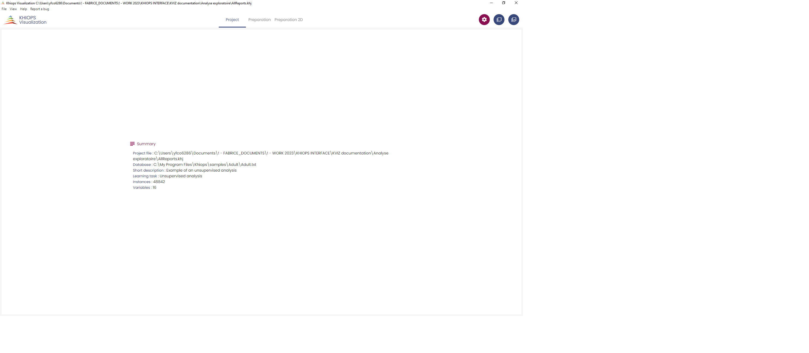

#  Functionalities

##  Screenshot

A useful feature available on all window sections is the screenshot. You can copy to clipbopard a selected section by a simple mouse click on one of the top buttons. A section is selected when it is surrounded by blue lines.

Using  (or \[Ctrl-C\]) you get a picture in bitmap format, that you can import in any image editing tool.

Using  (or \[Ctrl-D\]) you get the raw data (a table in CSV format), that you can import in any text editing tool.

##  Table display

Clicking  opens a list of columns you can hide or display.

The red dot indicates that at least one column is hidden

 allow to automatically redimension the columns of the table.

 opens a search box.

Long tables are split into pages of at most 500 lines.

##  Zoom

The sliding bars allow zooming on the chart.

## Tree preparation

This pane allows to explore each tree in an interactive manner. A typical screenshot is given below.

The upper left (orange rectangle) is like the other preparation panes and allows to select the tree variable and visualize the groups of leaves (leaves are considered as modalities of the tree variable and grouped accordingly) and the conditional class histograms.

The right sub-pane (A) is a visualization of the tree structure in a hyperbolic space; dragging a leaf to the center magnifies the neighboring area of the tree.

Leaf area can be made proportional to its population, leaf opacity can be made proportional to its target class distribution purity (the more, the purer). The tree is also given as a hierarchy (B).

Sub-pane (C) describes the content of the selected group of leaves

A sub-pane at the bottom (D) gives the information related to the chosen leaf, with two sub-sub-panes: the leaf infos displays the histogram of the target values, and the leaf rules provides the sequence of tree rules (ordered from top to bottom) leading to it.

There are multiple selection modes. Basically, everything that is clickable in one panel selects what is relevant in the others. For example, a click on a leaf in the hypertree (A) select the other leaves of the same group in (A) and (B), the information on the related group in variable sub-pane (in orange rectangle) and in (C), and the information related to the selected leaf in (D).

