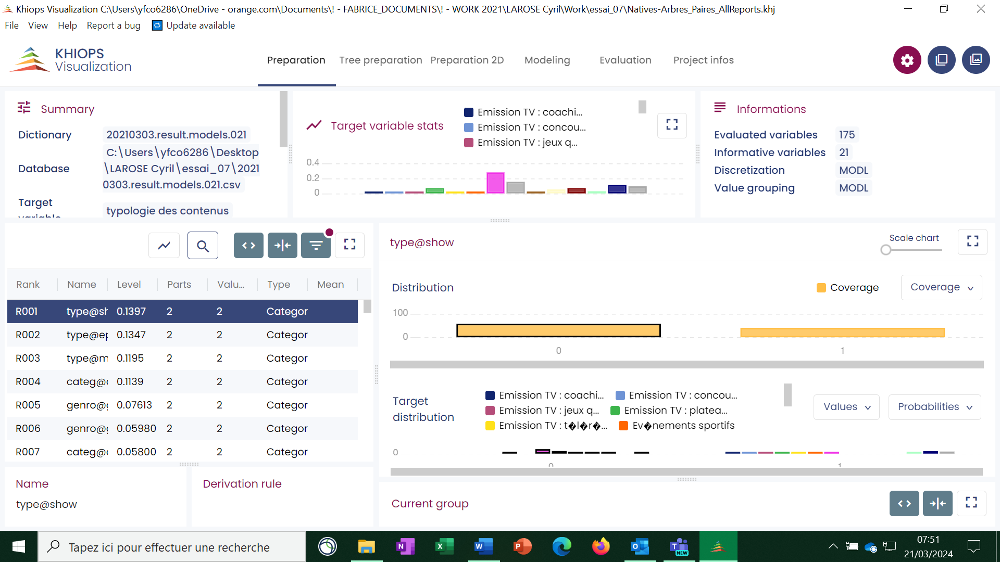

#  First step

The entry point of Khiops Visualization is the khv file generated by Khiops at the end of the analysis. A double-click on this file opens Khiops Visualization.

Khiops Visualization is composed of several tabbed panes. The first one is the project pane : it presents the report file and database locations.

Depending on the analysis type, the panes and their contents are not the same. Khiops Visualization can be composed with 5 panes:

  - Preparation: displays the Preparation report.

  - Tree preparation : displays the preparation report for tree variables

  - Preparation 2D: displays the 2D preparation report.

  - Modeling: displays the modeling report.

  - Evaluation: displays on one pane the test, train and evaluation reports.

The description of the criteria used in these reports can be found [`here`](criteria.md).
